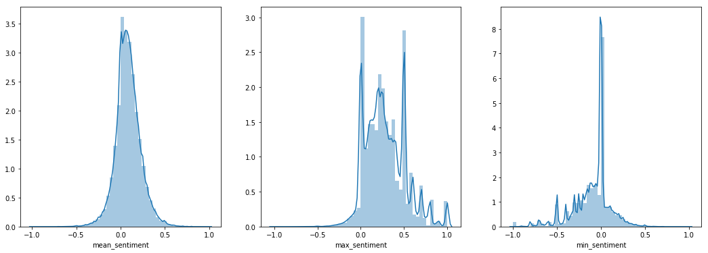
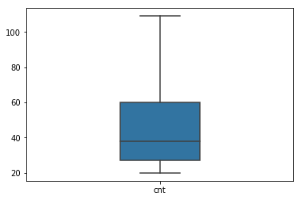

---
redirect_from:
  - "01/0-eda-copy1"
interact_link: content/01/0_eda-Copy1.ipynb
kernel_name: python3
has_widgets: false
title: 'EDA'
prev_page:
  url: /intro
  title: 'Home'
next_page:
  url: /guide/02_create
  title: 'Create your book'
comment: "***PROGRAMMATICALLY GENERATED, DO NOT EDIT. SEE ORIGINAL FILES IN /content***"
---


<div markdown="1" class="cell code_cell">
<div class="input_area" markdown="1">
```python
# HIDE

import pandas as pd

import pandas_profiling

import numpy as np

from textblob import TextBlob

from tqdm import tqdm

tqdm.pandas()

import seaborn as sns
%matplotlib inline

import matplotlib.pyplot as plt

```
</div>

</div>


<div markdown="1" class="cell code_cell">
<div class="input_area" markdown="1">
```python
# HIDE

def get_sentiment(text):
    blob = TextBlob(text)
    return [sentence.sentiment.polarity for sentence in blob.sentences]

```
</div>

</div>


<div markdown="1" class="cell code_cell">
<div class="input_area" markdown="1">
```python
# HIDE

df = pd.read_csv('./data/preprocessed/final_df_spacy_mods_topmine_more_20.csv')

```
</div>

</div>


<div markdown="1" class="cell code_cell">
<div class="input_area" markdown="1">
```python
# HIDE

df.loc[:, 'sentiment'] = df['text'].progress_apply(get_sentiment)

```
</div>

</div>


<div markdown="1" class="cell code_cell">
<div class="input_area" markdown="1">
```python
# HIDE

df.loc[:, 'mean_sentiment'] = df['sentiment'].apply(lambda x: np.mean(x))
df.loc[:, 'max_sentiment'] = df['sentiment'].apply(lambda x: np.max(x))
df.loc[:, 'min_sentiment'] = df['sentiment'].apply(lambda x: np.min(x))

```
</div>

</div>


<div markdown="1" class="cell code_cell">
<div class="input_area" markdown="1">
```python
# HIDE

df.columns

```
</div>

<div class="output_wrapper" markdown="1">
<div class="output_subarea" markdown="1">


{:.output_data_text}
```
Index(['ents_modal', 'prop_modal', 'by', 'text', 'timestamp', 'clean_text',
       'date', 'year_month', 'clean_2_text', 'clean_3_text', 'replace_ngram',
       'sentiment', 'mean_sentiment', 'max_sentiment', 'min_sentiment'],
      dtype='object')
```


</div>
</div>
</div>


<div markdown="1" class="cell code_cell">
<div class="input_area" markdown="1">
```python
# HIDE

df.drop(['clean_2_text', 'clean_3_text'],axis=1,inplace=True)

```
</div>

</div>


<div markdown="1" class="cell code_cell">
<div class="input_area" markdown="1">
```python
# HIDE

df.to_csv('./data/preprocessed/final_df_spacy_mods_topmine_more_20_sentiment.csv', index=None)

```
</div>

</div>


<div markdown="1" class="cell code_cell">
<div class="input_area" markdown="1">
```python
# HIDE

df = pd.read_csv('./data/preprocessed/final_df_spacy_mods_topmine_more_20_sentiment.csv')

```
</div>

</div>


<div markdown="1" class="cell code_cell">
<div class="input_area" markdown="1">
```python
# HIDE

df.loc[:, 'cnt'] = df['clean_text'].apply(lambda x: len(x.split()))

```
</div>

</div>


<div markdown="1" class="cell code_cell">
<div class="input_area" markdown="1">
```python
df.head(3)

```
</div>

<div class="output_wrapper" markdown="1">
<div class="output_subarea" markdown="1">


<div markdown="0" class="output output_html">
<div>
<style scoped>
    .dataframe tbody tr th:only-of-type {
        vertical-align: middle;
    }

    .dataframe tbody tr th {
        vertical-align: top;
    }

    .dataframe thead th {
        text-align: right;
    }
</style>
<table border="1" class="dataframe">
  <thead>
    <tr style="text-align: right;">
      <th></th>
      <th>ents_modal</th>
      <th>prop_modal</th>
      <th>by</th>
      <th>text</th>
      <th>timestamp</th>
      <th>clean_text</th>
      <th>date</th>
      <th>year_month</th>
      <th>replace_ngram</th>
      <th>sentiment</th>
      <th>mean_sentiment</th>
      <th>max_sentiment</th>
      <th>min_sentiment</th>
    </tr>
  </thead>
  <tbody>
    <tr>
      <th>0</th>
      <td>NaN</td>
      <td>NaN</td>
      <td>damm</td>
      <td>I think this is the problem with social media ...</td>
      <td>2019-01-18 03:54:02</td>
      <td>think problem social media networking used you...</td>
      <td>2019-01-18</td>
      <td>2019-01</td>
      <td>think problem social_media networking used you...</td>
      <td>[-0.06666666666666667, 0.0, 0.0, 0.0]</td>
      <td>-0.016667</td>
      <td>0.000</td>
      <td>-0.066667</td>
    </tr>
    <tr>
      <th>1</th>
      <td>CARDINAL:1 ORG:4</td>
      <td>DNS_A</td>
      <td>mobilemidget</td>
      <td>"One DNS hijacking technique involves changing...</td>
      <td>2019-01-11 20:32:19</td>
      <td>one dns hijacking technique involves changing ...</td>
      <td>2019-01-11</td>
      <td>2019-01</td>
      <td>one dns hijacking technique involves changing ...</td>
      <td>[0.0, 0.0, -0.16666666666666666, 0.5]</td>
      <td>0.083333</td>
      <td>0.500</td>
      <td>-0.166667</td>
    </tr>
    <tr>
      <th>2</th>
      <td>ORG:4 FAC:1</td>
      <td>App_Store</td>
      <td>steve_taylor</td>
      <td>&gt; Until we have the ability to make iOS apps o...</td>
      <td>2019-01-08 02:21:07</td>
      <td>ability make ios apps ondevice never option lo...</td>
      <td>2019-01-08</td>
      <td>2019-01</td>
      <td>ability make ios_apps device never option lot_...</td>
      <td>[0.595, 0.0, 0.0]</td>
      <td>0.198333</td>
      <td>0.595</td>
      <td>0.000000</td>
    </tr>
  </tbody>
</table>
</div>
</div>


</div>
</div>
</div>


<div markdown="1" class="cell code_cell">
<div class="input_area" markdown="1">
```python
plt.figure(figsize=(18,6))

plt.subplot(1, 3, 1)
sns.distplot(df['mean_sentiment']);

plt.subplot(1, 3, 2)
sns.distplot(df['max_sentiment']);

plt.subplot(1, 3, 3)
sns.distplot(df['min_sentiment']);


```
</div>

<div class="output_wrapper" markdown="1">
<div class="output_subarea" markdown="1">

{:.output_png}


</div>
</div>
</div>


<div markdown="1" class="cell code_cell">
<div class="input_area" markdown="1">
```python
# HIDE

df.head()

```
</div>

<div class="output_wrapper" markdown="1">
<div class="output_subarea" markdown="1">


<div markdown="0" class="output output_html">
<div>
<style scoped>
    .dataframe tbody tr th:only-of-type {
        vertical-align: middle;
    }

    .dataframe tbody tr th {
        vertical-align: top;
    }

    .dataframe thead th {
        text-align: right;
    }
</style>
<table border="1" class="dataframe">
  <thead>
    <tr style="text-align: right;">
      <th></th>
      <th>ents_modal</th>
      <th>prop_modal</th>
      <th>by</th>
      <th>text</th>
      <th>timestamp</th>
      <th>clean_text</th>
      <th>date</th>
      <th>year_month</th>
      <th>replace_ngram</th>
      <th>sentiment</th>
      <th>mean_sentiment</th>
      <th>max_sentiment</th>
      <th>min_sentiment</th>
    </tr>
  </thead>
  <tbody>
    <tr>
      <th>0</th>
      <td>NaN</td>
      <td>NaN</td>
      <td>damm</td>
      <td>I think this is the problem with social media ...</td>
      <td>2019-01-18 03:54:02</td>
      <td>think problem social media networking used you...</td>
      <td>2019-01-18</td>
      <td>2019-01</td>
      <td>think problem social_media networking used you...</td>
      <td>[-0.06666666666666667, 0.0, 0.0, 0.0]</td>
      <td>-0.016667</td>
      <td>0.000000</td>
      <td>-0.066667</td>
    </tr>
    <tr>
      <th>1</th>
      <td>CARDINAL:1 ORG:4</td>
      <td>DNS_A</td>
      <td>mobilemidget</td>
      <td>"One DNS hijacking technique involves changing...</td>
      <td>2019-01-11 20:32:19</td>
      <td>one dns hijacking technique involves changing ...</td>
      <td>2019-01-11</td>
      <td>2019-01</td>
      <td>one dns hijacking technique involves changing ...</td>
      <td>[0.0, 0.0, -0.16666666666666666, 0.5]</td>
      <td>0.083333</td>
      <td>0.500000</td>
      <td>-0.166667</td>
    </tr>
    <tr>
      <th>2</th>
      <td>ORG:4 FAC:1</td>
      <td>App_Store</td>
      <td>steve_taylor</td>
      <td>&gt; Until we have the ability to make iOS apps o...</td>
      <td>2019-01-08 02:21:07</td>
      <td>ability make ios apps ondevice never option lo...</td>
      <td>2019-01-08</td>
      <td>2019-01</td>
      <td>ability make ios_apps device never option lot_...</td>
      <td>[0.595, 0.0, 0.0]</td>
      <td>0.198333</td>
      <td>0.595000</td>
      <td>0.000000</td>
    </tr>
    <tr>
      <th>3</th>
      <td>DATE:1</td>
      <td>NaN</td>
      <td>simmanian</td>
      <td>I don't think we need to define what public in...</td>
      <td>2019-01-17 21:59:47</td>
      <td>dont think need define public interest perfect...</td>
      <td>2019-01-17</td>
      <td>2019-01</td>
      <td>think_need define public_interest perfect_way ...</td>
      <td>[0.24285714285714283, 0.0, 0.0, -0.33333333333...</td>
      <td>-0.067163</td>
      <td>0.242857</td>
      <td>-0.333333</td>
    </tr>
    <tr>
      <th>4</th>
      <td>NORP:1 GPE:2</td>
      <td>NaN</td>
      <td>porpoisely</td>
      <td>Not just foreign voices. Domestic chinese voic...</td>
      <td>2019-01-18 19:34:54</td>
      <td>foreign voices domestic chinese voices well te...</td>
      <td>2019-01-18</td>
      <td>2019-01</td>
      <td>foreign voices domestic chinese voices well te...</td>
      <td>[-0.125, 0.0, -0.14285714285714285, -0.4, 0.08...</td>
      <td>-0.063653</td>
      <td>0.196429</td>
      <td>-0.400000</td>
    </tr>
  </tbody>
</table>
</div>
</div>


</div>
</div>
</div>


<div markdown="1" class="cell code_cell">
<div class="input_area" markdown="1">
```python
# HIDE

from itertools import chain

import re

import seaborn as sns

import seaborn as sns
import matplotlib.pyplot as plt

from tqdm import tqdm

import nltk
from nltk.tokenize import word_tokenize, sent_tokenize, RegexpTokenizer

from itertools import chain

from collections import Counter

```
</div>

</div>


<div markdown="1" class="cell code_cell">
<div class="input_area" markdown="1">
```python
wrds = list(chain(*df['prop_modal'].dropna().apply(lambda x: x.split()).values))

```
</div>

</div>


<div markdown="1" class="cell code_cell">
<div class="input_area" markdown="1">
```python

from PIL import Image
from wordcloud import WordCloud, STOPWORDS, ImageColorGenerator
wordcloud = WordCloud(stopwords=['last_year', 'good_thing', 'really_want'], background_color="white").generate(' '.join(wrds))

# Display the generated image:
# the matplotlib way:
plt.figure(figsize=(14,16))
plt.imshow(wordcloud, interpolation='bilinear')
plt.axis("off")
plt.show()

```
</div>

<div class="output_wrapper" markdown="1">
<div class="output_subarea" markdown="1">

{:.output_png}


</div>
</div>
</div>


<div markdown="1" class="cell code_cell">
<div class="input_area" markdown="1">
```python
# HIDE

df.columns

```
</div>

<div class="output_wrapper" markdown="1">
<div class="output_subarea" markdown="1">


{:.output_data_text}
```
Index(['ents_modal', 'prop_modal', 'by', 'text', 'timestamp', 'clean_text',
       'date', 'year_month', 'replace_ngram', 'sentiment', 'mean_sentiment',
       'max_sentiment', 'min_sentiment'],
      dtype='object')
```


</div>
</div>
</div>


<div markdown="1" class="cell code_cell">
<div class="input_area" markdown="1">
```python
plt.figure(figsize=(10,8))
plt.xticks(rotation=90)
sns.countplot(list(chain(*df['ents_modal'].dropna().astype(str).apply(lambda x: re.findall(re.compile('[A-Z_]+'), x)).values)))

```
</div>

<div class="output_wrapper" markdown="1">
<div class="output_subarea" markdown="1">


{:.output_data_text}
```
<matplotlib.axes._subplots.AxesSubplot at 0x7f996e048860>
```


</div>
</div>
<div class="output_wrapper" markdown="1">
<div class="output_subarea" markdown="1">

{:.output_png}


</div>
</div>
</div>


<div markdown="1" class="cell code_cell">
<div class="input_area" markdown="1">
```python
# HIDE

df1 = pd.read_csv('./data/hn_2018_2019_coment.csv')
df1['timestamp'] = pd.to_datetime(df1['timestamp'])
df1['year_month'] = df1['timestamp'].dt.strftime('%Y-%m')

```
</div>

</div>


<div markdown="1" class="cell code_cell">
<div class="input_area" markdown="1">
```python
# HIDE

df1 = df1[df1['year_month'] >= '2019']

```
</div>

</div>


df = pd.read_csv('./data/df_hni_2018_05_orig.csv')


<div markdown="1" class="cell code_cell">
<div class="input_area" markdown="1">
```python
# HIDE

df['timestamp'] = pd.to_datetime(df['timestamp'])

```
</div>

</div>


<div markdown="1" class="cell code_cell">
<div class="input_area" markdown="1">
```python
# HIDE

df1['cnt_sentences'] = df1['text'].astype(str).apply(lambda x: len(sent_tokenize(x)))

```
</div>

</div>


<div markdown="1" class="cell code_cell">
<div class="input_area" markdown="1">
```python
# HIDE

tok = RegexpTokenizer(r'\w+')
df1['text_words'] = df1['text'].astype(str).progress_apply(lambda x: len(tok.tokenize(x)))

```
</div>

</div>


<div markdown="1" class="cell code_cell">
<div class="input_area" markdown="1">
```python
# HIDE

tqdm.pandas()

```
</div>

</div>


<div markdown="1" class="cell code_cell">
<div class="input_area" markdown="1">
```python
plt.figure(figsize=(10,8))
plt.hist(df1[df1['cnt_sentences']<20]['cnt_sentences'], bins=10)

```
</div>

<div class="output_wrapper" markdown="1">
<div class="output_subarea" markdown="1">


{:.output_data_text}
```
(array([682787., 271749.,  87504.,  34795.,   9305.,  11403.,   6237.,
          3569.,   2183.,   1401.]),
 array([ 1. ,  2.8,  4.6,  6.4,  8.2, 10. , 11.8, 13.6, 15.4, 17.2, 19. ]),
 <a list of 10 Patch objects>)
```


</div>
</div>
<div class="output_wrapper" markdown="1">
<div class="output_subarea" markdown="1">

{:.output_png}


</div>
</div>
</div>


<div markdown="1" class="cell code_cell">
<div class="input_area" markdown="1">
```python
plt.figure(figsize=(10,8))
sns.distplot(df1[df1['cnt_sentences']>0]['cnt_sentences'])

```
</div>

<div class="output_wrapper" markdown="1">
<div class="output_subarea" markdown="1">


{:.output_data_text}
```
<matplotlib.axes._subplots.AxesSubplot at 0x7f254c738128>
```


</div>
</div>
<div class="output_wrapper" markdown="1">
<div class="output_subarea" markdown="1">

{:.output_png}


</div>
</div>
</div>


<div markdown="1" class="cell code_cell">
<div class="input_area" markdown="1">
```python
plt.figure(figsize=(10,8))
sns.distplot(df1[df1['text_words']>0]['text_words'])

```
</div>

<div class="output_wrapper" markdown="1">
<div class="output_subarea" markdown="1">


{:.output_data_text}
```
<matplotlib.axes._subplots.AxesSubplot at 0x7f250ed45cf8>
```


</div>
</div>
<div class="output_wrapper" markdown="1">
<div class="output_subarea" markdown="1">

{:.output_png}


</div>
</div>
</div>


<div markdown="1" class="cell code_cell">
<div class="input_area" markdown="1">
```python
sns.boxplot(data=df1[['cnt_sentences']], orient='v', showfliers=False, width=0.3)

```
</div>

<div class="output_wrapper" markdown="1">
<div class="output_subarea" markdown="1">


{:.output_data_text}
```
<matplotlib.axes._subplots.AxesSubplot at 0x7f254c598470>
```


</div>
</div>
<div class="output_wrapper" markdown="1">
<div class="output_subarea" markdown="1">

{:.output_png}


</div>
</div>
</div>


<div markdown="1" class="cell code_cell">
<div class="input_area" markdown="1">
```python
sns.boxplot(data=df1[['text_words']], orient='v', showfliers=False, width=0.3)

```
</div>

<div class="output_wrapper" markdown="1">
<div class="output_subarea" markdown="1">


{:.output_data_text}
```
<matplotlib.axes._subplots.AxesSubplot at 0x7f250ec44438>
```


</div>
</div>
<div class="output_wrapper" markdown="1">
<div class="output_subarea" markdown="1">

{:.output_png}


</div>
</div>
</div>


<div markdown="1" class="cell code_cell">
<div class="input_area" markdown="1">
```python
sns.boxplot(data=df[['cnt']], orient='v', showfliers=False, width=0.3)

```
</div>

<div class="output_wrapper" markdown="1">
<div class="output_subarea" markdown="1">


{:.output_data_text}
```
<matplotlib.axes._subplots.AxesSubplot at 0x7f848c90d160>
```


</div>
</div>
<div class="output_wrapper" markdown="1">
<div class="output_subarea" markdown="1">

{:.output_png}


</div>
</div>
</div>


<div markdown="1" class="cell code_cell">
<div class="input_area" markdown="1">
```python
sns.distplot(df[df['cnt']<150][['cnt']])

```
</div>

<div class="output_wrapper" markdown="1">
<div class="output_subarea" markdown="1">


{:.output_data_text}
```
<matplotlib.axes._subplots.AxesSubplot at 0x7f8494ef9978>
```


</div>
</div>
<div class="output_wrapper" markdown="1">
<div class="output_subarea" markdown="1">

{:.output_png}


</div>
</div>
</div>


<div markdown="1" class="cell code_cell">
<div class="input_area" markdown="1">
```python
pd.concat([df['by'].value_counts().iloc[:10],
           df['by'].value_counts().iloc[:10] / df.shape[0] * 100,
          df.groupby('by')['mean_sentiment'].mean().loc[df['by'].value_counts().iloc[:10].index],
          df.groupby('by')['max_sentiment'].mean().loc[df['by'].value_counts().iloc[:10].index],
          df.groupby('by')['max_sentiment'].max().loc[df['by'].value_counts().iloc[:10].index],
          df.groupby('by')['min_sentiment'].min().loc[df['by'].value_counts().iloc[:10].index],
          df.groupby('by')['min_sentiment'].mean().loc[df['by'].value_counts().iloc[:10].index],
          df.groupby('by')['cnt'].mean().loc[df['by'].value_counts().iloc[:10].index]
          ],axis=1)

```
</div>

<div class="output_wrapper" markdown="1">
<div class="output_subarea" markdown="1">


<div markdown="0" class="output output_html">
<div>
<style scoped>
    .dataframe tbody tr th:only-of-type {
        vertical-align: middle;
    }

    .dataframe tbody tr th {
        vertical-align: top;
    }

    .dataframe thead th {
        text-align: right;
    }
</style>
<table border="1" class="dataframe">
  <thead>
    <tr style="text-align: right;">
      <th></th>
      <th>by</th>
      <th>by</th>
      <th>mean_sentiment</th>
      <th>max_sentiment</th>
      <th>max_sentiment</th>
      <th>min_sentiment</th>
      <th>min_sentiment</th>
      <th>cnt</th>
    </tr>
  </thead>
  <tbody>
    <tr>
      <th>dragonwriter</th>
      <td>1858</td>
      <td>0.323492</td>
      <td>0.079101</td>
      <td>0.156453</td>
      <td>1.00</td>
      <td>-1.000</td>
      <td>0.006565</td>
      <td>51.323466</td>
    </tr>
    <tr>
      <th>coldtea</th>
      <td>1312</td>
      <td>0.228429</td>
      <td>0.076650</td>
      <td>0.226631</td>
      <td>1.00</td>
      <td>-1.000</td>
      <td>-0.060942</td>
      <td>53.429878</td>
    </tr>
    <tr>
      <th>scarface74</th>
      <td>1190</td>
      <td>0.207188</td>
      <td>0.085041</td>
      <td>0.251883</td>
      <td>1.00</td>
      <td>-1.000</td>
      <td>-0.063218</td>
      <td>49.705882</td>
    </tr>
    <tr>
      <th>TeMPOraL</th>
      <td>1158</td>
      <td>0.201616</td>
      <td>0.076269</td>
      <td>0.288824</td>
      <td>1.00</td>
      <td>-1.000</td>
      <td>-0.118798</td>
      <td>56.587219</td>
    </tr>
    <tr>
      <th>stcredzero</th>
      <td>951</td>
      <td>0.165576</td>
      <td>0.071192</td>
      <td>0.335918</td>
      <td>1.00</td>
      <td>-1.000</td>
      <td>-0.175289</td>
      <td>64.234490</td>
    </tr>
    <tr>
      <th>dsfyu404ed</th>
      <td>875</td>
      <td>0.152344</td>
      <td>0.068512</td>
      <td>0.254264</td>
      <td>1.00</td>
      <td>-1.000</td>
      <td>-0.102584</td>
      <td>51.921143</td>
    </tr>
    <tr>
      <th>pjmlp</th>
      <td>840</td>
      <td>0.146250</td>
      <td>0.115429</td>
      <td>0.145429</td>
      <td>0.95</td>
      <td>-0.750</td>
      <td>0.088251</td>
      <td>36.022619</td>
    </tr>
    <tr>
      <th>rayiner</th>
      <td>828</td>
      <td>0.144161</td>
      <td>0.065259</td>
      <td>0.324059</td>
      <td>1.00</td>
      <td>-1.000</td>
      <td>-0.159725</td>
      <td>69.855072</td>
    </tr>
    <tr>
      <th>dang</th>
      <td>815</td>
      <td>0.141898</td>
      <td>0.090574</td>
      <td>0.351443</td>
      <td>1.00</td>
      <td>-1.000</td>
      <td>-0.149521</td>
      <td>43.277301</td>
    </tr>
    <tr>
      <th>benj111</th>
      <td>798</td>
      <td>0.138938</td>
      <td>0.079594</td>
      <td>0.254628</td>
      <td>1.00</td>
      <td>-0.875</td>
      <td>-0.073877</td>
      <td>37.884712</td>
    </tr>
  </tbody>
</table>
</div>
</div>


</div>
</div>
</div>


<div markdown="1" class="cell code_cell">
<div class="input_area" markdown="1">
```python
# HIDE

list_of_lists = df['replace_ngram'].apply(lambda x: x.split()).values

merged = list(chain.from_iterable(list_of_lists))

cnt_words = Counter(merged)

```
</div>

</div>


<div markdown="1" class="cell code_cell">
<div class="input_area" markdown="1">
```python
cnt_words.most_common(20)

```
</div>

<div class="output_wrapper" markdown="1">
<div class="output_subarea" markdown="1">


{:.output_data_text}
```
[('num', 605890),
 ('one', 149501),
 ('people', 102786),
 ('much', 99422),
 ('really', 85048),
 ('url', 74483),
 ('think', 62249),
 ('even', 51066),
 ('also', 50518),
 ('use', 45150),
 ('every', 44924),
 ('get', 43122),
 ('never', 42523),
 ('time', 42206),
 ('work', 39628),
 ('years', 38452),
 ('way', 37255),
 ('know', 35650),
 ('still', 34804),
 ('see', 34777)]
```


</div>
</div>
</div>


<div markdown="1" class="cell code_cell">
<div class="input_area" markdown="1">
```python
Counter({key: value for key, value in cnt_words.items() if len(key.split('_'))==2}).most_common(20)

```
</div>

<div class="output_wrapper" markdown="1">
<div class="output_subarea" markdown="1">


{:.output_data_text}
```
[('open_source', 7710),
 ('many_people', 7601),
 ('even_though', 5894),
 ('long_term', 5748),
 ('long_time', 4981),
 ('makes_sense', 4837),
 ('make_sure', 4343),
 ('url_hash', 4269),
 ('lot_people', 4261),
 ('social_media', 4047),
 ('make_sense', 3840),
 ('real_world', 3409),
 ('first_place', 3354),
 ('third_party', 3218),
 ('climate_change', 2876),
 ('last_year', 2736),
 ('machine_learning', 2712),
 ('use_case', 2688),
 ('new_york', 2679),
 ('c_hash', 2666)]
```


</div>
</div>
</div>


<div markdown="1" class="cell code_cell">
<div class="input_area" markdown="1">
```python
Counter({key: value for key, value in cnt_words.items() if len(key.split('_'))==3}).most_common(20)

```
</div>

<div class="output_wrapper" markdown="1">
<div class="output_subarea" markdown="1">


{:.output_data_text}
```
[('c_plus_plus', 8747),
 ('self_driving_cars', 845),
 ('full_time_onsite', 626),
 ('open_source_projects', 603),
 ('open_source_software', 599),
 ('open_source_project', 449),
 ('self_driving_car', 434),
 ('senior_software_engineer', 423),
 ('work_life_balance', 358),
 ('spend_lot_time', 332),
 ('makes_lot_sense', 317),
 ('full_time_url', 314),
 ('full_time_job', 301),
 ('full_stack_engineer', 272),
 ('full_stack_developer', 256),
 ('low_hanging_fruit', 251),
 ('spent_lot_time', 220),
 ('lowest_common_denominator', 215),
 ('url_software_engineer', 203),
 ('multi_billion_dollar', 201)]
```


</div>
</div>
</div>


<div markdown="1" class="cell code_cell">
<div class="input_area" markdown="1">
```python
pandas_profiling.ProfileReport(df1)

```
</div>

<div class="output_wrapper" markdown="1">
<div class="output_subarea" markdown="1">


<div markdown="0" class="output output_html">
<meta charset="UTF-8">

<style>

        .variablerow {
            border: 1px solid #e1e1e8;
            border-top: hidden;
            padding-top: 2em;
            padding-bottom: 2em;
            padding-left: 1em;
            padding-right: 1em;
        }

        .headerrow {
            border: 1px solid #e1e1e8;
            background-color: #f5f5f5;
            padding: 2em;
        }
        .namecol {
            margin-top: -1em;
            overflow-x: auto;
        }

        .dl-horizontal dt {
            text-align: left;
            padding-right: 1em;
            white-space: normal;
        }

        .dl-horizontal dd {
            margin-left: 0;
        }

        .ignore {
            opacity: 0.4;
        }

        .container.pandas-profiling {
            max-width:975px;
        }

        .col-md-12 {
            padding-left: 2em;
        }

        .indent {
            margin-left: 1em;
        }

        .center-img {
            margin-left: auto !important;
            margin-right: auto !important;
            display: block;
        }

        /* Table example_values */
            table.example_values {
                border: 0;
            }

            .example_values th {
                border: 0;
                padding: 0 ;
                color: #555;
                font-weight: 600;
            }

            .example_values tr, .example_values td{
                border: 0;
                padding: 0;
                color: #555;
            }

        /* STATS */
            table.stats {
                border: 0;
            }

            .stats th {
                border: 0;
                padding: 0 2em 0 0;
                color: #555;
                font-weight: 600;
            }

            .stats tr {
                border: 0;
            }

            .stats td{
                color: #555;
                padding: 1px;
                border: 0;
            }


        /* Sample table */
            table.sample {
                border: 0;
                margin-bottom: 2em;
                margin-left:1em;
            }
            .sample tr {
                border:0;
            }
            .sample td, .sample th{
                padding: 0.5em;
                white-space: nowrap;
                border: none;

            }

            .sample thead {
                border-top: 0;
                border-bottom: 2px solid #ddd;
            }

            .sample td {
                width:100%;
            }


        /* There is no good solution available to make the divs equal height and then center ... */
            .histogram {
                margin-top: 3em;
            }
        /* Freq table */

            table.freq {
                margin-bottom: 2em;
                border: 0;
            }
            table.freq th, table.freq tr, table.freq td {
                border: 0;
                padding: 0;
            }

            .freq thead {
                font-weight: 600;
                white-space: nowrap;
                overflow: hidden;
                text-overflow: ellipsis;

            }

            td.fillremaining{
                width:auto;
                max-width: none;
            }

            td.number, th.number {
                text-align:right ;
            }

        /* Freq mini */
            .freq.mini td{
                width: 50%;
                padding: 1px;
                font-size: 12px;

            }
            table.freq.mini {
                 width:100%;
            }
            .freq.mini th {
                overflow: hidden;
                text-overflow: ellipsis;
                white-space: nowrap;
                max-width: 5em;
                font-weight: 400;
                text-align:right;
                padding-right: 0.5em;
            }

            .missing {
                color: #a94442;
            }
            .alert, .alert > th, .alert > td {
                color: #a94442;
            }


        /* Bars in tables */
            .freq .bar{
                float: left;
                width: 0;
                height: 100%;
                line-height: 20px;
                color: #fff;
                text-align: center;
                background-color: #337ab7;
                border-radius: 3px;
                margin-right: 4px;
            }
            .other .bar {
                background-color: #999;
            }
            .missing .bar{
                background-color: #a94442;
            }
            .tooltip-inner {
                width: 100%;
                white-space: nowrap;
                text-align:left;
            }

            .extrapadding{
                padding: 2em;
            }

            .pp-anchor{

            }

</style>

<div class="container pandas-profiling">
    <div class="row headerrow highlight">
        <h1>Overview</h1>
    </div>
    <div class="row variablerow">
    <div class="col-md-6 namecol">
        <p class="h4">Dataset info</p>
        <table class="stats" style="margin-left: 1em;">
            <tbody>
            <tr>
                <th>Number of variables</th>
                <td>16 </td>
            </tr>
            <tr>
                <th>Number of observations</th>
                <td>1114277 </td>
            </tr>
            <tr>
                <th>Total Missing (%)</th>
                <td>43.8% </td>
            </tr>
            <tr>
                <th>Total size in memory</th>
                <td>136.0 MiB </td>
            </tr>
            <tr>
                <th>Average record size in memory</th>
                <td>128.0 B </td>
            </tr>
            </tbody>
        </table>
    </div>
    <div class="col-md-6 namecol">
        <p class="h4">Variables types</p>
        <table class="stats" style="margin-left: 1em;">
            <tbody>
            <tr>
                <th>Numeric</th>
                <td>1 </td>
            </tr>
            <tr>
                <th>Categorical</th>
                <td>5 </td>
            </tr>
            <tr>
                <th>Boolean</th>
                <td>0 </td>
            </tr>
            <tr>
                <th>Date</th>
                <td>1 </td>
            </tr>
            <tr>
                <th>Text (Unique)</th>
                <td>0 </td>
            </tr>
            <tr>
                <th>Rejected</th>
                <td>9 </td>
            </tr>
            <tr>
                <th>Unsupported</th>
                <td>0 </td>
            </tr>
            </tbody>
        </table>
    </div>
    <div class="col-md-12" style="padding-left: 1em;">
        
        <p class="h4">Warnings</p>
        <ul class="list-unstyled"><li><a href="#pp_var_by"><code>by</code></a> has 28289 / 2.5% missing values <span class="label label-default">Missing</span></li><li><a href="#pp_var_by"><code>by</code></a> has a high cardinality: 71998 distinct values  <span class="label label-warning">Warning</span></li><li><a href="#pp_var_dead"><code>dead</code></a> has 1091256 / 97.9% missing values <span class="label label-default">Missing</span></li><li><a href="#pp_var_deleted"><code>deleted</code></a> has 1085990 / 97.5% missing values <span class="label label-default">Missing</span></li><li><a href="#pp_var_descendants"><code>descendants</code></a> has 1114277 / 100.0% missing values <span class="label label-default">Missing</span></li><li><a href="#pp_var_descendants"><code>descendants</code></a> has constant value  <span class="label label-primary">Rejected</span></li><li><a href="#pp_var_id"><code>id</code></a> is highly correlated with <a href="#pp_var_parent"><code>parent</code></a> (ρ = 0.99853) <span class="label label-primary">Rejected</span></li><li><a href="#pp_var_parent"><code>parent</code></a> is highly correlated with <a href="#pp_var_time"><code>time</code></a> (ρ = 0.99844) <span class="label label-primary">Rejected</span></li><li><a href="#pp_var_ranking"><code>ranking</code></a> has 1114277 / 100.0% missing values <span class="label label-default">Missing</span></li><li><a href="#pp_var_ranking"><code>ranking</code></a> has constant value  <span class="label label-primary">Rejected</span></li><li><a href="#pp_var_score"><code>score</code></a> has 1114277 / 100.0% missing values <span class="label label-default">Missing</span></li><li><a href="#pp_var_score"><code>score</code></a> has constant value  <span class="label label-primary">Rejected</span></li><li><a href="#pp_var_text"><code>text</code></a> has 28289 / 2.5% missing values <span class="label label-default">Missing</span></li><li><a href="#pp_var_text"><code>text</code></a> has a high cardinality: 1080819 distinct values  <span class="label label-warning">Warning</span></li><li><a href="#pp_var_time"><code>time</code></a> is highly correlated with <a href="#pp_var_index"><code>index</code></a> (ρ = 0.95945) <span class="label label-primary">Rejected</span></li><li><a href="#pp_var_title"><code>title</code></a> has 1114277 / 100.0% missing values <span class="label label-default">Missing</span></li><li><a href="#pp_var_title"><code>title</code></a> has constant value  <span class="label label-primary">Rejected</span></li><li><a href="#pp_var_type"><code>type</code></a> has constant value comment <span class="label label-primary">Rejected</span></li><li><a href="#pp_var_url"><code>url</code></a> has 1114277 / 100.0% missing values <span class="label label-default">Missing</span></li><li><a href="#pp_var_url"><code>url</code></a> has constant value  <span class="label label-primary">Rejected</span></li> </ul>
    </div>
</div>
    <div class="row headerrow highlight">
        <h1>Variables</h1>
    </div>
    <div class="row variablerow">
    <div class="col-md-3 namecol">
        <p class="h4 pp-anchor" id="pp_var_by">by<br/>
            <small>Categorical</small>
        </p>
    </div><div class="col-md-3">
    <table class="stats ">
        <tr class="alert">
            <th>Distinct count</th>
            <td>71998</td>
        </tr>
        <tr>
            <th>Unique (%)</th>
            <td>6.5%</td>
        </tr>
        <tr class="alert">
            <th>Missing (%)</th>
            <td>2.5%</td>
        </tr>
        <tr class="alert">
            <th>Missing (n)</th>
            <td>28289</td>
        </tr>
    </table>
</div>
<div class="col-md-6 collapse in" id="minifreqtable-3267117091456717895">
    <table class="mini freq">
        <tr class="">
    <th>dang</th>
    <td>
        <div class="bar" style="width:1%" data-toggle="tooltip" data-placement="right" data-html="true"
             data-delay=500 title="Percentage: 0.2%">
            &nbsp;
        </div>
        2641
    </td>
</tr><tr class="">
    <th>saagarjha</th>
    <td>
        <div class="bar" style="width:1%" data-toggle="tooltip" data-placement="right" data-html="true"
             data-delay=500 title="Percentage: 0.2%">
            &nbsp;
        </div>
        2346
    </td>
</tr><tr class="">
    <th>dragonwriter</th>
    <td>
        <div class="bar" style="width:1%" data-toggle="tooltip" data-placement="right" data-html="true"
             data-delay=500 title="Percentage: 0.2%">
            &nbsp;
        </div>
        2326
    </td>
</tr><tr class="other">
    <th>Other values (71994)</th>
    <td>
        <div class="bar" style="width:100%" data-toggle="tooltip" data-placement="right" data-html="true"
             data-delay=500 title="Percentage: 96.8%">
            1078675
        </div>
        
    </td>
</tr><tr class="missing">
    <th>(Missing)</th>
    <td>
        <div class="bar" style="width:3%" data-toggle="tooltip" data-placement="right" data-html="true"
             data-delay=500 title="Percentage: 2.5%">
            &nbsp;
        </div>
        28289
    </td>
</tr>
    </table>
</div>
<div class="col-md-12 text-right">
    <a role="button" data-toggle="collapse" data-target="#freqtable-3267117091456717895, #minifreqtable-3267117091456717895"
       aria-expanded="true" aria-controls="collapseExample">
        Toggle details
    </a>
</div>
<div class="col-md-12 extrapadding collapse" id="freqtable-3267117091456717895">
    
<table class="freq table table-hover">
    <thead>
    <tr>
        <td class="fillremaining">Value</td>
        <td class="number">Count</td>
        <td class="number">Frequency (%)</td>
        <td style="min-width:200px">&nbsp;</td>
    </tr>
    </thead>
    <tr class="">
        <td class="fillremaining">dang</td>
        <td class="number">2641</td>
        <td class="number">0.2%</td>
        <td>
            <div class="bar" style="width:1%">&nbsp;</div>
        </td>
</tr><tr class="">
        <td class="fillremaining">saagarjha</td>
        <td class="number">2346</td>
        <td class="number">0.2%</td>
        <td>
            <div class="bar" style="width:1%">&nbsp;</div>
        </td>
</tr><tr class="">
        <td class="fillremaining">dragonwriter</td>
        <td class="number">2326</td>
        <td class="number">0.2%</td>
        <td>
            <div class="bar" style="width:1%">&nbsp;</div>
        </td>
</tr><tr class="">
        <td class="fillremaining">pjmlp</td>
        <td class="number">2301</td>
        <td class="number">0.2%</td>
        <td>
            <div class="bar" style="width:1%">&nbsp;</div>
        </td>
</tr><tr class="">
        <td class="fillremaining">scarface74</td>
        <td class="number">2190</td>
        <td class="number">0.2%</td>
        <td>
            <div class="bar" style="width:1%">&nbsp;</div>
        </td>
</tr><tr class="">
        <td class="fillremaining">coldtea</td>
        <td class="number">2135</td>
        <td class="number">0.2%</td>
        <td>
            <div class="bar" style="width:1%">&nbsp;</div>
        </td>
</tr><tr class="">
        <td class="fillremaining">TeMPOraL</td>
        <td class="number">1594</td>
        <td class="number">0.1%</td>
        <td>
            <div class="bar" style="width:1%">&nbsp;</div>
        </td>
</tr><tr class="">
        <td class="fillremaining">maxxxxx</td>
        <td class="number">1549</td>
        <td class="number">0.1%</td>
        <td>
            <div class="bar" style="width:1%">&nbsp;</div>
        </td>
</tr><tr class="">
        <td class="fillremaining">JohnFen</td>
        <td class="number">1459</td>
        <td class="number">0.1%</td>
        <td>
            <div class="bar" style="width:1%">&nbsp;</div>
        </td>
</tr><tr class="">
        <td class="fillremaining">pjc50</td>
        <td class="number">1428</td>
        <td class="number">0.1%</td>
        <td>
            <div class="bar" style="width:1%">&nbsp;</div>
        </td>
</tr><tr class="other">
        <td class="fillremaining">Other values (71987)</td>
        <td class="number">1066019</td>
        <td class="number">95.7%</td>
        <td>
            <div class="bar" style="width:100%">&nbsp;</div>
        </td>
</tr><tr class="missing">
        <td class="fillremaining">(Missing)</td>
        <td class="number">28289</td>
        <td class="number">2.5%</td>
        <td>
            <div class="bar" style="width:3%">&nbsp;</div>
        </td>
</tr>
</table>
</div>
</div><div class="row variablerow">
    <div class="col-md-3 namecol">
        <p class="h4 pp-anchor" id="pp_var_dead">dead<br/>
            <small>Categorical</small>
        </p>
    </div><div class="col-md-3">
    <table class="stats ">
        <tr class="">
            <th>Distinct count</th>
            <td>2</td>
        </tr>
        <tr>
            <th>Unique (%)</th>
            <td>0.0%</td>
        </tr>
        <tr class="alert">
            <th>Missing (%)</th>
            <td>97.9%</td>
        </tr>
        <tr class="alert">
            <th>Missing (n)</th>
            <td>1091256</td>
        </tr>
    </table>
</div>
<div class="col-md-6 collapse in" id="minifreqtable1503001377508487654">
    <table class="mini freq">
        <tr class="">
    <th>True</th>
    <td>
        <div class="bar" style="width:3%" data-toggle="tooltip" data-placement="right" data-html="true"
             data-delay=500 title="Percentage: 2.1%">
            &nbsp;
        </div>
        23021
    </td>
</tr><tr class="missing">
    <th>(Missing)</th>
    <td>
        <div class="bar" style="width:100%" data-toggle="tooltip" data-placement="right" data-html="true"
             data-delay=500 title="Percentage: 97.9%">
            1091256
        </div>
        
    </td>
</tr>
    </table>
</div>
<div class="col-md-12 text-right">
    <a role="button" data-toggle="collapse" data-target="#freqtable1503001377508487654, #minifreqtable1503001377508487654"
       aria-expanded="true" aria-controls="collapseExample">
        Toggle details
    </a>
</div>
<div class="col-md-12 extrapadding collapse" id="freqtable1503001377508487654">
    
<table class="freq table table-hover">
    <thead>
    <tr>
        <td class="fillremaining">Value</td>
        <td class="number">Count</td>
        <td class="number">Frequency (%)</td>
        <td style="min-width:200px">&nbsp;</td>
    </tr>
    </thead>
    <tr class="">
        <td class="fillremaining">True</td>
        <td class="number">23021</td>
        <td class="number">2.1%</td>
        <td>
            <div class="bar" style="width:3%">&nbsp;</div>
        </td>
</tr><tr class="missing">
        <td class="fillremaining">(Missing)</td>
        <td class="number">1091256</td>
        <td class="number">97.9%</td>
        <td>
            <div class="bar" style="width:100%">&nbsp;</div>
        </td>
</tr>
</table>
</div>
</div><div class="row variablerow">
    <div class="col-md-3 namecol">
        <p class="h4 pp-anchor" id="pp_var_deleted">deleted<br/>
            <small>Categorical</small>
        </p>
    </div><div class="col-md-3">
    <table class="stats ">
        <tr class="">
            <th>Distinct count</th>
            <td>2</td>
        </tr>
        <tr>
            <th>Unique (%)</th>
            <td>0.0%</td>
        </tr>
        <tr class="alert">
            <th>Missing (%)</th>
            <td>97.5%</td>
        </tr>
        <tr class="alert">
            <th>Missing (n)</th>
            <td>1085990</td>
        </tr>
    </table>
</div>
<div class="col-md-6 collapse in" id="minifreqtable-5669068646563495688">
    <table class="mini freq">
        <tr class="">
    <th>True</th>
    <td>
        <div class="bar" style="width:3%" data-toggle="tooltip" data-placement="right" data-html="true"
             data-delay=500 title="Percentage: 2.5%">
            &nbsp;
        </div>
        28287
    </td>
</tr><tr class="missing">
    <th>(Missing)</th>
    <td>
        <div class="bar" style="width:100%" data-toggle="tooltip" data-placement="right" data-html="true"
             data-delay=500 title="Percentage: 97.5%">
            1085990
        </div>
        
    </td>
</tr>
    </table>
</div>
<div class="col-md-12 text-right">
    <a role="button" data-toggle="collapse" data-target="#freqtable-5669068646563495688, #minifreqtable-5669068646563495688"
       aria-expanded="true" aria-controls="collapseExample">
        Toggle details
    </a>
</div>
<div class="col-md-12 extrapadding collapse" id="freqtable-5669068646563495688">
    
<table class="freq table table-hover">
    <thead>
    <tr>
        <td class="fillremaining">Value</td>
        <td class="number">Count</td>
        <td class="number">Frequency (%)</td>
        <td style="min-width:200px">&nbsp;</td>
    </tr>
    </thead>
    <tr class="">
        <td class="fillremaining">True</td>
        <td class="number">28287</td>
        <td class="number">2.5%</td>
        <td>
            <div class="bar" style="width:3%">&nbsp;</div>
        </td>
</tr><tr class="missing">
        <td class="fillremaining">(Missing)</td>
        <td class="number">1085990</td>
        <td class="number">97.5%</td>
        <td>
            <div class="bar" style="width:100%">&nbsp;</div>
        </td>
</tr>
</table>
</div>
</div><div class="row variablerow ignore">
    <div class="col-md-3 namecol">
        <p class="h4 pp-anchor" id="pp_var_descendants"><s>descendants</s><br/>
            <small>Constant</small>
        </p>
    </div><div class="col-md-3">
    <p><em>This variable is constant and should be ignored for analysis</em></p>
</div>
<div class="col-md-6">
    <table class="stats ">
        <tr>
            <th>Constant value</th>
            <td></td>
        </tr>
    </table>
</div>
</div><div class="row variablerow ignore">
    <div class="col-md-3 namecol">
        <p class="h4 pp-anchor" id="pp_var_id"><s>id</s><br/>
            <small>Highly correlated</small>
        </p>
    </div><div class="col-md-3">
    <p><em>This variable is highly correlated with <a href="#pp_var_parent"><code>parent</code></a> and should be ignored for analysis</em></p>
</div>
<div class="col-md-6">
    <table class="stats ">
        <tr>
            <th>Correlation</th>
            <td>0.99853</td>
        </tr>
    </table>
</div>
</div><div class="row variablerow">
    <div class="col-md-3 namecol">
        <p class="h4 pp-anchor" id="pp_var_index">index<br/>
            <small>Numeric</small>
        </p>
    </div><div class="col-md-6">
    <div class="row">
        <div class="col-sm-6">
            <table class="stats ">
                <tr>
                    <th>Distinct count</th>
                    <td>1114277</td>
                </tr>
                <tr>
                    <th>Unique (%)</th>
                    <td>100.0%</td>
                </tr>
                <tr class="ignore">
                    <th>Missing (%)</th>
                    <td>0.0%</td>
                </tr>
                <tr class="ignore">
                    <th>Missing (n)</th>
                    <td>0</td>
                </tr>
                <tr class="ignore">
                    <th>Infinite (%)</th>
                    <td>0.0%</td>
                </tr>
                <tr class="ignore">
                    <th>Infinite (n)</th>
                    <td>0</td>
                </tr>
            </table>

        </div>
        <div class="col-sm-6">
            <table class="stats ">

                <tr>
                    <th>Mean</th>
                    <td>2941300</td>
                </tr>
                <tr>
                    <th>Minimum</th>
                    <td>2384135</td>
                </tr>
                <tr>
                    <th>Maximum</th>
                    <td>3498411</td>
                </tr>
                <tr class="ignore">
                    <th>Zeros (%)</th>
                    <td>0.0%</td>
                </tr>
            </table>
        </div>
    </div>
</div>
<div class="col-md-3 collapse in" id="minihistogram1110929166671000803">
    

</div>
<div class="col-md-12 text-right">
    <a role="button" data-toggle="collapse" data-target="#descriptives1110929166671000803,#minihistogram1110929166671000803"
       aria-expanded="false" aria-controls="collapseExample">
        Toggle details
    </a>
</div>
<div class="row collapse col-md-12" id="descriptives1110929166671000803">
    <ul class="nav nav-tabs" role="tablist">
        <li role="presentation" class="active"><a href="#quantiles1110929166671000803"
                                                  aria-controls="quantiles1110929166671000803" role="tab"
                                                  data-toggle="tab">Statistics</a></li>
        <li role="presentation"><a href="#histogram1110929166671000803" aria-controls="histogram1110929166671000803"
                                   role="tab" data-toggle="tab">Histogram</a></li>
        <li role="presentation"><a href="#common1110929166671000803" aria-controls="common1110929166671000803"
                                   role="tab" data-toggle="tab">Common Values</a></li>
        <li role="presentation"><a href="#extreme1110929166671000803" aria-controls="extreme1110929166671000803"
                                   role="tab" data-toggle="tab">Extreme Values</a></li>

    </ul>

    <div class="tab-content">
        <div role="tabpanel" class="tab-pane active row" id="quantiles1110929166671000803">
            <div class="col-md-4 col-md-offset-1">
                <p class="h4">Quantile statistics</p>
                <table class="stats indent">
                    <tr>
                        <th>Minimum</th>
                        <td>2384135</td>
                    </tr>
                    <tr>
                        <th>5-th percentile</th>
                        <td>2439800</td>
                    </tr>
                    <tr>
                        <th>Q1</th>
                        <td>2662700</td>
                    </tr>
                    <tr>
                        <th>Median</th>
                        <td>2941300</td>
                    </tr>
                    <tr>
                        <th>Q3</th>
                        <td>3219800</td>
                    </tr>
                    <tr>
                        <th>95-th percentile</th>
                        <td>3442700</td>
                    </tr>
                    <tr>
                        <th>Maximum</th>
                        <td>3498411</td>
                    </tr>
                    <tr>
                        <th>Range</th>
                        <td>1114276</td>
                    </tr>
                    <tr>
                        <th>Interquartile range</th>
                        <td>557140</td>
                    </tr>
                </table>
            </div>
            <div class="col-md-4 col-md-offset-2">
                <p class="h4">Descriptive statistics</p>
                <table class="stats indent">
                    <tr>
                        <th>Standard deviation</th>
                        <td>321660</td>
                    </tr>
                    <tr>
                        <th>Coef of variation</th>
                        <td>0.10936</td>
                    </tr>
                    <tr>
                        <th>Kurtosis</th>
                        <td>-1.2</td>
                    </tr>
                    <tr>
                        <th>Mean</th>
                        <td>2941300</td>
                    </tr>
                    <tr>
                        <th>MAD</th>
                        <td>278570</td>
                    </tr>
                    <tr class="">
                        <th>Skewness</th>
                        <td>-3.0272e-15</td>
                    </tr>
                    <tr>
                        <th>Sum</th>
                        <td>3277392854621</td>
                    </tr>
                    <tr>
                        <th>Variance</th>
                        <td>103470000000</td>
                    </tr>
                    <tr>
                        <th>Memory size</th>
                        <td>8.5 MiB</td>
                    </tr>
                </table>
            </div>
        </div>
        <div role="tabpanel" class="tab-pane col-md-8 col-md-offset-2" id="histogram1110929166671000803">
            <img src="data:image/png;base64,iVBORw0KGgoAAAANSUhEUgAAAlgAAAGQCAYAAAByNR6YAAAABHNCSVQICAgIfAhkiAAAAAlwSFlzAAAPYQAAD2EBqD%2BnaQAAIABJREFUeJzt3Xt0VOW9//FPQoQccyVgIubgiQW0uREMakpAJKmAiChghMRjlVYECiRFoZVbaDzlGCogKrFQ6jIFKctpqHIV8UQktZJTvGEngxRN6aHEQFIyA4RLQpL9%2B8MfU4cAicMDub1fa7mWeZ79PPs7X8X5uPeeiY9lWZYAAABgjG9LFwAAANDeELAAAAAMI2ABAAAYRsACAAAwjIAFAABgGAELAADAMAIWAACAYQQsAAAAwwhYAAAAhhGwAAAADCNgAQAAGEbAAgAAMIyABQAAYBgBCwAAwDACFgAAgGEELAAAAMMIWAAAAIYRsAAAAAwjYAEAABhGwAIAADCMgAUAAGAYAQsAAMAwAhYAAIBhBCwAAADDCFgAAACGEbAAAAAMI2ABAAAYRsACAAAwjIAFAABgGAELAADAMAIWAACAYQQsAAAAwwhYAAAAhhGwAAAADCNgAQAAGEbAAgAAMIyABQAAYBgBCwAAwDACFgAAgGF%2BLV1AR1FZeeKqncvX10dhYQGqqjqphgbrqp23raNv3qN33qFv3qFv3uuIvbvuuqAWOS9XsNohX18f%2Bfj4yNfXp6VLaVPom/fonXfom3fom/fo3dVDwAIAADCMgAUAAGAYAQsAAMAwAhYAAIBhBCwAAADDCFgAAACGEbAAAAAMI2ABAAAYRsACAAAwjIAFAABgGAELAADAMAIWAACAYQQsAAAAw/xaugBcnhEvfNDSJQAAcNm2zRjY0iUYxRUsAAAAwwhYAAAAhhGwAAAADCNgAQAAGEbAAgAAMIyABQAAYBgBCwAAwDACFgAAgGEELAAAAMMIWAAAAIYRsAAAAAwjYAEAABhGwAIAADCMgAUAAGAYAQsAAMAwAhYAAIBhBCwAAADDCFgAAACGEbAAAAAMI2ABAAAYRsACAAAwjIAFAABgGAELAADAMAIWAACAYQQsAAAAwwhYAAAAhrVowHr//feVnJysJ598stFccXGx0tLSlJiYqJEjR2rTpk0e82vWrNHw4cOVmJiojIwMlZSUuOdqamq0YMECDR48WElJScrKypLT6XTPl5WVadKkSUpKSlJKSooWL16shoaGZp8bAADgUlosYP3mN7/RwoUL9R//8R%2BN5ioqKjR16lSlp6eruLhY8%2BbNU3Z2tux2uyRpx44dWr58uZ577jnt2rVLKSkpmjJlik6dOiVJWrZsmRwOh2w2m7Zv3y7LsjRnzhz3/pmZmYqIiFBhYaHy8/NVWFio1atXN%2BvcAAAATWmxgNWlSxetX7/%2BggFr8%2BbNioqKUlpamrp06aLk5GSlpqaqoKBAkmSz2TR27FglJCTI399fEydOlCS99957qqur0/r16zV16lT16NFDoaGhmjFjhnbu3KkjR47Ibrdr3759mjVrloKCghQVFaUJEybIZrM169wAAABN8WupEz/66KMXnXM4HIqJifEYi4mJ0bZt29zz9957r3vO19dX0dHRstvtio6O1okTJxQbG%2Bue79Wrl/z9/eVwOFRRUaHIyEiFhIS452NjY3XgwAFVV1c3ee7mqKioUGVlpceYn9%2B1Cg8Pb/YeAAB0JH5%2B7eux8BYLWJficrkUERHhMRYaGup%2BjsrlcnkEJEkKCQmR0%2BmUy%2BWSJAUHB3vMBwcHu%2BfPnzu317n5S527OWw2m/Ly8jzGpk2bpqysrGbvAQBAR9K1a0BLl2BUqwxYzWFZltfzTa29XOPHj1dqaqrHmJ/ftXI6T17R8wIA0FZdqffIlgpurTJgde3a1X0l6hyn06mwsLCLzrtcLvXp08d9jMvlUkDAv5p67NgxdevWTfX19Rdc6%2BPjo7CwsCbP3Rzh4eGNbgdWVp5QXV3DRVYAANCxtbf3yFZ5wzM%2BPt7jaxckqaSkRAkJCZKkuLg4ORwO91x9fb327t2rhIQE9ezZUyEhIR7z%2B/fvV21treLi4hQXF6fy8nJVVVW55%2B12u3r37q2AgIAmzw0AANCUVhmwRo0apbKyMhUUFKimpkZFRUUqKirSuHHjJEkZGRnasGGD9uzZo9OnT2vFihXq3LmzhgwZok6dOmncuHFauXKlysvL5XQ69fzzz2vo0KHq3r27YmJiFB8fr6VLl6q6ulqlpaXKz89XRkZGs84NAADQFB/rSj%2BQdBHx8fGSpLq6OkmSn9/XdyvPfd/Uhx9%2BqIULF6q0tFSRkZGaOXOmhg0b5l6/bt06rVq1SkePHlV8fLxycnJ08803S5Jqa2uVm5urrVu3qq6uTikpKcrJyVFQUJAk6fDhw8rOztbu3bsVGBio9PR0TZ8%2BXT4%2BPs06tzcqK09c1vqLGfHCB1dkXwAArqZtMwZekX2vuy7oiuzblBYLWB0NAQsAgItrbwGrVd4iBAAAaMsIWAAAAIYRsAAAAAwjYAEAABhGwAIAADCMgAUAAGAYAQsAAMAwAhYAAIBhBCwAAADDCFgAAACGEbAAAAAMI2ABAAAYRsACAAAwjIAFAABgGAELAADAMAIWAACAYQQsAAAAwwhYAAAAhhGwAAAADCNgAQAAGEbAAgAAMIyABQAAYBgBCwAAwDACFgAAgGEELAAAAMMIWAAAAIYRsAAAAAwjYAEAABhGwAIAADCMgAUAAGAYAQsAAMAwAhYAAIBhBCwAAADDCFgAAACGEbAAAAAMI2ABAAAYRsACAAAwjIAFAABgGAELAADAMAIWAACAYQQsAAAAwwhYAAAAhhGwAAAADCNgAQAAGNZqA9bevXv16KOP6rbbbtPAgQM1a9YsVVVVSZKKi4uVlpamxMREjRw5Ups2bfJYu2bNGg0fPlyJiYnKyMhQSUmJe66mpkYLFizQ4MGDlZSUpKysLDmdTvd8WVmZJk2apKSkJKWkpGjx4sVqaGi4Oi8aAAC0C60yYNXV1WnSpEnq16%2Bfdu3apS1btqiqqko5OTmqqKjQ1KlTlZ6eruLiYs2bN0/Z2dmy2%2B2SpB07dmj58uV67rnntGvXLqWkpGjKlCk6deqUJGnZsmVyOByy2Wzavn27LMvSnDlz3OfOzMxURESECgsLlZ%2Bfr8LCQq1evbpF%2BgAAANqmVhmwKisrVVlZqQceeECdO3dW165dNXToUH3%2B%2BefavHmzoqKilJaWpi5duig5OVmpqakqKCiQJNlsNo0dO1YJCQny9/fXxIkTJUnvvfee6urqtH79ek2dOlU9evRQaGioZsyYoZ07d%2BrIkSOy2%2B3at2%2BfZs2apaCgIEVFRWnChAmy2Wwt2Q4AANDG%2BLV0ARcSERGh6Oho2Ww2/eQnP9GZM2f0zjvvaMiQIXI4HIqJifE4PiYmRtu2bZMkORwO3Xvvve45X19fRUdHy263Kzo6WidOnFBsbKx7vlevXvL395fD4VBFRYUiIyMVEhLino%2BNjdWBAwdUXV2twMDAZtVfUVGhyspKjzE/v2sVHh7%2BrXsBAEBH4OfXKq/5eK1VBixfX18tX75cEyZMcN%2Beu%2BOOOzRz5kxNnTpVERERHseHhoa6n6NyuVweAUmSQkJC5HQ65XK5JEnBwcEe88HBwe758%2BfO7eV0OpsdsGw2m/Ly8jzGpk2bpqysrGatBwCgo%2BnaNaClSzCqVQas2tpaTZkyRffcc4/7%2BalnnnlGs2bNatZ6y7K8nm9qbXOMHz9eqampHmN%2BftfK6Tx52XsDANAeXan3yJYKbq0yYBUXF%2BvQoUN66qmn1KlTJwUFBSkrK0sPPPCA7rzzTveVqHOcTqfCwsIkSV27dm0073K51KdPH/cxLpdLAQH/avixY8fUrVs31dfXX3Ctj4%2BPe21zhIeHN7odWFl5QnV1fBoRAIALaW/vka3yhmd9fb0aGho8ribV1tZKkpKTkz2%2BdkGSSkpKlJCQIEmKi4uTw%2BHw2Gvv3r1KSEhQz549FRIS4jG/f/9%2B1dbWKi4uTnFxcSovL3d/HYQk2e129e7d2yOQAQAAXEqrDFi33nqrrr32Wi1fvlynT5%2BW0%2BnUihUrdPvtt%2BuBBx5QWVmZCgoKVFNTo6KiIhUVFWncuHGSpIyMDG3YsEF79uzR6dOntWLFCnXu3FlDhgxRp06dNG7cOK1cuVLl5eVyOp16/vnnNXToUHXv3l0xMTGKj4/X0qVLVV1drdLSUuXn5ysjI6OFOwIAANoSH8vEQ0dXQElJiX75y19q37596ty5s%2B644w7Nnj1bERER%2BvDDD7Vw4UKVlpYqMjJSM2fO1LBhw9xr161bp1WrVuno0aOKj49XTk6Obr75ZklfXwnLzc3V1q1bVVdXp5SUFOXk5CgoKEiSdPjwYWVnZ2v37t0KDAxUenq6pk%2BfLh8fn8t6PZWVJy5r/cWMeOGDK7IvAABX07YZA6/IvtddF3RF9m1Kqw1Y7Q0BCwCAi2tvAatV3iIEAABoywhYAAAAhhGwAAAADCNgAQAAGEbAAgAAMIyABQAAYBgBCwAAwDACFgAAgGEELAAAAMMIWAAAAIYRsAAAAAwjYAEAABhGwAIAADCMgAUAAGAYAQsAAMAwAhYAAIBhBCwAAADDCFgAAACGEbAAAAAM8ypgpaamKi8vT%2BXl5abrAQAAaPO8ClgPPvig3nrrLd19992aOHGi3nnnHdXV1ZmuDQAAoE3ysSzL8naxw%2BHQli1btG3bNp09e1ajR49WWlqabrrpJpM1tguVlSeuyL4jXvjgiuwLAMDVtG3GwCuy73XXBV2RfZtyWQHrHMuy9NZbbyknJ0fV1dVKTk7WT37yE/Xt29dEje0CAQsAgItrbwHrsh5yP3v2rN566y098cQTevrppxUREaE5c%2BYoOjpaEyZM0ObNm03VCQAA0Gb4ebOotLRU69ev14YNG3Ty5EkNHz5cq1evVv/%2B/d3H3H777crJydGoUaOMFQsAANAWeBWwRo4cqZtuukmTJ0/W6NGjFRoa2uiYu%2B66S1VVVZddIAAAQFvjVcBas2aN7rjjjiaP%2B%2Byzz7zZHgAAoE3z6hmsW265RVOmTFFhYaF77Le//a2eeOIJuVwuY8UBAAC0RV4FrNzcXJ04cUK9e/d2jw0ZMkQNDQ1atGiRseIAAADaIq9uEf7pT3/S5s2b1bVrV/dYVFSUlixZovvuu89YcQAAAG2RV1ewzpw5oy5dujTezNdXp0%2BfvuyiAAAA2jKvAtbtt9%2BuRYsW6dixY%2B6xI0eO6JlnnvH4qgYAAICOyKtbhHPnztWPfvQjDRgwQIGBgWpoaNDJkyfVs2dPvfbaa6ZrBAAAaFO8Clg9e/bU1q1b9cc//lEHDx6Ur6%2BvbrrpJg0aNEidOnUyXSMAAECb4lXAkqTOnTvr7rvvNlkLAABAu%2BBVwPrHP/6hpUuX6osvvtCZM2cazb/77ruXXRgAAEBb5fUzWBUVFRo0aJCuvfZa0zUBAAC0aV4FrJKSEr377rsKCwszXQ8AAECb59XXNHTr1o0rVwAAABfhVcCaPHmy8vLyZFmW6XoAAADaPK9uEf7xj3/UJ598ojfeeEP//u//Ll9fz5z2%2BuuvGykOAACgLfIqYAUGBmrw4MGmawEAAGgXvApYubm5pusAAABoN7x6BkuS/va3v2n58uWaM2eOe%2BzTTz81UtQ5K1as0KBBg9SvXz9NmDBBhw4dkiQVFxcrLS1NiYmJGjlypDZt2uSxbs2aNRo%2BfLgSExOVkZGhkpIS91xNTY0WLFigwYMHKykpSVlZWXI6ne75srIyTZo0SUlJSUpJSdHixYvV0NBg9HUBAID2zauAVVxcrPvvv1/vvPOOtmzZIunrLx999NFHjX3J6O9%2B9ztt2rRJa9as0Z/%2B9Cf17t1bv/3tb1VRUaGpU6cqPT1dxcXFmjdvnrKzs2W32yVJO3bs0PLly/Xcc89p165dSklJ0ZQpU3Tq1ClJ0rJly%2BRwOGSz2bR9%2B3ZZluUREjMzMxUREaHCwkLl5%2BersLBQq1evNvKaAABAx%2BBVwFq2bJl%2B%2BtOfavPmzfLx8ZH09e8nXLRokV5%2B%2BWUjhb366qt68skn9Z3vfEeBgYGaP3%2B%2B5s%2Bfr82bNysqKkppaWnq0qWLkpOTlZqaqoKCAkmSzWbT2LFjlZCQIH9/f02cOFGS9N5776murk7r16/X1KlT1aNHD4WGhmrGjBnauXOnjhw5Irvdrn379mnWrFkKCgpSVFSUJkyYIJvNZuQ1AQCAjsGrgLV//35lZGRIkjtgSdI999yj0tLSyy7qyJEjOnTokI4dO6Z7773XfSuvqqpKDodDMTExHsfHxMS4bwOeP%2B/r66vo6GjZ7XYdPHhQJ06cUGxsrHu%2BV69e8vf3l8PhkMPhUGRkpEJCQtzzsbGxOnDggKqrqy/7dQEAgI7Bq4fcg4KCdObMGXXu3NljvKKiotGYNw4fPixJevvtt5Wfny/LspSVlaX58%2BfrzJkzioiI8Dg%2BNDTU/RyVy%2BXyCEiSFBISIqfTKZfLJUkKDg72mA8ODnbPnz93bi%2Bn06nAwMBm1V9RUaHKykqPMT%2B/axUeHt6s9QAAdDR%2Bfl4/Ft4qeRWwEhMT9eyzz2r%2B/PnusQMHDujnP/%2B5BgwYcNlFnfsC04kTJ7rDVGZmpp544gklJyc3e7038ya%2BPNVmsykvL89jbNq0acrKyrrsvQEAaI%2B6dg1o6RKM8ipgzZkzR4899piSkpJUX1%2BvxMREnT59Wn369NGiRYsuu6ju3btL8rzSFBkZKcuydPbsWfeVqHOcTqf79yJ27dq10bzL5VKfPn3cx7hcLgUE/Osf5LFjx9StWzfV19dfcK2Pj8%2B3%2Br2L48ePV2pqqseYn9%2B1cjpPNnsPAAA6kiv1HtlSwc2rgHX99ddry5YtKioq0oEDB%2BTv76%2BbbrpJAwcO9Hgmy1vXX3%2B9AgMD9fnnn7uflyorK9M111yju%2B66Sxs3bvQ4vqSkRAkJCZKkuLg4ORwOjRkzRpJUX1%2BvvXv3Ki0tTT179lRISIj7WSvp6%2BfJamtrFRcXp4qKCpWXl6uqqsodqOx2u3r37u0RyJoSHh7e6HZgZeUJ1dXxdQ8AAFxIe3uP9PqG5zXXXKO7775bTzzxhH7wgx9o0KBBRsKVJPn5%2BSktLU0rV67U//3f/%2Bno0aN6%2BeWXNWrUKI0ZM0ZlZWUqKChQTU2NioqKVFRUpHHjxkmSMjIytGHDBu3Zs0enT5/WihUr1LlzZw0ZMkSdOnXSuHHjtHLlSpWXl8vpdOr555/X0KFD1b17d8XExCg%2BPl5Lly5VdXW1SktLlZ%2Bf736gHwAAoDl8LC8eOkpNTb1kmDLxXVi1tbXKzc3V1q1bdfbsWQ0fPlzZ2dkKCAjQhx9%2BqIULF6q0tFSRkZGaOXOmhg0b5l67bt06rVq1SkePHlV8fLxycnJ08803N9q3rq5OKSkpysnJUVBQkKSvH7DPzs7W7t27FRgYqPT0dE2fPv2yw2Nl5YnLWn8xI1744IrsCwDA1bRtxsArsu911wVdkX2b4lXAWrJkiUfgqK%2Bv14EDB2S32/XYY4/piSeeMFpke0DAAgDg4tpbwPLqGaxZs2ZdcHz79u3685//fFkFAQAAtHVGv3Ti7rvv1tatW01uCQAA0OYYDVh79%2B418j1SAAAAbZlXtwjT09MbjZ0%2BfVqlpaUeD5sDAAB0RF4FrKioqEafquvSpYvS0tL00EMPGSkMAACgrfIqYJn4tnYAAID2yquAtWHDhmYfO3r0aG9OAQAA0GZ5FbDmzZunhoaGRg%2B0%2B/j4eIz5%2BPgQsAAAQIfjVcB65ZVX9Oqrr2rKlCm65ZZbZFmW/vrXv%2Bo3v/mNHnnkESUlJZmuEwAAoM3w%2BhmsVatWKSIiwj122223qWfPnnr88ce1ZcsWYwUCAAC0NV59D9bf//53hYSENBoPDg5WWVnZZRcFAADQlnkVsCIjI7Vo0SI5nU732PHjx7V06VLdeOONxooDAABoi7y6RTh37lzNnDlTNptNAQEB8vX1VXV1tfz9/fXyyy%2BbrhEAAKBN8SpgDRo0SDt37lRRUZEOHz4sy7IUERGhO%2B%2B8U0FBLfNbqwEAAFoLrwKWJP3bv/2bvv/97%2Bvw4cPq2bOnyZoAAADaNK%2BewTpz5oyefvpp3XrrrRoxYoSkr5/Bmjhxoo4fP260QAAAgLbGq4C1ePFiff7551qyZIl8ff%2B1RX19vZYsWWKsOAAAgLbIq4C1fft2vfTSS7rnnnvcv/Q5ODhYubm5euedd4wWCAAA0NZ4FbBOnjypqKioRuNhYWE6derU5dYEAADQpnkVsG688Ub9%2Bc9/liSP3z349ttv64YbbjBTGQAAQBvl1acIH374YWVmZurBBx9UQ0OD8vPzVVJSou3bt2vevHmmawQAAGhTvApY48ePl5%2Bfn9auXatOnTpp5cqVuummm7RkyRLdc889pmsEAABoU7wKWFVVVXrwwQf14IMPmq4HAACgzfPqGazvf//7Hs9eAQAA4F%2B8ClhJSUnatm2b6VoAAADaBa9uEfbo0UP//d//rVWrVunGG2/UNddc4zG/dOlSI8UBAAC0RV4FrC%2B//FLf%2Bc53JElOp9NoQQAAAG3dtwpYTz75pJYtW6bXXnvNPfbyyy9r2rRpxgsDAABoq77VM1g7duxoNLZq1SpjxQAAALQH3ypgXeiTg3yaEAAAwNO3CljnfrFzU2MAAAAdmVdf0wAAAICLI2ABAAAY9q0%2BRXj27FnNnDmzyTG%2BBwsAAHRk3ypg9e/fXxUVFU2OAQAAdGTfKmB98/uvAAAAcGE8gwUAAGAYAQsAAMAwAhYAAIBhBCwAAADDCFgAAACGEbAAAAAMI2ABAAAYRsACAAAwrE0ErGeffVa33HKL%2B%2Bfi4mKlpaUpMTFRI0eO1KZNmzyOX7NmjYYPH67ExERlZGSopKTEPVdTU6MFCxZo8ODBSkpKUlZWlpxOp3u%2BrKxMkyZNUlJSklJSUrR48WI1NDRc%2BRcJAADajVYfsD7//HNt3LjR/XNFRYWmTp2q9PR0FRcXa968ecrOzpbdbpck7dixQ8uXL9dzzz2nXbt2KSUlRVOmTNGpU6ckScuWLZPD4ZDNZtP27dtlWZbmzJnj3j8zM1MREREqLCxUfn6%2BCgsLtXr16qv7ogEAQJvWqgNWQ0ODfv7zn2vChAnusc2bNysqKkppaWnq0qWLkpOTlZqaqoKCAkmSzWbT2LFjlZCQIH9/f02cOFGS9N5776murk7r16/X1KlT1aNHD4WGhmrGjBnauXOnjhw5Irvdrn379mnWrFkKCgpSVFSUJkyYIJvN1hIvHwAAtFGtOmC9/vrr6tKli0aNGuUeczgciomJ8TguJibGfRvw/HlfX19FR0fLbrfr4MGDOnHihGJjY93zvXr1kr%2B/vxwOhxwOhyIjIxUSEuKej42N1YEDB1RdXX2lXiYAAGhnvtUve76a/vnPf2r58uWNfsG0y%2BVSRESEx1hoaKj7OSqXy%2BURkCQpJCRETqdTLpdLkhQcHOwxHxwc7J4/f%2B7cXk6nU4GBgc2qvaKiQpWVlR5jfn7XKjw8vFnrAQDoaPz8WvU1n2%2Bt1Qas3NxcjR07Vr1799ahQ4e%2B1VrLsryeb2ptc9hsNuXl5XmMTZs2TVlZWZe9NwAA7VHXrgEtXYJRrTJgFRcX69NPP9WWLVsazXXt2tV9Jeocp9OpsLCwi867XC716dPHfYzL5VJAwL/%2BQR47dkzdunVTfX39Bdf6%2BPi41zbH%2BPHjlZqa6jHm53etnM6Tzd4DAICO5Eq9R7ZUcGuVAWvTpk06evSoUlJSJP3rqlJSUpJ%2B9KMfNQpeJSUlSkhIkCTFxcXJ4XBozJgxkqT6%2Bnrt3btXaWlp6tmzp0JCQtzPWknS/v37VVtbq7i4OFVUVKi8vFxVVVXuQGW329W7d2%2BPQNaU8PDwRrcDKytPqK6Or3sAAOBC2tt7ZKu84Tl79mxt375dGzdu1MaNG7Vq1SpJ0saNGzVq1CiVlZWpoKBANTU1KioqUlFRkcaNGydJysjI0IYNG7Rnzx6dPn1aK1asUOfOnTVkyBB16tRJ48aN08qVK1VeXi6n06nnn39eQ4cOVffu3RUTE6P4%2BHgtXbpU1dXVKi0tVX5%2BvjIyMlqyHQAAoI1plVewQkJCPB5Ur6urkyRdf/31kqRf//rXWrhwoZ555hlFRkZq8eLF%2Bu53vytJGjx4sJ566inNmDFDR48eVXx8vFatWiV/f39JUlZWlk6ePKkHHnhAdXV1SklJUU5OjvtcL730krKzszVw4EAFBgYqPT1dDz/88FV65QAAoD3wsUw81Y0mVVaeuCL7jnjhgyuyLwAAV9O2GQOvyL7XXRd0RfZtSqu8RQgAANCWEbAAAAAMI2ABAAAYRsACAAAwjIAFAABgGAELAADAMAIWAACAYQQsAAAAwwhYAAAAhhGwAAAADCNgAQAAGEbAAgAAMIyABQAAYBgBCwAAwDACFgAAgGEELAAAAMMIWAAAAIYRsAAAAAwjYAEAABhGwAIAADCMgAUAAGAYAQsAAMAwAhYAAIBhBCwAAADDCFgAAACGEbAAAAAMI2ABAAAYRsACAAAwjIAFAABgGAELAADAMAIWAACAYQQsAAAAwwhYAAAAhhGwAAAADCNgAQAAGEbAAgAAMIyABQAAYBgBCwAAwDACFgAAgGEELAAAAMMIWAAAAIYRsAAAAAwjYAEAABhGwAIAADCs1QassrIyTZs2TUlJSUpOTtbs2bN1/PhxSVJxcbHS0tKUmJiokSNHatOmTR5r16xZo%2BHDhysxMVEZGRkqKSlxz9XU1GjBggUaPHiwkpKSlJWVJafT6XHeSZMmKSkpSSkpKVq8eLEaGhquzosGAADtQqsNWFOmTFFwcLB27NihN954Q1988YV%2B%2BctfqqKiQlOnTlV6erqKi4s1b948ZWdny263S5J27Nih5cuX67nnntOuXbuUkpKiKVOm6NSpU5KkZcuWyeFwyGazafv27bIsS3PmzHGfNzMzUxERESosLFR%2Bfr4KCwu1evXqFukBAABom1plwDp%2B/Lji4uI0c%2BZMBQQE6Po3iGU/AAAQN0lEQVTrr9eYMWP00UcfafPmzYqKilJaWpq6dOmi5ORkpaamqqCgQJJks9k0duxYJSQkyN/fXxMnTpQkvffee6qrq9P69es1depU9ejRQ6GhoZoxY4Z27typI0eOyG63a9%2B%2BfZo1a5aCgoIUFRWlCRMmyGaztWQ7AABAG%2BPX0gVcSHBwsHJzcz3GysvLFR4eLofDoZiYGI%2B5mJgYbdu2TZLkcDh07733uud8fX0VHR0tu92u6OhonThxQrGxse75Xr16yd/fXw6HQxUVFYqMjFRISIh7PjY2VgcOHFB1dbUCAwObVX9FRYUqKys9xvz8rlV4eHjzGgAAQAfj59cqr/l4rVUGrPPZ7XatXbtWK1as0CuvvKKIiAiP%2BdDQUPdzVC6XyyMgSVJISIicTqdcLpekrwPcNwUHB7vnz587t5fT6Wx2wLLZbMrLy/MYmzZtmrKyspq1HgCAjqZr14CWLsGoVh%2BwPv74Y/34xz/WzJkzlZycrFdeeaXJNZZleT3f1NrmGD9%2BvFJTUz3G/PyuldN58rL3BgCgPbpS75EtFdxadcDasWOHfvrTnyo7O1ujR4%2BWJHXt2tV9Jeocp9OpsLCwi867XC716dPHfYzL5VJAwL8afuzYMXXr1k319fUXXOvj4%2BNe2xzh4eGNbgdWVp5QXR2fRgQA4ELa23tkq73h%2Bcknn%2Bjpp5/Wiy%2B%2B6A5XkhQfH%2B/xtQuSVFJSooSEBElSXFycHA6He66%2Bvl579%2B5VQkKCevbsqZCQEI/5/fv3q7a2VnFxcYqLi1N5ebmqqqrc83a7Xb179/YIZAAAAJfSKgNWXV2d5s%2Bfr1mzZmnQoEEec6NGjVJZWZkKCgpUU1OjoqIiFRUVady4cZKkjIwMbdiwQXv27NHp06e1YsUKde7cWUOGDFGnTp00btw4rVy5UuXl5XI6nXr%2B%2Bec1dOhQde/eXTExMYqPj9fSpUtVXV2t0tJS5efnKyMjoyXaAAAA2igfy8RDR4Z99NFH%2Bs///E917ty50dzbb7%2Btr776SgsXLlRpaakiIyM1c%2BZMDRs2zH3MunXrtGrVKh09elTx8fHKycnRzTffLEmqra1Vbm6utm7dqrq6OqWkpCgnJ0dBQUGSpMOHDys7O1u7d%2B9WYGCg0tPTNX36dPn4%2BFzWa6qsPHFZ6y9mxAsfXJF9AQC4mrbNGHhF9r3uuqArsm9TWmXAao8IWAAAXFx7C1it8hYhAABAW0bAAgAAMIyABQAAYBgBCwAAwDACFgAAgGEELAAAAMMIWAAAAIYRsAAAAAwjYAEAABhGwAIAADCMgAUAAGAYAQsAAMAwAhYAAIBhBCwAAADDCFgAAACGEbAAAAAMI2ABAAAYRsACAAAwjIAFAABgGAELAADAMAIWAACAYQQsAAAAwwhYAAAAhhGwAAAADCNgAQAAGEbAAgAAMIyABQAAYBgBCwAAwDACFgAAgGEELAAAAMMIWAAAAIYRsAAAAAwjYAEAABhGwAIAADCMgAUAAGAYAQsAAMAwAhYAAIBhBCwAAADDCFgAAACGEbAAAAAMI2ABAAAYRsACAAAwjIAFAABgGAELAADAMALWBZSVlWnSpElKSkpSSkqKFi9erIaGhpYuCwAAtBF%2BLV1Aa5SZmanY2FgVFhbq6NGjmjx5srp3764f/vCHLV0aAABoA7iCdR673a59%2B/Zp1qxZCgoKUlRUlCZMmCCbzdbSpQEAgDaCK1jncTgcioyMVEhIiHssNjZWBw4cUHV1tQIDA5vco6KiQpWVlR5jfn7XKjw83Hi9AAC0B35%2B7euaDwHrPC6XS8HBwR5j58KW0%2BlsVsCy2WzKy8vzGJs%2BfboyMzPNFfr/ffTf9zQaq6iokM1m0/jx4wl13wJ98x698w598w598x69u3raV1w0xLKsy1o/fvx4vfHGGx5/jR8/3lB1TausrFReXl6jq2i4NPrmPXrnHfrmHfrmPXp39XAF6zxhYWFyuVweYy6XSz4%2BPgoLC2vWHuHh4fyfAQAAHRhXsM4TFxen8vJyVVVVucfsdrt69%2B6tgICAFqwMAAC0FQSs88TExCg%2BPl5Lly5VdXW1SktLlZ%2Bfr4yMjJYuDQAAtBGdcnJyclq6iNbmzjvv1JYtW/SLX/xCW7duVVpamh5//HH5%2BPi0dGnNFhAQoDvuuIOrbt8SffMevfMOffMOffMevbs6fKzLfaIbAAAAHrhFCAAAYBgBCwAAwDACFgAAgGEELAAAAMMIWAAAAIYRsAAAAAwjYAEAABhGwAIAADCMgAUAAGAYAasFlJWVadq0aUpKSlJycrJmz56t48ePexzT0NCgsWPH6gc/%2BIHH%2BJo1azR8%2BHAlJiYqIyNDJSUl7rmamhotWLBAgwcPVlJSkrKysuR0Oj3OO2nSJCUlJSklJUWLFy9WQ0ODe764uFhpaWlKTEzUyJEjtWnTpmaf%2B2q4VN%2Bqq6v19NNPKzExUbfffruys7N15syZZtXekfv21ltvadSoUbr11luVmpqqF154weO1deS%2B7du3T4899pj69%2B%2Bv5ORkzZgxQ5WVlZdde3vvm3Tp3u3evVvjx49XYmKiUlNT9atf/arZ9bf33l2qb%2Bfw3tCGWLjq7rvvPmv27NlWdXW1VV5ebo0dO9aaO3euxzFr1qyx%2Bvfvbz3yyCPusXfffde67bbbrD179linT5%2B2fv3rX1sDBw60Tp48aVmWZeXm5lpjx461vvrqK8vpdFrTp0%2B3Jk%2Be7F4/ZswYa/78%2Bdbx48etAwcOWMOGDbNeffVVy7Is68iRI1a/fv2sgoIC68yZM9YHH3xg9e3b1/rLX/7SrHNfDZfqW2ZmppWZmWlVVVVZ5eXl1g9/%2BENrw4YN9O0Sfdu3b58VExNj7dixw6qrq7NKS0utQYMGWWvXru3wfaupqbEGDBhg5eXlWTU1NdbRo0etRx55xJo6depl196e%2B9ZU78rKyqx%2B/fpZ69ats2pra63PPvvM6t%2B/P39Wm%2BjbN/He0HYQsK6yY8eOWbNnz7YqKyvdY6%2B99po1bNgw989HjhyxBgwYYC1btszjD9GkSZOsZ5991v1zfX29NXDgQGvLli3W2bNnrf79%2B1uFhYXu%2BS%2B//NK65ZZbrMOHD1t/%2BctfrOjoaMvlcrnn161bZw0fPtyyLMt65ZVXrNGjR3vUOmPGDCs7O7vJc18Nl%2BrboUOHrNjYWI%2B5b6JvF%2B7bm2%2B%2BaQ0YMKBR7edCa0fum8vlsn7/%2B99bZ8%2BedY%2BtXr3aGjp06GXV3t77ZlmX7t1nn31mLVy40OP4zMxMa/78%2BZZldezeXapv5/De0LZwi/AqCw4OVm5urrp37%2B4eKy8vV3h4uPvnZ599Vunp6brxxhs91jocDsXExLh/9vX1VXR0tOx2uw4ePKgTJ04oNjbWPd%2BrVy/5%2B/vL4XDI4XAoMjJSISEh7vnY2FgdOHBA1dXVjfaWpJiYGPel3kud%2B2q4VN8%2B/vhj9ejRQxs3btSgQYN05513asmSJaqrq2uy9o7ctzvuuENnzpzRW2%2B9pdraWn3xxRf66KOPNGTIkCZrb%2B99CwkJ0UMPPSQ/Pz9J0t/%2B9je9%2BeabGjFixGXV3t77Jl26d3379tW8efM8ji8vL1dEREST9bf33l2qb%2Bfw3tC2ELBamN1u19q1a/XjH/9YkvT%2B%2B%2B/L4XBo8uTJjY51uVwefwikr/9QOp1OuVwuSV%2B/oX5TcHCwe/78uXN7XWw%2BNDTUfZ/%2BUuduCd/s2%2BHDh3XkyBGVl5dr%2B/btysvL0/r167V27VpJ9O2bvtm3G264QUuXLtXcuXMVHx%2Bv%2B%2B67T/fff7%2BGDh0qib5JXz%2BbEhcXp3vvvVfx8fHKysq6rNo7St%2BkC/fufK%2B99poOHjyo9PR0SfROunjfeG9oewhYLejjjz/W448/rpkzZyo5OVk1NTX6r//6L82fP19dunS54BrLsi6556Xmm1rblMtdb8r5fZOk%2Bvp6/exnP1NAQIASEhL00EMP6e2333avoW%2BN%2B1ZaWqqf/vSnys3N1WeffaaNGzeqsLBQa9asca/p6H2LjIyU3W7X22%2B/rb///e/62c9%2B1qx1Hb1vUtO9W7t2rV588UX96le/8rjC2tF7d6G%2B8d7QNhGwWsiOHTs0adIkzZ07V48%2B%2BqgkacWKFYqOjtZdd911wTVdu3Z1/9/IOS6XS2FhYQoLC3P//E3Hjh1Tt27dFBYWdsG1Pj4%2BCgsLu%2BDeTqfTve%2Blzn01Xahv3bt3V5cuXdS5c2f3cZGRke5P39C3C/ftD3/4g/r27asRI0bI399f3/3ud/Xwww%2BroKCgydo7St8kycfHR1FRUXryySe1ZcsW%2Bfn5eV17R%2Bqb1Lh3VVVVkqRly5Zp5cqVWrNmjfr37%2B8%2Bnt597fy%2BPfvss7w3tEEErBbwySef6Omnn9aLL76o0aNHu8c3bdqkDz74QElJSUpKStIvfvELffLJJ0pKSlJ5ebni4uLkcDjcx9fX12vv3r1KSEhQz549FRIS4jG/f/9%2B1dbWKi4uTnFxcSovL3f/B076%2BnZR7969FRAQoPj4%2BEYfrS0pKVFCQoIkXfLcV8vF%2Bta7d2%2BdPHlS//jHP9xjZWVluuGGG5qsvSP3raGhQfX19R7H1tbWuv%2B%2BI/etuLhYw4cP9/iouq/v1/%2B57Nu3r9e1t/e%2BSZfu3TXXXKP8/Hxt2bJFNput0bM9Hbl3l%2Brb%2B%2B%2B/z3tDW3T1nqeHZVnW2bNnrREjRlivv/56o7mKigqrvLzc/Vd%2Bfr41btw4q7y83Kqrq7OKioqs/v37W59%2B%2Bql16tQpa/ny5dZdd91lnT592rIsy1q8eLE1ZswY66uvvrKqqqqsyZMnW5mZme79H3roIWvu3LnWiRMnrC%2B//NJKTU11fyT/n//8p3Xrrbdav//9760zZ85YO3futPr27Wt9/vnnlmVZTZ77SrtU3xoaGqwxY8ZYkydPto4dO2bt3bvX%2Bt73vme9%2Beabzaq9o/btf//3f62YmBjrf/7nf6za2lqrtLTUGjp0qPXiiy82q/b23Lfjx49bycnJ1qJFi6xTp05ZR48etR5//HHr4Ycfvuza23PfmurdwYMHrX79%2Bll//etfL7i2I/fuUn3jvaFtImBdZR9%2B%2BKF18803W3FxcY3%2BOnTokMexf/jDHzw%2BimtZlvW73/3Ouuuuu6y4uDgrIyPD4z9UNTU1Vk5OjnX77bdbt956q/XUU09Zx48fd8%2BXl5dbEydOtPr27WslJydbL730ktXQ0OCe3717t3X//fdbsbGx1rBhw6zt27c3%2B9xXWlN9%2B%2Bqrr6yJEydaCQkJ1oABA6xVq1Z5vDb6duG%2Bbd682brvvvusfv36WSkpKdaSJUusmpqaZtXenvtmWZa1b98%2B65FHHrH69u1rfe9737NmzJhhHT58%2BLJrb%2B99s6yL9y4vL8%2B65ZZbGv27%2BM2vqenIvbvUv3PfxHtD2%2BBjWTydBgAAYBLPYAEAABhGwAIAADCMgAUAAGAYAQsAAMAwAhYAAIBhBCwAAADDCFgAAACGEbAAAAAMI2ABAAAYRsACAAAwjIAFAABgGAELAADAMAIWAACAYf8P/xXy169B/kkAAAAASUVORK5CYII%3D"/>
        </div>
        <div role="tabpanel" class="tab-pane col-md-12" id="common1110929166671000803">
            
<table class="freq table table-hover">
    <thead>
    <tr>
        <td class="fillremaining">Value</td>
        <td class="number">Count</td>
        <td class="number">Frequency (%)</td>
        <td style="min-width:200px">&nbsp;</td>
    </tr>
    </thead>
    <tr class="">
        <td class="fillremaining">1</td>
        <td class="number">2385779</td>
        <td class="number">214.1%</td>
        <td>
            <div class="bar" style="width:1%">&nbsp;</div>
        </td>
</tr><tr class="">
        <td class="fillremaining">1</td>
        <td class="number">3060867</td>
        <td class="number">274.7%</td>
        <td>
            <div class="bar" style="width:1%">&nbsp;</div>
        </td>
</tr><tr class="">
        <td class="fillremaining">1</td>
        <td class="number">2704509</td>
        <td class="number">242.7%</td>
        <td>
            <div class="bar" style="width:1%">&nbsp;</div>
        </td>
</tr><tr class="">
        <td class="fillremaining">1</td>
        <td class="number">2710654</td>
        <td class="number">243.3%</td>
        <td>
            <div class="bar" style="width:1%">&nbsp;</div>
        </td>
</tr><tr class="">
        <td class="fillremaining">1</td>
        <td class="number">2708607</td>
        <td class="number">243.1%</td>
        <td>
            <div class="bar" style="width:1%">&nbsp;</div>
        </td>
</tr><tr class="">
        <td class="fillremaining">1</td>
        <td class="number">3058816</td>
        <td class="number">274.5%</td>
        <td>
            <div class="bar" style="width:1%">&nbsp;</div>
        </td>
</tr><tr class="">
        <td class="fillremaining">1</td>
        <td class="number">3056769</td>
        <td class="number">274.3%</td>
        <td>
            <div class="bar" style="width:1%">&nbsp;</div>
        </td>
</tr><tr class="">
        <td class="fillremaining">1</td>
        <td class="number">3062914</td>
        <td class="number">274.9%</td>
        <td>
            <div class="bar" style="width:1%">&nbsp;</div>
        </td>
</tr><tr class="">
        <td class="fillremaining">1</td>
        <td class="number">3050628</td>
        <td class="number">273.8%</td>
        <td>
            <div class="bar" style="width:1%">&nbsp;</div>
        </td>
</tr><tr class="">
        <td class="fillremaining">1</td>
        <td class="number">2560438</td>
        <td class="number">229.8%</td>
        <td>
            <div class="bar" style="width:1%">&nbsp;</div>
        </td>
</tr><tr class="other">
        <td class="fillremaining">Other values (1114267)</td>
        <td class="number">3277364494640</td>
        <td class="number">294124754.9%</td>
        <td>
            <div class="bar" style="width:100%">&nbsp;</div>
        </td>
</tr>
</table>
        </div>
        <div role="tabpanel" class="tab-pane col-md-12"  id="extreme1110929166671000803">
            <p class="h4">Minimum 5 values</p>
            
<table class="freq table table-hover">
    <thead>
    <tr>
        <td class="fillremaining">Value</td>
        <td class="number">Count</td>
        <td class="number">Frequency (%)</td>
        <td style="min-width:200px">&nbsp;</td>
    </tr>
    </thead>
    <tr class="">
        <td class="fillremaining">1</td>
        <td class="number">2385779</td>
        <td class="number">214.1%</td>
        <td>
            <div class="bar" style="width:78%">&nbsp;</div>
        </td>
</tr><tr class="">
        <td class="fillremaining">1</td>
        <td class="number">3060867</td>
        <td class="number">274.7%</td>
        <td>
            <div class="bar" style="width:100%">&nbsp;</div>
        </td>
</tr><tr class="">
        <td class="fillremaining">1</td>
        <td class="number">2704509</td>
        <td class="number">242.7%</td>
        <td>
            <div class="bar" style="width:88%">&nbsp;</div>
        </td>
</tr><tr class="">
        <td class="fillremaining">1</td>
        <td class="number">2710654</td>
        <td class="number">243.3%</td>
        <td>
            <div class="bar" style="width:88%">&nbsp;</div>
        </td>
</tr><tr class="">
        <td class="fillremaining">1</td>
        <td class="number">2708607</td>
        <td class="number">243.1%</td>
        <td>
            <div class="bar" style="width:88%">&nbsp;</div>
        </td>
</tr>
</table>
            <p class="h4">Maximum 5 values</p>
            
<table class="freq table table-hover">
    <thead>
    <tr>
        <td class="fillremaining">Value</td>
        <td class="number">Count</td>
        <td class="number">Frequency (%)</td>
        <td style="min-width:200px">&nbsp;</td>
    </tr>
    </thead>
    <tr class="">
        <td class="fillremaining">1</td>
        <td class="number">3118936</td>
        <td class="number">279.9%</td>
        <td>
            <div class="bar" style="width:99%">&nbsp;</div>
        </td>
</tr><tr class="">
        <td class="fillremaining">1</td>
        <td class="number">3141463</td>
        <td class="number">281.9%</td>
        <td>
            <div class="bar" style="width:99%">&nbsp;</div>
        </td>
</tr><tr class="">
        <td class="fillremaining">1</td>
        <td class="number">3139414</td>
        <td class="number">281.7%</td>
        <td>
            <div class="bar" style="width:99%">&nbsp;</div>
        </td>
</tr><tr class="">
        <td class="fillremaining">1</td>
        <td class="number">3145557</td>
        <td class="number">282.3%</td>
        <td>
            <div class="bar" style="width:100%">&nbsp;</div>
        </td>
</tr><tr class="">
        <td class="fillremaining">1</td>
        <td class="number">2386061</td>
        <td class="number">214.1%</td>
        <td>
            <div class="bar" style="width:76%">&nbsp;</div>
        </td>
</tr>
</table>
        </div>
    </div>
</div>
</div><div class="row variablerow ignore">
    <div class="col-md-3 namecol">
        <p class="h4 pp-anchor" id="pp_var_parent"><s>parent</s><br/>
            <small>Highly correlated</small>
        </p>
    </div><div class="col-md-3">
    <p><em>This variable is highly correlated with <a href="#pp_var_time"><code>time</code></a> and should be ignored for analysis</em></p>
</div>
<div class="col-md-6">
    <table class="stats ">
        <tr>
            <th>Correlation</th>
            <td>0.99844</td>
        </tr>
    </table>
</div>
</div><div class="row variablerow ignore">
    <div class="col-md-3 namecol">
        <p class="h4 pp-anchor" id="pp_var_ranking"><s>ranking</s><br/>
            <small>Constant</small>
        </p>
    </div><div class="col-md-3">
    <p><em>This variable is constant and should be ignored for analysis</em></p>
</div>
<div class="col-md-6">
    <table class="stats ">
        <tr>
            <th>Constant value</th>
            <td></td>
        </tr>
    </table>
</div>
</div><div class="row variablerow ignore">
    <div class="col-md-3 namecol">
        <p class="h4 pp-anchor" id="pp_var_score"><s>score</s><br/>
            <small>Constant</small>
        </p>
    </div><div class="col-md-3">
    <p><em>This variable is constant and should be ignored for analysis</em></p>
</div>
<div class="col-md-6">
    <table class="stats ">
        <tr>
            <th>Constant value</th>
            <td></td>
        </tr>
    </table>
</div>
</div><div class="row variablerow">
    <div class="col-md-3 namecol">
        <p class="h4 pp-anchor" id="pp_var_text">text<br/>
            <small>Categorical</small>
        </p>
    </div><div class="col-md-3">
    <table class="stats ">
        <tr class="alert">
            <th>Distinct count</th>
            <td>1080819</td>
        </tr>
        <tr>
            <th>Unique (%)</th>
            <td>97.0%</td>
        </tr>
        <tr class="alert">
            <th>Missing (%)</th>
            <td>2.5%</td>
        </tr>
        <tr class="alert">
            <th>Missing (n)</th>
            <td>28289</td>
        </tr>
    </table>
</div>
<div class="col-md-6 collapse in" id="minifreqtable-1230458819112092863">
    <table class="mini freq">
        <tr class="">
    <th>Thanks!</th>
    <td>
        <div class="bar" style="width:1%" data-toggle="tooltip" data-placement="right" data-html="true"
             data-delay=500 title="Percentage: 0.0%">
            &nbsp;
        </div>
        201
    </td>
</tr><tr class="">
    <th>Yes.</th>
    <td>
        <div class="bar" style="width:1%" data-toggle="tooltip" data-placement="right" data-html="true"
             data-delay=500 title="Percentage: 0.0%">
            &nbsp;
        </div>
        130
    </td>
</tr><tr class="">
    <th>Thank you!</th>
    <td>
        <div class="bar" style="width:1%" data-toggle="tooltip" data-placement="right" data-html="true"
             data-delay=500 title="Percentage: 0.0%">
            &nbsp;
        </div>
        113
    </td>
</tr><tr class="other">
    <th>Other values (1080815)</th>
    <td>
        <div class="bar" style="width:100%" data-toggle="tooltip" data-placement="right" data-html="true"
             data-delay=500 title="Percentage: 97.4%">
            1085544
        </div>
        
    </td>
</tr><tr class="missing">
    <th>(Missing)</th>
    <td>
        <div class="bar" style="width:3%" data-toggle="tooltip" data-placement="right" data-html="true"
             data-delay=500 title="Percentage: 2.5%">
            &nbsp;
        </div>
        28289
    </td>
</tr>
    </table>
</div>
<div class="col-md-12 text-right">
    <a role="button" data-toggle="collapse" data-target="#freqtable-1230458819112092863, #minifreqtable-1230458819112092863"
       aria-expanded="true" aria-controls="collapseExample">
        Toggle details
    </a>
</div>
<div class="col-md-12 extrapadding collapse" id="freqtable-1230458819112092863">
    
<table class="freq table table-hover">
    <thead>
    <tr>
        <td class="fillremaining">Value</td>
        <td class="number">Count</td>
        <td class="number">Frequency (%)</td>
        <td style="min-width:200px">&nbsp;</td>
    </tr>
    </thead>
    <tr class="">
        <td class="fillremaining">Thanks!</td>
        <td class="number">201</td>
        <td class="number">0.0%</td>
        <td>
            <div class="bar" style="width:1%">&nbsp;</div>
        </td>
</tr><tr class="">
        <td class="fillremaining">Yes.</td>
        <td class="number">130</td>
        <td class="number">0.0%</td>
        <td>
            <div class="bar" style="width:1%">&nbsp;</div>
        </td>
</tr><tr class="">
        <td class="fillremaining">Thank you!</td>
        <td class="number">113</td>
        <td class="number">0.0%</td>
        <td>
            <div class="bar" style="width:1%">&nbsp;</div>
        </td>
</tr><tr class="">
        <td class="fillremaining">Why?</td>
        <td class="number">97</td>
        <td class="number">0.0%</td>
        <td>
            <div class="bar" style="width:1%">&nbsp;</div>
        </td>
</tr><tr class="">
        <td class="fillremaining">No.</td>
        <td class="number">87</td>
        <td class="number">0.0%</td>
        <td>
            <div class="bar" style="width:1%">&nbsp;</div>
        </td>
</tr><tr class="">
        <td class="fillremaining">Yes</td>
        <td class="number">81</td>
        <td class="number">0.0%</td>
        <td>
            <div class="bar" style="width:1%">&nbsp;</div>
        </td>
</tr><tr class="">
        <td class="fillremaining">Thank you.</td>
        <td class="number">69</td>
        <td class="number">0.0%</td>
        <td>
            <div class="bar" style="width:1%">&nbsp;</div>
        </td>
</tr><tr class="">
        <td class="fillremaining">Exactly.</td>
        <td class="number">45</td>
        <td class="number">0.0%</td>
        <td>
            <div class="bar" style="width:1%">&nbsp;</div>
        </td>
</tr><tr class="">
        <td class="fillremaining">No</td>
        <td class="number">45</td>
        <td class="number">0.0%</td>
        <td>
            <div class="bar" style="width:1%">&nbsp;</div>
        </td>
</tr><tr class="">
        <td class="fillremaining">Source?</td>
        <td class="number">43</td>
        <td class="number">0.0%</td>
        <td>
            <div class="bar" style="width:1%">&nbsp;</div>
        </td>
</tr><tr class="other">
        <td class="fillremaining">Other values (1080808)</td>
        <td class="number">1085077</td>
        <td class="number">97.4%</td>
        <td>
            <div class="bar" style="width:100%">&nbsp;</div>
        </td>
</tr><tr class="missing">
        <td class="fillremaining">(Missing)</td>
        <td class="number">28289</td>
        <td class="number">2.5%</td>
        <td>
            <div class="bar" style="width:3%">&nbsp;</div>
        </td>
</tr>
</table>
</div>
</div><div class="row variablerow ignore">
    <div class="col-md-3 namecol">
        <p class="h4 pp-anchor" id="pp_var_time"><s>time</s><br/>
            <small>Highly correlated</small>
        </p>
    </div><div class="col-md-3">
    <p><em>This variable is highly correlated with <a href="#pp_var_index"><code>index</code></a> and should be ignored for analysis</em></p>
</div>
<div class="col-md-6">
    <table class="stats ">
        <tr>
            <th>Correlation</th>
            <td>0.95945</td>
        </tr>
    </table>
</div>
</div><div class="row variablerow">
    <div class="col-md-3 namecol">
        <p class="h4 pp-anchor" id="pp_var_timestamp">timestamp<br/>
            <small>Date</small>
        </p>
    </div><div class="col-md-6">
    <div class="row">
        <div class="col-sm-6">
            <table class="stats ">
                <tr>
                    <th>Distinct count</th>
                    <td>1060773</td>
                </tr>
                <tr>
                    <th>Unique (%)</th>
                    <td>95.2%</td>
                </tr>
                <tr class="ignore">
                    <th>Missing (%)</th>
                    <td>0.0%</td>
                </tr>
                <tr class="ignore">
                    <th>Missing (n)</th>
                    <td>0</td>
                </tr>
                <tr class="ignore">
                    <th>Infinite (%)</th>
                    <td>0.0%</td>
                </tr>
                <tr class="ignore">
                    <th>Infinite (n)</th>
                    <td>0</td>
                </tr>
            </table>
        </div>
        <div class="col-sm-6">
            <table class="stats ">
                <tr>
                    <th>Minimum</th>
                    <td>2019-01-01 00:00:56</td>
                </tr>
                <tr>
                    <th>Maximum</th>
                    <td>2019-05-31 23:59:40</td>
                </tr>
            </table>
        </div>
    </div>
</div>
<div class="col-md-3 collapse in" id="minihistogram-2070754636118050580">
    
</div>
<div class="col-md-12 text-right">
    <a role="button" data-toggle="collapse" data-target="#descriptives-2070754636118050580,#minihistogram-2070754636118050580"
       aria-expanded="false" aria-controls="collapseExample">
        Toggle details
    </a>
</div>
<div class="row collapse col-md-12" id="descriptives-2070754636118050580">
    <img src="data:image/png;base64,iVBORw0KGgoAAAANSUhEUgAAAlgAAAGQCAYAAAByNR6YAAAABHNCSVQICAgIfAhkiAAAAAlwSFlzAAAPYQAAD2EBqD%2BnaQAAIABJREFUeJzt3Xt0VOW9//FPLkIk94CJGGljuZVciEQxq8EiiXIRRC5GSHo8HqoINEgOFTxAaTjhFIvlIi0BQWxNQetyTtByU8STAqmVtIiWnskAxaacqmlgIpmBhEtCkv37wx/TjoCE5AnJxPdrrawunmfvZ3/3d1HzYe89e/wsy7IEAAAAY/zbuwAAAIDOhoAFAABgGAELAADAMAIWAACAYQQsAAAAwwhYAAAAhhGwAAAADCNgAQAAGEbAAgAAMIyABQAAYBgBCwAAwDACFgAAgGEELAAAAMMIWAAAAIYRsAAAAAwjYAEAABhGwAIAADCMgAUAAGAYAQsAAMAwAhYAAIBhBCwAAADDCFgAAACGEbAAAAAMI2ABAAAYRsACAAAwjIAFAABgGAELAADAMAIWAACAYQQsAAAAwwhYAAAAhhGwAAAADCNgAQAAGEbAAgAAMIyABQAAYBgBCwAAwDACFgAAgGEELAAAAMMIWAAAAIYRsAAAAAwLbO8CviqqqmqMr%2Bnv76eoqGBVV59RU5NlfH3QYxPo4fVBn9sOvW17bdnjm24KNbpec3EFy4f5%2B/vJz89P/v5%2B7V1Kp0WPW48eXh/0ue3Q27bXGXtMwAIAADCMgAUAAGBYuwasd999V2lpafr%2B979/ydz%2B/fs1efJkpaSkKCMjQ88//7zX/KZNmzRy5EilpKQoOztbZWVlnrm6ujotWrRIQ4cOVWpqqnJzc%2BVyuTzzFRUVmjZtmlJTU5Wenq7ly5erqanJM19aWqrMzEylpKRozJgx2rZtWxucPQAA6KzaLWC9%2BOKLWrJkib7%2B9a9fMvf3v/9d06dP1/jx4/WHP/xBP/3pT/XSSy9p69atkqTdu3eroKBAy5Yt0759%2B5Senq4ZM2bo7NmzkqRVq1bJ4XDIZrNp165dsixLCxYs8Kw/a9YsxcTEqLi4WIWFhSouLtbGjRslSU6nUzk5OcrKylJpaakWLlyovLw82e3269AVAADQGbRbwOratas2b9582YD12WefKTMzU9nZ2brhhhs0cOBApaWl6cCBA5Ikm82miRMnKjk5WUFBQZo6daokac%2BePWpoaNDmzZuVk5Ojnj17KiIiQrNnz9bevXt14sQJ2e12HTlyRHPnzlVoaKji4uI0ZcoU2Ww2SdL27dsVFxenzMxMde3aVWlpacrIyFBRUdH1aw4AAPBp7faahkcfffSKcwMHDtTAgQO9xiorK9WvXz9JksPh0OjRoz1z/v7%2BGjBggOx2uwYMGKCamholJCR45nv37q2goCA5HA45nU7FxsYqPDzcM5%2BQkKBjx46ptrZWDodD8fHxXseOj4/Xzp07W3W%2BAADgq8Mn3oP18ssv6%2BOPP1ZWVpYkye12ewUkSQoPD5fL5ZLb7ZYkhYWFec2HhYV55r84d3Gti/MxMTFe8xEREV7PcF2N0%2BlUVVWV11hgYDdFR0c3e43mCAjw9/pfmEePW48eXh/0ue3Q27bXGXvc4QPWK6%2B8op/97Gd64YUX1KNHD8%2B4ZX35i8i%2BbP5q%2B7aWzWbTmjVrvMZmzpyp3NzcNjleWNiNbbIu/oEetx49vD7oc9uht22vM/W4QwesVatW6fXXX9emTZu8bttFRkZ6rlRd5Ha71bdvX0VFRXn%2BHBwc7Jk/deqUunfvrsbGxsvu6%2Bfnp6ioqMuu7XK5POs2x%2BTJk5WRkeE1FhjYTS7XmWav0RwBAf4KC7tRp0%2BfU2Nj09V3wDWjx61HD68P%2Btx26G3ba8seR0YGX32jNtBhA1ZhYaF27Nghm82m2NhYr7nExEQ5HA5NmDBBktTY2KhDhw4pMzNTvXr1Unh4uBwOh2e/o0ePqr6%2BXomJiXI6naqsrFR1dbUnNNntdvXp00fBwcFKSkrS66%2B/7nW8srIyJScnN7v26OjoS24HVlXVqKGhbf6P2djY1GZr43P0uPXo4fVBn9sOvW17nanHHfJm5yeffKLVq1dr3bp1l4QrScrOztaWLVt08OBBnTt3TuvWrVOXLl00bNgwBQQEaNKkSVq/fr0qKyvlcrn03HPPafjw4erRo4fi4%2BOVlJSklStXqra2VuXl5SosLFR2drYkaezYsaqoqFBRUZHq6upUUlKikpISTZo06Xq3AQAA%2BKh2u4KVlJQkSWpoaJAkFRcXS/r8atK2bdt07tw5PfTQQ1773HLLLdq1a5eGDh2qp556SrNnz9bJkyeVlJSkDRs2KCgoSJKUm5urM2fOaNy4cWpoaFB6erry8/M966xevVp5eXkaMmSIQkJClJWVpe985zuSpO7du%2BuFF17QkiVLtHjxYsXGxmr58uX65je/2dYtAQAAnYSf1dZPfEPS57cITQsM9FdkZLBcrjOd5pJqR0OPW48eXh/0ue3Q27bXlj2%2B6aZQo%2Bs1V4d9BgsAgI7m/p%2B%2B194ldFoHnhnV3iUY1SGfwQIAAPBlBCwAAADDCFgAAACG8QwWAHQyvvSc0M7ZQ9q7BKBNcAULAADAMAIWAACAYQQsAAAAw3gGCwCuwpeeaQLQMXAFCwAAwDACFgAAgGEELAAAAMMIWAAAAIYRsAAAAAwjYAEAABhGwAIAADCMgAUAAGAYAQsAAMAw3uQOXIGvvb175%2Bwh7V0CAOD/4woWAACAYVzBAnDd%2BdrVQbQd/i6gs%2BIKFgAAgGFcwcJ1w79UAQBfFVzBAgAAMIyABQAAYBgBCwAAwDACFgAAgGEELAAAAMMIWAAAAIYRsAAAAAwjYAEAABhGwAIAADCMN7n7uDsXvt3eJQAAgC/gChYAAIBhBCwAAADDuEUIdBJ8mTYAdBxcwQIAADCMgAUAAGAYAQsAAMAwAhYAAIBhBCwAAADD2jVgvfvuu0pLS9P3v//9S%2BZKS0uVmZmplJQUjRkzRtu2bfOa37Rpk0aOHKmUlBRlZ2errKzMM1dXV6dFixZp6NChSk1NVW5urlwul2e%2BoqJC06ZNU2pqqtLT07V8%2BXI1NTU1%2B9gAAABfpt0C1osvvqglS5bo61//%2BiVzTqdTOTk5ysrKUmlpqRYuXKi8vDzZ7XZJ0u7du1VQUKBly5Zp3759Sk9P14wZM3T27FlJ0qpVq%2BRwOGSz2bRr1y5ZlqUFCxZ41p81a5ZiYmJUXFyswsJCFRcXa%2BPGjc06NgAAwNW0W8Dq2rWrNm/efNmAtX37dsXFxSkzM1Ndu3ZVWlqaMjIyVFRUJEmy2WyaOHGikpOTFRQUpKlTp0qS9uzZo4aGBm3evFk5OTnq2bOnIiIiNHv2bO3du1cnTpyQ3W7XkSNHNHfuXIWGhiouLk5TpkyRzWZr1rEBAACupt0C1qOPPqrQ0NDLzjkcDsXHx3uNxcfHe24DfnHe399fAwYMkN1u18cff6yamholJCR45nv37q2goCA5HA45HA7FxsYqPDzcM5%2BQkKBjx46ptrb2qscGAAC4mg75Jne3262YmBivsYiICM9zVG632ysgSVJ4eLhcLpfcbrckKSwszGs%2BLCzMM//FuYtrXZz/smM3h9PpVFVVlddYYGA3RUdHN3uN5ggI4DMKAIDOozP9XuuQAas5LMtq8fzV9m0tm82mNWvWeI3NnDlTubm5bXpcAAB8WVjYje1dgjEdMmBFRkZ6rkRd5HK5FBUVdcV5t9utvn37erZxu90KDg72zJ86dUrdu3dXY2PjZff18/NTVFTUVY/dHJMnT1ZGRobXWGBgN7lcZ5q9RnN0pqQPAMDp0%2BfU2Nh09Q2vQWRk8NU3agMdMmAlJSXp9ddf9xorKytTcnKyJCkxMVEOh0MTJkyQJDU2NurQoUPKzMxUr169FB4e7nnWSpKOHj2q%2Bvp6JSYmyul0qrKyUtXV1Z7QZLfb1adPHwUHB1/12M0RHR19ye3AqqoaNTSY/UsDAEBn0tjY1Gl%2BV3bISyBjx45VRUWFioqKVFdXp5KSEpWUlGjSpEmSpOzsbG3ZskUHDx7UuXPntG7dOnXp0kXDhg1TQECAJk2apPXr16uyslIul0vPPfechg8frh49eig%2BPl5JSUlauXKlamtrVV5ersLCQmVnZzfr2AAAAFfjZ7X1A0lXkJSUJElqaGiQJAUGfn4x7eL7pt5//30tWbJE5eXlio2N1Zw5czRixAjP/q%2B%2B%2Bqo2bNigkydPKikpSfn5%2BerXr58kqb6%2BXkuXLtWbb76phoYGpaenKz8/3/OpxePHjysvL0/79%2B9XSEiIsrKy9OSTT8rPz69Zx26JqqqaVu1/OYGB/hq%2B4l3j6wIAcL0deGaUXK4zxq9g3XTT5d9Y0NbaLWB91RCwAAC4ss4WsDrkLUIAAABfRsACAAAwjIAFAABgGAELAADAMAIWAACAYQQsAAAAwwhYAAAAhhGwAAAADCNgAQAAGEbAAgAAMIyABQAAYBgBCwAAwDACFgAAgGEELAAAAMMIWAAAAIYRsAAAAAwjYAEAABhGwAIAADCMgAUAAGAYAQsAAMAwAhYAAIBhBCwAAADDCFgAAACGEbAAAAAMI2ABAAAYRsACAAAwjIAFAABgGAELAADAMAIWAACAYQQsAAAAwwhYAAAAhhGwAAAADCNgAQAAGEbAAgAAMIyABQAAYBgBCwAAwDACFgAAgGEELAAAAMMIWAAAAIYRsAAAAAwjYAEAABjWYQPWoUOH9Oijj%2BrOO%2B/UkCFDNHfuXFVXV0uSSktLlZmZqZSUFI0ZM0bbtm3z2nfTpk0aOXKkUlJSlJ2drbKyMs9cXV2dFi1apKFDhyo1NVW5ublyuVye%2BYqKCk2bNk2pqalKT0/X8uXL1dTUdH1OGgAAdAodMmA1NDRo2rRpuv3227Vv3z7t2LFD1dXVys/Pl9PpVE5OjrKyslRaWqqFCxcqLy9PdrtdkrR7924VFBRo2bJl2rdvn9LT0zVjxgydPXtWkrRq1So5HA7ZbDbt2rVLlmVpwYIFnmPPmjVLMTExKi4uVmFhoYqLi7Vx48Z26QMAAPBNHTJgVVVVqaqqSuPGjVOXLl0UGRmp4cOH6/Dhw9q%2Bfbvi4uKUmZmprl27Ki0tTRkZGSoqKpIk2Ww2TZw4UcnJyQoKCtLUqVMlSXv27FFDQ4M2b96snJwc9ezZUxEREZo9e7b27t2rEydOyG6368iRI5o7d65CQ0MVFxenKVOmyGaztWc7AACAj%2BmQASsmJkYDBgyQzWbTmTNndPLkSb3zzjsaNmyYHA6H4uPjvbaPj4/33Ab84ry/v78GDBggu92ujz/%2BWDU1NUpISPDM9%2B7dW0FBQXI4HHI4HIqNjVV4eLhnPiEhQceOHVNtbW0bnzUAAOgsAtu7gMvx9/dXQUGBpkyZ4rk9d9ddd2nOnDnKyclRTEyM1/YRERGe56jcbrdXQJKk8PBwuVwuud1uSVJYWJjXfFhYmGf%2Bi3MX13K5XAoJCWlW/U6nU1VVVV5jgYHdFB0d3az9mysgoEPmYwAAWqQz/V7rkAGrvr5eM2bM0KhRozzPTy1evFhz585t1v6WZbV4/mr7NofNZtOaNWu8xmbOnKnc3NxWrw0AQGcVFnZje5dgTIcMWKWlpfr000/11FNPKSAgQKGhocrNzdW4ceP07W9/23Ml6iKXy6WoqChJUmRk5CXzbrdbffv29WzjdrsVHBzsmT916pS6d%2B%2BuxsbGy%2B7r5%2Bfn2bc5Jk%2BerIyMDK%2BxwMBucrnONHuN5uhMSR8AgNOnz6mx0ewn9yMjg6%2B%2BURvokAGrsbFRTU1NXleT6uvrJUlpaWn69a9/7bV9WVmZkpOTJUmJiYlyOByaMGGCZ61Dhw4pMzNTvXr1Unh4uOdZK0k6evSo6uvrlZiYKKfTqcrKSlVXV3sCld1uV58%2BfbwC2dVER0dfcjuwqqpGDQ287gEAgCtpbGzqNL8rO%2BQlkEGDBqlbt24qKCjQuXPn5HK5tG7dOg0ePFjjxo1TRUWFioqKVFdXp5KSEpWUlGjSpEmSpOzsbG3ZskUHDx7UuXPntG7dOnXp0kXDhg1TQECAJk2apPXr16uyslIul0vPPfechg8frh49eig%2BPl5JSUlauXKlamtrVV5ersLCQmVnZ7dzRwAAgC/xs0w8dNQGysrK9JOf/ERHjhxRly5ddNddd2n%2B/PmKiYnR%2B%2B%2B/ryVLlqi8vFyxsbGaM2eORowY4dn31Vdf1YYNG3Ty5EklJSUpPz9f/fr1k/T5lbClS5fqzTffVENDg9LT05Wfn6/Q0FBJ0vHjx5WXl6f9%2B/crJCREWVlZevLJJ%2BXn59eq86mqqmnV/pcTGOiv4SveNb4uAADX24FnRsnlOmP8CtZNN4UaXa%2B5OmzA6mwIWAAAXFlnC1gd8hYhAACALyNgAQAAGEbAAgAAMIyABQAAYBgBCwAAwDACFgAAgGEELAAAAMMIWAAAAIa1KGBlZGRozZo1qqysNF0PAACAz2tRwHrooYf01ltv6b777tPUqVP1zjvvqKGhwXRtAAAAPqlVX5XjcDi0Y8cO7dy5UxcuXND48eOVmZmp2267zWSNnQJflQMAwJV1tq/KMfJdhJZl6a233lJ%2Bfr5qa2uVlpamf//3f9fAgQNN1NgpELAAALiyzhawWvWQ%2B4ULF/TWW2/piSee0Lx58xQTE6MFCxZowIABmjJlirZv326qTgAAAJ8R2JKdysvLtXnzZm3ZskVnzpzRyJEjtXHjRt1xxx2ebQYPHqz8/HyNHTvWWLEAAAC%2BoEUBa8yYMbrttts0ffp0jR8/XhEREZdsc88996i6urrVBQIAAPiaFgWsTZs26a677rrqdn/6059asjwAAIBPa9EzWP3799eMGTNUXFzsGfvlL3%2BpJ554Qm6321hxAAAAvqhFAWvp0qWqqalRnz59PGPDhg1TU1OTnn32WWPFAQAA%2BKIW3SL83e9%2Bp%2B3btysyMtIzFhcXpxUrVuiBBx4wVhwAAIAvatEVrPPnz6tr166XLubvr3PnzrW6KAAAAF/WooA1ePBgPfvsszp16pRn7MSJE1q8eLHXqxoAAAC%2Bilp0i/AHP/iBHnvsMX3rW99SSEiImpqadObMGfXq1Usvv/yy6RoBAAB8SosCVq9evfTmm2/qt7/9rT7%2B%2BGP5%2B/vrtttu0913362AgADTNQIAAPiUFgUsSerSpYvuu%2B8%2Bk7UAAAB0Ci0KWJ988olWrlypjz76SOfPn79k/je/%2BU2rCwMAAPBVLX4Gy%2Bl06u6771a3bt1M1wQAAODTWhSwysrK9Jvf/EZRUVGm6wEAAPB5LXpNQ/fu3blyBQAAcAUtCljTp0/XmjVrZFmW6XoAAAB8XotuEf72t7/Vhx9%2BqDfeeEO33nqr/P29c9prr71mpDgAAABf1KKAFRISoqFDh5quBQAAoFNoUcBaunSp6ToAAAA6jRY9gyVJf/3rX1VQUKAFCxZ4xv74xz8aKQoAAMCXtShglZaW6sEHH9Q777yjHTt2SPr85aOPPvooLxkFAABfeS0KWKtWrdLTTz%2Bt7du3y8/PT9Ln30/47LPPau3atUYLBAAA8DUtClhHjx5Vdna2JHkCliSNGjVK5eXlZioDAADwUS0KWKGhoZf9DkKn06kuXbq0uigAAABf1qKAlZKSoh//%2BMeqra31jB07dkzz5s3Tt771LWPFAQAA%2BKIWvaZhwYIF%2Brd/%2BzelpqaqsbFRKSkpOnfunPr27atnn33WdI0AAAA%2BpUUB6%2Babb9aOHTtUUlKiY8eOKSgoSLfddpuGDBni9UwWAADAV1GLApYk3XDDDbrvvvtM1gIAANAptChgZWRkfOmVKlPvwlq3bp1%2B9atfqba2VrfffruWLFmiW2%2B9VaWlpVq5cqX%2B%2Bte/qmfPnpo%2BfboefPBBz36bNm3Sr371K1VVVal///5auHChEhMTJUl1dXV65plntHfvXtXV1Sk1NVWLFy9WZGSkJKmiokKLFy/Wn/70J3Xr1k2jR4/WnDlzLvm%2BRQAAgCtpUWoYPXq018/IkSPVr18/1dXVKSsry0hhv/rVr7Rt2zZt2rRJv/vd79SnTx/98pe/lNPpVE5OjrKyslRaWqqFCxcqLy9PdrtdkrR7924VFBRo2bJl2rdvn9LT0zVjxgydPXtW0ufv8HI4HLLZbNq1a5csy/J6G/2sWbMUExOj4uJiFRYWqri4WBs3bjRyTgAA4KuhRVew5s6de9nxXbt26Q9/%2BEOrCrropZde0rx58/SNb3xDkvTDH/5QkvSLX/xCcXFxyszMlCSlpaUpIyNDRUVFSkpKks1m08SJE5WcnCxJmjp1qjZt2qQ9e/Zo5MiR2rx5s37yk5%2BoZ8%2BekqTZs2drzJgxOnHihJxOp44cOaLCwkKFhoYqNDRUU6ZM0caNG/Xd737XyHkBAIDOr8XPYF3Offfdp0WLFmnRokWtWufEiRP69NNPderUKY0ePVonT55Uamqq8vPz5XA4FB8f77V9fHy8du7cKUlyOBwaPXq0Z87f318DBgyQ3W7XgAEDVFNTo4SEBM987969FRQUJIfDIafTqdjYWIWHh3vmExISdOzYMdXW1iokJKRZ9TudTlVVVXmNBQZ2U3R09DX34ssEBHDbEgDQeXSm32tGA9ahQ4dkWVar1zl%2B/Lgk6e2331ZhYaEsy1Jubq5%2B%2BMMf6vz584qJifHaPiIiQi6XS5Lkdru9ApIkhYeHy%2BVyye12S5LCwsK85sPCwjzzX5y7uJbL5Wp2wLLZbFqzZo3X2MyZM5Wbm9us/QEA%2BCoKC7uxvUswpkUB63LPWZ07d07l5eUaMWJEq4u6GNKmTp3qCVOzZs3SE088obS0tGbv35J5EwFx8uTJysjI8BoLDOwml%2BtMq9f%2BZ50p6QMAcPr0OTU2NhldMzIy2Oh6zdWigBUXF3fJpwi7du2qzMxMPfzww60uqkePHpK8rzTFxsbKsixduHDBcyXqIpfLpaioKElSZGTkJfNut1t9%2B/b1bON2uxUc/I%2BGnzp1St27d1djY%2BNl9/Xz8/Ps2xzR0dGX3A6sqqpRQ4PZvzQAAHQmjY1NneZ3ZYsCVlu/rf3mm29WSEiIDh8%2B7HleqqKiQjfccIPuuecebd261Wv7srIyz0PtiYmJcjgcmjBhgiSpsbFRhw4dUmZmpnr16qXw8HA5HA7FxsZK%2BvyLq%2Bvr65WYmCin06nKykpVV1d7ApXdblefPn28AhkAAMCXaVHA2rJlS7O3HT9%2B/DWvHxgYqMzMTK1fv16DBw9WSEiI1q5dq7Fjx2rChAl6/vnnVVRUpAcffFC///3vVVJSIpvNJknKzs7WU089pQceeED9%2B/fXL37xC3Xp0kXDhg1TQECAJk2apPXr1yspKUlBQUF67rnnNHz4cPXo0UM9evRQUlKSVq5cqQULFujEiRMqLCzUY489ds3nAAAAvrr8rBY8dJSQkKCmpqZLnlfy8/PzGvPz89Phw4dbVFh9fb2WLl2qN998UxcuXNDIkSOVl5en4OBgvf/%2B%2B1qyZInKy8sVGxurOXPmeD379eqrr2rDhg06efKkkpKSlJ%2Bfr379%2Bl2ybkNDg9LT05Wfn6/Q0FBJnz9gn5eXp/379yskJERZWVl68sknW/0VQFVVNa3a/3ICA/01fMW7xtcFAOB6O/DMKLlcZ4zfIrzpplCj6zVXiwJWaWmpXnrpJc2YMUP9%2B/eXZVn685//rBdffFGPPPKIUlNTPdt26dLFaMG%2BioAFAMCVdbaA1eJnsDZs2OD1uoQ777xTvXr10uOPP64dO3YYKxAAAMDXtOhz/v/3f/93ybumpM8/9VdRUdHqogAAAHxZiwJWbGysnn32Wc/LPSXp9OnTWrlypb72ta8ZKw4AAMAXtegW4Q9%2B8APNmTNHNptNwcHB8vf3V21trYKCgrR27VrTNQIAAPiUFgWsu%2B%2B%2BW3v37lVJSYmOHz8uy7IUExOjb3/7255P4wEAAHxVtfi7CG%2B88Ubde%2B%2B9On78uHr16mWyJgAAAJ/Womewzp8/r3nz5mnQoEG6//77JX3%2BDNbUqVN1%2BvRpowUCAAD4mhYFrOXLl%2Bvw4cNasWKF/P3/sURjY6NWrFhhrDgAAABf1KKAtWvXLq1evVqjRo3yvOE8LCxMS5cu1TvvvGO0QAAAAF/TooB15swZxcXFXTIeFRWls2fPtrYmAAAAn9aigPW1r31Nf/jDHyTJ67sH3377bd1yyy1mKgMAAPBRLfoU4Xe%2B8x3NmjVLDz30kJqamlRYWKiysjLt2rVLCxcuNF0jAACAT2lRwJo8ebICAwP1yiuvKCAgQOvXr9dtt92mFStWaNSoUaZrBAAA8CktCljV1dV66KGH9NBDD5muBwAAwOe16Bmse%2B%2B91%2BvZKwAAAPxDiwJWamqqdu7caboWAACATqFFtwh79uypZ555Rhs2bNDXvvY13XDDDV7zK1euNFIcAACAL2pRwPrLX/6ib3zjG5Ikl8tltCAAAABfd00B6/vf/75WrVqll19%2B2TO2du1azZw503hhAAAAvuqansHavXv3JWMbNmwwVgwAAEBncE0B63KfHOTThAAAAN6uKWBd/GLnq40BAAB8lbXoNQ0AAAC4MgIWAACAYdf0KcILFy5ozpw5Vx3jPVgAAOCr7JoC1h133CGn03nVMQAAgK%2ByawpY//z%2BKwAAAFwez2ABAAAYRsACAAAwjIAFAABgGAELAADAMAIWAACAYQQsAAAAwwhYAAAAhhGwAAAADCNgAQAAGEbAAgAAMIyABQAAYBgBCwAAwDACFgAAgGEELAAAAMN8ImD9%2BMc/Vv/%2B/T1/Li0tVWZmplJSUjRmzBht27bNa/tNmzZp5MiRSklJUXZ2tsrKyjxzdXV1WrRokYYOHarU1FTl5ubK5XJ55isqKjRt2jSlpqYqPT1dy5cvV1NTU9ufJAAA6DQ6fMA6fPiwtm7d6vmz0%2BlUTk6OsrKyVFpaqoULFyovL092u12StHv3bhUUFGjZsmXat2%2Bf0tPTNWPGDJ09e1aStGrVKjkcDtlsNu3atUuWZWnBggWe9WfNmqWYmBgVFxersLBQxcXF2rhx4/U9aQAHXUbIAAAVsklEQVQA4NM6dMBqamrSf/7nf2rKlCmese3btysuLk6ZmZnq2rWr0tLSlJGRoaKiIkmSzWbTxIkTlZycrKCgIE2dOlWStGfPHjU0NGjz5s3KyclRz549FRERodmzZ2vv3r06ceKE7Ha7jhw5orlz5yo0NFRxcXGaMmWKbDZbe5w%2BAADwUYHtXcCXee2119S1a1eNHTtWP/3pTyVJDodD8fHxXtvFx8dr586dnvnRo0d75vz9/TVgwADZ7XYNGDBANTU1SkhI8Mz37t1bQUFBcjgccjqdio2NVXh4uGc%2BISFBx44dU21trUJCQppVt9PpVFVVlddYYGA3RUdHX1sDriIgoEPnYwAArkln%2Br3WYQPWZ599poKCAr388ste4263WzExMV5jERERnueo3G63V0CSpPDwcLlcLrndbklSWFiY13xYWJhn/otzF9dyuVzNDlg2m01r1qzxGps5c6Zyc3ObtT8AAF9FYWE3tncJxnTYgLV06VJNnDhRffr00aeffnpN%2B1qW1eL5q%2B3bHJMnT1ZGRobXWGBgN7lcZ1q99j/rTEkfAIDTp8%2BpsdHsB8siI4ONrtdcHTJglZaW6o9//KN27NhxyVxkZKTnStRFLpdLUVFRV5x3u93q27evZxu3263g4H80/NSpU%2BrevbsaGxsvu6%2Bfn59n3%2BaIjo6%2B5HZgVVWNGhr4NCIAAFfS2NjUaX5XdshLINu2bdPJkyeVnp6u1NRUTZw4UZKUmpqqfv36eb12QZLKysqUnJwsSUpMTJTD4fDMNTY26tChQ0pOTlavXr0UHh7uNX/06FHV19crMTFRiYmJqqysVHV1tWfebrerT58%2BXoEMAADgy3TIgDV//nzt2rVLW7du1datW7VhwwZJ0tatWzV27FhVVFSoqKhIdXV1KikpUUlJiSZNmiRJys7O1pYtW3Tw4EGdO3dO69atU5cuXTRs2DAFBARo0qRJWr9%2BvSorK%2BVyufTcc89p%2BPDh6tGjh%2BLj45WUlKSVK1eqtrZW5eXlKiwsVHZ2dnu2AwAA%2BJgOeYswPDzc60H1hoYGSdLNN98sSXrhhRe0ZMkSLV68WLGxsVq%2BfLm%2B%2Bc1vSpKGDh2qp556SrNnz9bJkyeVlJSkDRs2KCgoSJKUm5urM2fOaNy4cWpoaFB6erry8/M9x1q9erXy8vI0ZMgQhYSEKCsrS9/5zneu05kDAIDOwM8y8VQ3rqqqqsb4moGB/hq%2B4l3j6wIAcL0deGaUXK4zxp/BuummUKPrNVeHvEUIAADgywhYAAAAhhGwAAAADCNgAQAAGEbAAgAAMIyABQAAYBgBCwAAwDACFgAAgGEELAAAAMMIWAAAAIYRsAAAAAwjYAEAABhGwAIAADCMgAUAAGAYAQsAAMAwAhYAAIBhBCwAAADDCFgAAACGEbAAAAAMI2ABAAAYRsACAAAwjIAFAABgGAELAADAMAIWAACAYQQsAAAAwwhYAAAAhhGwAAAADCNgAQAAGEbAAgAAMIyABQAAYBgBCwAAwDACFgAAgGEELAAAAMMIWAAAAIYRsAAAAAwjYAEAABhGwAIAADCMgAUAAGAYAQsAAMAwAhYAAIBhBCwAAADDOmzAqqio0MyZM5Wamqq0tDTNnz9fp0%2BfliSVlpYqMzNTKSkpGjNmjLZt2%2Ba176ZNmzRy5EilpKQoOztbZWVlnrm6ujotWrRIQ4cOVWpqqnJzc%2BVyubyOO23aNKWmpio9PV3Lly9XU1PT9TlpAADQKXTYgDVjxgyFhYVp9%2B7deuONN/TRRx/pJz/5iZxOp3JycpSVlaXS0lItXLhQeXl5stvtkqTdu3eroKBAy5Yt0759%2B5Senq4ZM2bo7NmzkqRVq1bJ4XDIZrNp165dsixLCxYs8Bx31qxZiomJUXFxsQoLC1VcXKyNGze2Sw8AAIBv6pAB6/Tp00pMTNScOXMUHBysm2%2B%2BWRMmTNCBAwe0fft2xcXFKTMzU127dlVaWpoyMjJUVFQkSbLZbJo4caKSk5MVFBSkqVOnSpL27NmjhoYGbd68WTk5OerZs6ciIiI0e/Zs7d27VydOnJDdbteRI0c0d%2B5chYaGKi4uTlOmTJHNZmvPdgAAAB8T2N4FXE5YWJiWLl3qNVZZWano6Gg5HA7Fx8d7zcXHx2vnzp2SJIfDodGjR3vm/P39NWDAANntdg0YMEA1NTVKSEjwzPfu3VtBQUFyOBxyOp2KjY1VeHi4Zz4hIUHHjh1TbW2tQkJCmlW/0%2BlUVVWV11hgYDdFR0c3rwHNFBDQIfMxAAAt0pl%2Br3XIgPVFdrtdr7zyitatW6ef//zniomJ8ZqPiIjwPEfldru9ApIkhYeHy%2BVyye12S/o8wP2zsLAwz/wX5y6u5XK5mh2wbDab1qxZ4zU2c%2BZM5ebmNmt/AAC%2BisLCbmzvEozp8AHrgw8%2B0Pe%2B9z3NmTNHaWlp%2BvnPf37VfSzLavH81fZtjsmTJysjI8NrLDCwm1yuM61e%2B591pqQPAMDp0%2BfU2Gj2g2WRkcFG12uuDh2wdu/eraefflp5eXkaP368JCkyMtJzJeoil8ulqKioK8673W717dvXs43b7VZw8D8afurUKXXv3l2NjY2X3dfPz8%2Bzb3NER0dfcjuwqqpGDQ18GhEAgCtpbGzqNL8rO%2BwlkA8//FDz5s3Tz372M0%2B4kqSkpCSv1y5IUllZmZKTkyVJiYmJcjgcnrnGxkYdOnRIycnJ6tWrl8LDw73mjx49qvr6eiUmJioxMVGVlZWqrq72zNvtdvXp08crkAEAAHyZDhmwGhoa9MMf/lBz587V3Xff7TU3duxYVVRUqKioSHV1dSopKVFJSYkmTZokScrOztaWLVt08OBBnTt3TuvWrVOXLl00bNgwBQQEaNKkSVq/fr0qKyvlcrn03HPPafjw4erRo4fi4%2BOVlJSklStXqra2VuXl5SosLFR2dnZ7tAEAAPgoP8vEQ0eGHThwQP/yL/%2BiLl26XDL39ttv6%2B9//7uWLFmi8vJyxcbGas6cORoxYoRnm1dffVUbNmzQyZMnlZSUpPz8fPXr10%2BSVF9fr6VLl%2BrNN99UQ0OD0tPTlZ%2Bfr9DQUEnS8ePHlZeXp/379yskJERZWVl68skn5efn16pzqqqqadX%2BlxMY6K/hK941vi4AANfbgWdGyeU6Y/wW4U03hRpdr7k6ZMDqjAhYAABcWWcLWB3yFiEAAIAvI2ABAAAYRsACAAAwjIAFAABgGAELAADAMAIWAACAYQQsAAAAwwhYAAAAhhGwAAAADCNgAQAAGEbAAgAAMIyABQAAYBgBCwAAwDACFgAAgGEELAAAAMMIWAAAAIYRsAAAAAwjYAEAABhGwAIAADCMgAUAAGAYAQsAAMAwAhYAAIBhBCwAAADDCFgAAACGEbAAAAAMI2ABAAAYRsACAAAwjIAFAABgGAELAADAMAIWAACAYQQsAAAAwwhYAAAAhhGwAAAADCNgAQAAGEbAAgAAMIyABQAAYBgBCwAAwDACFgAAgGEELAAAAMMIWAAAAIYRsAAAAAwjYF1GRUWFpk2bptTUVKWnp2v58uVqampq77IAAICPCGzvAjqiWbNmKSEhQcXFxTp58qSmT5%2BuHj166Lvf/W57lwYAAHwAV7C%2BwG6368iRI5o7d65CQ0MVFxenKVOmyGaztXdpAADAR3AF6wscDodiY2MVHh7uGUtISNCxY8dUW1urkJCQq67hdDpVVVXlNRYY2E3R0dFGaw0IIB8DADqPzvR7jYD1BW63W2FhYV5jF8OWy%2BVqVsCy2Wxas2aN19iTTz6pWbNmmStUnwe5f7v5I02ePNl4eMPnnE6nbDYbPW4Fenh90Oe2Q2/bntPpVEFBQafqceeJigZZltWq/SdPnqw33njD62fy5MmGqvuHqqoqrVmz5pKrZTCHHrcePbw%2B6HPbobdtrzP2mCtYXxAVFSW32%2B015na75efnp6ioqGatER0d3WkSOAAAuHZcwfqCxMREVVZWqrq62jNmt9vVp08fBQcHt2NlAADAVxCwviA%2BPl5JSUlauXKlamtrVV5ersLCQmVnZ7d3aQAAwEcE5Ofn57d3ER3Nt7/9be3YsUM/%2BtGP9OabbyozM1OPP/64/Pz82ru0SwQHB%2Buuu%2B7i6lobosetRw%2BvD/rcduht2%2BtsPfazWvtENwAAALxwixAAAMAwAhYAAIBhBCwAAADDCFgAAACGEbAAAAAMI2ABAAAYRsACAAAwjIAFAABgGAELAADAMAJWG6uoqNDMmTOVmpqqtLQ0zZ8/X6dPn5YklZaWKjMzUykpKRozZoy2bdvmte%2BZM2c0d%2B5c9e/fX%2BXl5V5zn332mebOnashQ4bozjvv1IIFC3T%2B/PkvreWtt97S2LFjNWjQIE2cOFG/%2B93vLlnz8ccfV//%2B/VVXV2fg7K8fX%2BlzU1OT1qxZo4yMDA0aNEiTJ0/WgQMHDHWhdXylh/X19VqyZInuvvtuz3xJSYmhLrQtX%2BnxP3M4HIqPj9cbb7zRijNve77S2/nz53u%2B8/biz5133mmoC23LV3osSR9%2B%2BKEmTpyogQMHasSIEdq%2BfbuBDlwjC23qgQcesObPn2/V1tZalZWV1sSJE60f/OAH1okTJ6zbb7/dKioqss6fP2%2B999571sCBA63//d//tSzLso4fP26NGDHC%2Bo//%2BA%2BrX79%2B1l/%2B8hevdR999FHrscces6qqqqyTJ09ajz/%2BuJWfn3/FOg4dOmQlJiZae/futc6fP29t3brVSk5OtiorKy3LsqwjR45Y99xzj/XUU09Z/fr1s86fP992TWkDvtLnX/ziF9awYcOso0ePWnV1ddbq1autu%2B66y6qpqWm75jSTr/RwyZIl1sMPP2xVVlZaFy5csAoLC62kpCTL6XS2XXMM8ZUeX9TY2Gg99NBD1h133GG9/vrr5htikK/0dt68edbq1avbrhFtyFd6fOLECWvw4MHWr3/9a%2Bv8%2BfPW3r17rTFjxlgul6vtmnMZBKw2dOrUKWv%2B/PlWVVWVZ%2Bzll1%2B2RowYYf385z%2B3xo8f77X97Nmzrby8PMuyLOvw4cPW//zP/1iffPLJJX8ha2trrf79%2B1vvv/%2B%2BZ%2Byjjz6ybr/9dquuru6ytSxevNiaOXOm19jDDz9svfDCC5ZlWda%2BffusDz74wPr973/vcwHLl/pcWFhovfXWW17H6Nevn/XBBx%2B08OzN8KUeFhcXW0ePHvXM1dTUWP369bMOHDjQwrO/Pnypxxe98sor1pQpU6xHHnmkQwcsX%2BqtrwYsX%2BpxQUGBNX369NadsAHcImxDYWFhWrp0qXr06OEZq6ysVHR0tOey%2Bz%2BLj49XWVmZJOmb3/ym7rvvvi9d38/Pz%2BtYZ8%2Be1SeffHLZba90PLvdLkn61re%2BpZSUlOafXAfiS32eMmWK7r//fs/c8ePHJUnR0dFXO8025Us9vPfee9W3b19JUm1trV544QXFxcUpISGhmWfbPnypx5JUVVWltWvXKi8vr3kn2I58rbe///3vNX78eA0aNEiZmZmeWjoyX%2BrxBx98oF69eiknJ0d33HGHxo0bp/fee6/5J2sIAes6stvteuWVV/S9731PbrdbYWFhXvMRERFyuVxXXSc4OFiDBw/W2rVrdfLkSZ06dUoFBQUKDAyU2%2B2%2B7D5ut1vh4eFeY%2BHh4c06nq/xlT7X19dr4cKFevDBB3Xrrbdewxm2PV/o4WOPPaY77rhDJSUlev755xUUFHSNZ9m%2BOnqPly5dqocffljf%2BMY3WnB27asj97ZXr176%2Bte/rhdeeEHvvvuu7rzzTj322GM%2B99/ijtzj48ePa9u2bXrkkUf07rvvatSoUZo5c6ZOnDjRwrNtGQLWdfLBBx/o8ccf15w5c5SWltbq9ZYtW6auXbtq1KhRevjhh5WamqobbrhBgYGBV9zHsqxWH7ej85U%2B19bW6oknnlBAQIAWL17c6jpN8pUevvTSS/rggw/0wAMP6JFHHrnu//FsjY7e4/fee08HDx7U9773vVbXdr119N7OnDlTP/7xjxUTE6OQkBA9/fTT6tKli4qLi1td6/XS0XtsWZbuuecepaWlqVu3bpo%2BfbpCQ0O1d%2B/eVtd6La5cPYzZvXu3nn76aeXl5Wn8%2BPGSpMjIyEvSucvlUlRUVLPW7Nmzp9atW%2Be177lz5xQTE6MtW7Z4Xda32%2B2XPZ7b7W728XyBr/S5urpajz32mG699VatWLGiQ1158ZUeXhQSEqJp06bp9ddf144dO/T44483%2B1zbS0fvcX19vf7rv/5LixYt6lB/N5ujo/f2cgICAtSzZ085nc5m1dPefKHHN910k9cVNX9/f91yyy2qqqq6tpNtJa5gtbEPP/xQ8%2BbN089%2B9jPPX0ZJSkpKuuS%2Be1lZmZKTk5u17t69e70%2B6vree%2B/plltu0c0336zx48fLbrd7fiQpMTHxkuPZ7fZmH6%2Bj85U%2B19XVafr06UpISNDq1as71C8wX%2Bnh%2BPHj9Zvf/MZr3t/f/0v/tdtR%2BEKPDx48qL/97W%2BaN2%2BeUlNTlZqaqg8//FA/%2BtGPOvQVLV/orWVZWrp0qY4cOeKZq6%2Bv18cff6xevXpd8zlfb77QY0nq3bu3Dh8%2B7JmzLEt///vfFRsbe20n3Frt9nj9V8CFCxes%2B%2B%2B/33rttdcumfvss8%2BsQYMGWf/93//t%2BRjpwIEDrcOHD3ttd7lPXVjW559E%2Bdd//VerpqbG%2Bvjjj617773X2rhx4xVr%2BfOf/2wlJSVZe/bssc6fP28VFRVZgwYNuuSj7b74KUJf6vPzzz9vZWdnW42NjQbO3Bxf6uGiRYussWPHWn/729%2Bs%2Bvp667XXXrMSEhIuOW5H4ys9rqursyorK71%2BJk2aZBUWFlonT5400wzDfKW3lmVZOTk5VlZWlnX8%2BHGrtrbWeuaZZ6whQ4ZYZ86cMdCJtuNLPXY4HFZ8fLz1xhtvWOfPn7defPFFa/Dgwdbp06cNdKL5CFht6P3337f69etnJSYmXvLz6aefWvv377cefPBBKyEhwRoxYoS1a9cuz75r1661EhMTrYSEBKtfv35WQkKClZiYaK1du9ayLMuqrq62pk2bZt1%2B%2B%2B1WWlqaVVBQYDU1NX1pPbt27bJGjBhhJSQkWOPGjbP279/vmVu4cKHX8S7W%2Betf/7ptmmOQL/X53nvvteLj4y%2Bp8%2BLx2osv9fDs2bPWkiVLrLvuusu6/fbbrQkTJlh79%2B5tm8YY5Es9/qKO/poGX%2Bqty%2BWy5s%2Bfb6WlpVkDBw60HnnkkQ7/jwPL8q0eW5Zlvf3229aIESOsxMREa9y4cdaf/vQn8025Cj/L%2Bgo8%2BQwAAHAd8QwWAACAYQQsAAAAwwhYAAAAhhGwAAAADCNgAQAAGEbAAgAAMIyABQAAYBgBCwAAwDACFgAAgGEELAAAAMMIWAAAAIYRsAAAAAwjYAEAABj2/wDoCa8Oxr2VyQAAAABJRU5ErkJggg%3D%3D">
</div>
</div><div class="row variablerow ignore">
    <div class="col-md-3 namecol">
        <p class="h4 pp-anchor" id="pp_var_title"><s>title</s><br/>
            <small>Constant</small>
        </p>
    </div><div class="col-md-3">
    <p><em>This variable is constant and should be ignored for analysis</em></p>
</div>
<div class="col-md-6">
    <table class="stats ">
        <tr>
            <th>Constant value</th>
            <td></td>
        </tr>
    </table>
</div>
</div><div class="row variablerow ignore">
    <div class="col-md-3 namecol">
        <p class="h4 pp-anchor" id="pp_var_type"><s>type</s><br/>
            <small>Constant</small>
        </p>
    </div><div class="col-md-3">
    <p><em>This variable is constant and should be ignored for analysis</em></p>
</div>
<div class="col-md-6">
    <table class="stats ">
        <tr>
            <th>Constant value</th>
            <td>comment</td>
        </tr>
    </table>
</div>
</div><div class="row variablerow ignore">
    <div class="col-md-3 namecol">
        <p class="h4 pp-anchor" id="pp_var_url"><s>url</s><br/>
            <small>Constant</small>
        </p>
    </div><div class="col-md-3">
    <p><em>This variable is constant and should be ignored for analysis</em></p>
</div>
<div class="col-md-6">
    <table class="stats ">
        <tr>
            <th>Constant value</th>
            <td></td>
        </tr>
    </table>
</div>
</div><div class="row variablerow">
    <div class="col-md-3 namecol">
        <p class="h4 pp-anchor" id="pp_var_year_month">year_month<br/>
            <small>Categorical</small>
        </p>
    </div><div class="col-md-3">
    <table class="stats ">
        <tr class="">
            <th>Distinct count</th>
            <td>5</td>
        </tr>
        <tr>
            <th>Unique (%)</th>
            <td>0.0%</td>
        </tr>
        <tr class="ignore">
            <th>Missing (%)</th>
            <td>0.0%</td>
        </tr>
        <tr class="ignore">
            <th>Missing (n)</th>
            <td>0</td>
        </tr>
    </table>
</div>
<div class="col-md-6 collapse in" id="minifreqtable6026160406759399105">
    <table class="mini freq">
        <tr class="">
    <th>2019-05</th>
    <td>
        <div class="bar" style="width:58%" data-toggle="tooltip" data-placement="right" data-html="true"
             data-delay=500 title="Percentage: 21.7%">
            241360
        </div>
        
    </td>
</tr><tr class="">
    <th>2019-03</th>
    <td>
        <div class="bar" style="width:55%" data-toggle="tooltip" data-placement="right" data-html="true"
             data-delay=500 title="Percentage: 20.8%">
            231371
        </div>
        
    </td>
</tr><tr class="">
    <th>2019-04</th>
    <td>
        <div class="bar" style="width:53%" data-toggle="tooltip" data-placement="right" data-html="true"
             data-delay=500 title="Percentage: 20.0%">
            223011
        </div>
        
    </td>
</tr><tr class="other">
    <th>Other values (2)</th>
    <td>
        <div class="bar" style="width:100%" data-toggle="tooltip" data-placement="right" data-html="true"
             data-delay=500 title="Percentage: 37.6%">
            418535
        </div>
        
    </td>
</tr>
    </table>
</div>
<div class="col-md-12 text-right">
    <a role="button" data-toggle="collapse" data-target="#freqtable6026160406759399105, #minifreqtable6026160406759399105"
       aria-expanded="true" aria-controls="collapseExample">
        Toggle details
    </a>
</div>
<div class="col-md-12 extrapadding collapse" id="freqtable6026160406759399105">
    
<table class="freq table table-hover">
    <thead>
    <tr>
        <td class="fillremaining">Value</td>
        <td class="number">Count</td>
        <td class="number">Frequency (%)</td>
        <td style="min-width:200px">&nbsp;</td>
    </tr>
    </thead>
    <tr class="">
        <td class="fillremaining">2019-05</td>
        <td class="number">241360</td>
        <td class="number">21.7%</td>
        <td>
            <div class="bar" style="width:100%">&nbsp;</div>
        </td>
</tr><tr class="">
        <td class="fillremaining">2019-03</td>
        <td class="number">231371</td>
        <td class="number">20.8%</td>
        <td>
            <div class="bar" style="width:95%">&nbsp;</div>
        </td>
</tr><tr class="">
        <td class="fillremaining">2019-04</td>
        <td class="number">223011</td>
        <td class="number">20.0%</td>
        <td>
            <div class="bar" style="width:92%">&nbsp;</div>
        </td>
</tr><tr class="">
        <td class="fillremaining">2019-01</td>
        <td class="number">221091</td>
        <td class="number">19.8%</td>
        <td>
            <div class="bar" style="width:91%">&nbsp;</div>
        </td>
</tr><tr class="">
        <td class="fillremaining">2019-02</td>
        <td class="number">197444</td>
        <td class="number">17.7%</td>
        <td>
            <div class="bar" style="width:81%">&nbsp;</div>
        </td>
</tr>
</table>
</div>
</div>
    <div class="row headerrow highlight">
        <h1>Correlations</h1>
    </div>
    
    <div class="row headerrow highlight">
        <h1>Sample</h1>
    </div>
    <div class="row variablerow">
    <div class="col-md-12" style="overflow:scroll; width: 100%%; overflow-y: hidden;">
        <table border="1" class="dataframe sample">
  <thead>
    <tr style="text-align: right;">
      <th></th>
      <th>by</th>
      <th>score</th>
      <th>time</th>
      <th>timestamp</th>
      <th>title</th>
      <th>type</th>
      <th>url</th>
      <th>text</th>
      <th>parent</th>
      <th>deleted</th>
      <th>dead</th>
      <th>descendants</th>
      <th>id</th>
      <th>ranking</th>
      <th>year_month</th>
    </tr>
  </thead>
  <tbody>
    <tr>
      <th>2384135</th>
      <td>damm</td>
      <td>NaN</td>
      <td>1547783642</td>
      <td>2019-01-18 03:54:02</td>
      <td>NaN</td>
      <td>comment</td>
      <td>NaN</td>
      <td>I think this is the problem with social media ...</td>
      <td>18936573.0</td>
      <td>NaN</td>
      <td>NaN</td>
      <td>NaN</td>
      <td>18936900</td>
      <td>NaN</td>
      <td>2019-01</td>
    </tr>
    <tr>
      <th>2384136</th>
      <td>mobilemidget</td>
      <td>NaN</td>
      <td>1547238739</td>
      <td>2019-01-11 20:32:19</td>
      <td>NaN</td>
      <td>comment</td>
      <td>NaN</td>
      <td>&amp;quot;One DNS hijacking technique involves cha...</td>
      <td>18886266.0</td>
      <td>NaN</td>
      <td>NaN</td>
      <td>NaN</td>
      <td>18886678</td>
      <td>NaN</td>
      <td>2019-01</td>
    </tr>
    <tr>
      <th>2384137</th>
      <td>steve_taylor</td>
      <td>NaN</td>
      <td>1546914067</td>
      <td>2019-01-08 02:21:07</td>
      <td>NaN</td>
      <td>comment</td>
      <td>NaN</td>
      <td>&amp;gt; Until we have the ability to make iOS app...</td>
      <td>18851538.0</td>
      <td>NaN</td>
      <td>NaN</td>
      <td>NaN</td>
      <td>18852533</td>
      <td>NaN</td>
      <td>2019-01</td>
    </tr>
    <tr>
      <th>2384138</th>
      <td>AnimalMuppet</td>
      <td>NaN</td>
      <td>1548647888</td>
      <td>2019-01-28 03:58:08</td>
      <td>NaN</td>
      <td>comment</td>
      <td>NaN</td>
      <td>I&amp;#x27;m not sure that after a month you know ...</td>
      <td>19013269.0</td>
      <td>NaN</td>
      <td>NaN</td>
      <td>NaN</td>
      <td>19015245</td>
      <td>NaN</td>
      <td>2019-01</td>
    </tr>
    <tr>
      <th>2384139</th>
      <td>simmanian</td>
      <td>NaN</td>
      <td>1547762387</td>
      <td>2019-01-17 21:59:47</td>
      <td>NaN</td>
      <td>comment</td>
      <td>NaN</td>
      <td>I don&amp;#x27;t think we need to define what publ...</td>
      <td>18934357.0</td>
      <td>NaN</td>
      <td>NaN</td>
      <td>NaN</td>
      <td>18935060</td>
      <td>NaN</td>
      <td>2019-01</td>
    </tr>
  </tbody>
</table>
    </div>
</div>
</div>
</div>


</div>
</div>
</div>


<div markdown="1" class="cell code_cell">
<div class="input_area" markdown="1">
```python
df.head()

```
</div>

<div class="output_wrapper" markdown="1">
<div class="output_subarea" markdown="1">


<div markdown="0" class="output output_html">
<div>
<style scoped>
    .dataframe tbody tr th:only-of-type {
        vertical-align: middle;
    }

    .dataframe tbody tr th {
        vertical-align: top;
    }

    .dataframe thead th {
        text-align: right;
    }
</style>
<table border="1" class="dataframe">
  <thead>
    <tr style="text-align: right;">
      <th></th>
      <th>ents_modal</th>
      <th>prop_modal</th>
      <th>by</th>
      <th>text</th>
      <th>timestamp</th>
      <th>clean_text</th>
      <th>date</th>
      <th>year_month</th>
      <th>clean_2_text</th>
      <th>clean_3_text</th>
      <th>replace_ngram</th>
    </tr>
  </thead>
  <tbody>
    <tr>
      <th>0</th>
      <td>NaN</td>
      <td>NaN</td>
      <td>damm</td>
      <td>I think this is the problem with social media ...</td>
      <td>2019-01-18 03:54:02</td>
      <td>think problem social media networking used you...</td>
      <td>2019-01-18</td>
      <td>2019-01</td>
      <td>think problem social media networking used you...</td>
      <td>think problem social media networking used you...</td>
      <td>think problem social_media networking used you...</td>
    </tr>
    <tr>
      <th>1</th>
      <td>CARDINAL:1 ORG:4</td>
      <td>DNS_A</td>
      <td>mobilemidget</td>
      <td>"One DNS hijacking technique involves changing...</td>
      <td>2019-01-11 20:32:19</td>
      <td>one dns hijacking technique involves changing ...</td>
      <td>2019-01-11</td>
      <td>2019-01</td>
      <td>one dns hijacking technique involves changing ...</td>
      <td>one dns hijacking technique involves changing ...</td>
      <td>one dns hijacking technique involves changing ...</td>
    </tr>
    <tr>
      <th>2</th>
      <td>ORG:4 FAC:1</td>
      <td>App_Store</td>
      <td>steve_taylor</td>
      <td>&gt; Until we have the ability to make iOS apps o...</td>
      <td>2019-01-08 02:21:07</td>
      <td>ability make ios apps ondevice never option lo...</td>
      <td>2019-01-08</td>
      <td>2019-01</td>
      <td>ability make ios apps device never option lot ...</td>
      <td>ability make ios apps device never option lot ...</td>
      <td>ability make ios_apps device never option lot_...</td>
    </tr>
    <tr>
      <th>3</th>
      <td>DATE:1</td>
      <td>NaN</td>
      <td>simmanian</td>
      <td>I don't think we need to define what public in...</td>
      <td>2019-01-17 21:59:47</td>
      <td>dont think need define public interest perfect...</td>
      <td>2019-01-17</td>
      <td>2019-01</td>
      <td>think need define public interest perfect way ...</td>
      <td>think need define public interest perfect way ...</td>
      <td>think_need define public_interest perfect_way ...</td>
    </tr>
    <tr>
      <th>4</th>
      <td>NORP:1 GPE:2</td>
      <td>NaN</td>
      <td>porpoisely</td>
      <td>Not just foreign voices. Domestic chinese voic...</td>
      <td>2019-01-18 19:34:54</td>
      <td>foreign voices domestic chinese voices well te...</td>
      <td>2019-01-18</td>
      <td>2019-01</td>
      <td>foreign voices domestic chinese voices well te...</td>
      <td>foreign voices domestic chinese voices well te...</td>
      <td>foreign voices domestic chinese voices well te...</td>
    </tr>
  </tbody>
</table>
</div>
</div>


</div>
</div>
</div>


<div markdown="1" class="cell code_cell">
<div class="input_area" markdown="1">
```python
pandas_profiling.ProfileReport(df)

```
</div>

<div class="output_wrapper" markdown="1">
<div class="output_subarea" markdown="1">


<div markdown="0" class="output output_html">
<meta charset="UTF-8">

<style>

        .variablerow {
            border: 1px solid #e1e1e8;
            border-top: hidden;
            padding-top: 2em;
            padding-bottom: 2em;
            padding-left: 1em;
            padding-right: 1em;
        }

        .headerrow {
            border: 1px solid #e1e1e8;
            background-color: #f5f5f5;
            padding: 2em;
        }
        .namecol {
            margin-top: -1em;
            overflow-x: auto;
        }

        .dl-horizontal dt {
            text-align: left;
            padding-right: 1em;
            white-space: normal;
        }

        .dl-horizontal dd {
            margin-left: 0;
        }

        .ignore {
            opacity: 0.4;
        }

        .container.pandas-profiling {
            max-width:975px;
        }

        .col-md-12 {
            padding-left: 2em;
        }

        .indent {
            margin-left: 1em;
        }

        .center-img {
            margin-left: auto !important;
            margin-right: auto !important;
            display: block;
        }

        /* Table example_values */
            table.example_values {
                border: 0;
            }

            .example_values th {
                border: 0;
                padding: 0 ;
                color: #555;
                font-weight: 600;
            }

            .example_values tr, .example_values td{
                border: 0;
                padding: 0;
                color: #555;
            }

        /* STATS */
            table.stats {
                border: 0;
            }

            .stats th {
                border: 0;
                padding: 0 2em 0 0;
                color: #555;
                font-weight: 600;
            }

            .stats tr {
                border: 0;
            }

            .stats td{
                color: #555;
                padding: 1px;
                border: 0;
            }


        /* Sample table */
            table.sample {
                border: 0;
                margin-bottom: 2em;
                margin-left:1em;
            }
            .sample tr {
                border:0;
            }
            .sample td, .sample th{
                padding: 0.5em;
                white-space: nowrap;
                border: none;

            }

            .sample thead {
                border-top: 0;
                border-bottom: 2px solid #ddd;
            }

            .sample td {
                width:100%;
            }


        /* There is no good solution available to make the divs equal height and then center ... */
            .histogram {
                margin-top: 3em;
            }
        /* Freq table */

            table.freq {
                margin-bottom: 2em;
                border: 0;
            }
            table.freq th, table.freq tr, table.freq td {
                border: 0;
                padding: 0;
            }

            .freq thead {
                font-weight: 600;
                white-space: nowrap;
                overflow: hidden;
                text-overflow: ellipsis;

            }

            td.fillremaining{
                width:auto;
                max-width: none;
            }

            td.number, th.number {
                text-align:right ;
            }

        /* Freq mini */
            .freq.mini td{
                width: 50%;
                padding: 1px;
                font-size: 12px;

            }
            table.freq.mini {
                 width:100%;
            }
            .freq.mini th {
                overflow: hidden;
                text-overflow: ellipsis;
                white-space: nowrap;
                max-width: 5em;
                font-weight: 400;
                text-align:right;
                padding-right: 0.5em;
            }

            .missing {
                color: #a94442;
            }
            .alert, .alert > th, .alert > td {
                color: #a94442;
            }


        /* Bars in tables */
            .freq .bar{
                float: left;
                width: 0;
                height: 100%;
                line-height: 20px;
                color: #fff;
                text-align: center;
                background-color: #337ab7;
                border-radius: 3px;
                margin-right: 4px;
            }
            .other .bar {
                background-color: #999;
            }
            .missing .bar{
                background-color: #a94442;
            }
            .tooltip-inner {
                width: 100%;
                white-space: nowrap;
                text-align:left;
            }

            .extrapadding{
                padding: 2em;
            }

            .pp-anchor{

            }

</style>

<div class="container pandas-profiling">
    <div class="row headerrow highlight">
        <h1>Overview</h1>
    </div>
    <div class="row variablerow">
    <div class="col-md-6 namecol">
        <p class="h4">Dataset info</p>
        <table class="stats" style="margin-left: 1em;">
            <tbody>
            <tr>
                <th>Number of variables</th>
                <td>11 </td>
            </tr>
            <tr>
                <th>Number of observations</th>
                <td>574358 </td>
            </tr>
            <tr>
                <th>Total Missing (%)</th>
                <td>8.4% </td>
            </tr>
            <tr>
                <th>Total size in memory</th>
                <td>48.2 MiB </td>
            </tr>
            <tr>
                <th>Average record size in memory</th>
                <td>88.0 B </td>
            </tr>
            </tbody>
        </table>
    </div>
    <div class="col-md-6 namecol">
        <p class="h4">Variables types</p>
        <table class="stats" style="margin-left: 1em;">
            <tbody>
            <tr>
                <th>Numeric</th>
                <td>0 </td>
            </tr>
            <tr>
                <th>Categorical</th>
                <td>10 </td>
            </tr>
            <tr>
                <th>Boolean</th>
                <td>0 </td>
            </tr>
            <tr>
                <th>Date</th>
                <td>1 </td>
            </tr>
            <tr>
                <th>Text (Unique)</th>
                <td>0 </td>
            </tr>
            <tr>
                <th>Rejected</th>
                <td>0 </td>
            </tr>
            <tr>
                <th>Unsupported</th>
                <td>0 </td>
            </tr>
            </tbody>
        </table>
    </div>
    <div class="col-md-12" style="padding-left: 1em;">
        
        <p class="h4">Warnings</p>
        <ul class="list-unstyled"><li><a href="#pp_var_by"><code>by</code></a> has a high cardinality: 51572 distinct values  <span class="label label-warning">Warning</span></li><li><a href="#pp_var_clean_2_text"><code>clean_2_text</code></a> has a high cardinality: 573416 distinct values  <span class="label label-warning">Warning</span></li><li><a href="#pp_var_clean_3_text"><code>clean_3_text</code></a> has a high cardinality: 573415 distinct values  <span class="label label-warning">Warning</span></li><li><a href="#pp_var_clean_text"><code>clean_text</code></a> has a high cardinality: 573431 distinct values  <span class="label label-warning">Warning</span></li><li><a href="#pp_var_date"><code>date</code></a> has a high cardinality: 151 distinct values  <span class="label label-warning">Warning</span></li><li><a href="#pp_var_ents_modal"><code>ents_modal</code></a> has 87316 / 15.2% missing values <span class="label label-default">Missing</span></li><li><a href="#pp_var_ents_modal"><code>ents_modal</code></a> has a high cardinality: 138947 distinct values  <span class="label label-warning">Warning</span></li><li><a href="#pp_var_prop_modal"><code>prop_modal</code></a> has 446351 / 77.7% missing values <span class="label label-default">Missing</span></li><li><a href="#pp_var_prop_modal"><code>prop_modal</code></a> has a high cardinality: 84541 distinct values  <span class="label label-warning">Warning</span></li><li><a href="#pp_var_replace_ngram"><code>replace_ngram</code></a> has a high cardinality: 573413 distinct values  <span class="label label-warning">Warning</span></li><li><a href="#pp_var_text"><code>text</code></a> has a high cardinality: 573617 distinct values  <span class="label label-warning">Warning</span></li> </ul>
    </div>
</div>
    <div class="row headerrow highlight">
        <h1>Variables</h1>
    </div>
    <div class="row variablerow">
    <div class="col-md-3 namecol">
        <p class="h4 pp-anchor" id="pp_var_by">by<br/>
            <small>Categorical</small>
        </p>
    </div><div class="col-md-3">
    <table class="stats ">
        <tr class="alert">
            <th>Distinct count</th>
            <td>51572</td>
        </tr>
        <tr>
            <th>Unique (%)</th>
            <td>9.0%</td>
        </tr>
        <tr class="ignore">
            <th>Missing (%)</th>
            <td>0.0%</td>
        </tr>
        <tr class="ignore">
            <th>Missing (n)</th>
            <td>0</td>
        </tr>
    </table>
</div>
<div class="col-md-6 collapse in" id="minifreqtable-1558561814331629458">
    <table class="mini freq">
        <tr class="">
    <th>dragonwriter</th>
    <td>
        <div class="bar" style="width:1%" data-toggle="tooltip" data-placement="right" data-html="true"
             data-delay=500 title="Percentage: 0.3%">
            &nbsp;
        </div>
        1858
    </td>
</tr><tr class="">
    <th>coldtea</th>
    <td>
        <div class="bar" style="width:1%" data-toggle="tooltip" data-placement="right" data-html="true"
             data-delay=500 title="Percentage: 0.2%">
            &nbsp;
        </div>
        1312
    </td>
</tr><tr class="">
    <th>scarface74</th>
    <td>
        <div class="bar" style="width:1%" data-toggle="tooltip" data-placement="right" data-html="true"
             data-delay=500 title="Percentage: 0.2%">
            &nbsp;
        </div>
        1190
    </td>
</tr><tr class="other">
    <th>Other values (51569)</th>
    <td>
        <div class="bar" style="width:100%" data-toggle="tooltip" data-placement="right" data-html="true"
             data-delay=500 title="Percentage: 99.2%">
            569998
        </div>
        
    </td>
</tr>
    </table>
</div>
<div class="col-md-12 text-right">
    <a role="button" data-toggle="collapse" data-target="#freqtable-1558561814331629458, #minifreqtable-1558561814331629458"
       aria-expanded="true" aria-controls="collapseExample">
        Toggle details
    </a>
</div>
<div class="col-md-12 extrapadding collapse" id="freqtable-1558561814331629458">
    
<table class="freq table table-hover">
    <thead>
    <tr>
        <td class="fillremaining">Value</td>
        <td class="number">Count</td>
        <td class="number">Frequency (%)</td>
        <td style="min-width:200px">&nbsp;</td>
    </tr>
    </thead>
    <tr class="">
        <td class="fillremaining">dragonwriter</td>
        <td class="number">1858</td>
        <td class="number">0.3%</td>
        <td>
            <div class="bar" style="width:1%">&nbsp;</div>
        </td>
</tr><tr class="">
        <td class="fillremaining">coldtea</td>
        <td class="number">1312</td>
        <td class="number">0.2%</td>
        <td>
            <div class="bar" style="width:1%">&nbsp;</div>
        </td>
</tr><tr class="">
        <td class="fillremaining">scarface74</td>
        <td class="number">1190</td>
        <td class="number">0.2%</td>
        <td>
            <div class="bar" style="width:1%">&nbsp;</div>
        </td>
</tr><tr class="">
        <td class="fillremaining">TeMPOraL</td>
        <td class="number">1158</td>
        <td class="number">0.2%</td>
        <td>
            <div class="bar" style="width:1%">&nbsp;</div>
        </td>
</tr><tr class="">
        <td class="fillremaining">stcredzero</td>
        <td class="number">951</td>
        <td class="number">0.2%</td>
        <td>
            <div class="bar" style="width:1%">&nbsp;</div>
        </td>
</tr><tr class="">
        <td class="fillremaining">dsfyu404ed</td>
        <td class="number">875</td>
        <td class="number">0.2%</td>
        <td>
            <div class="bar" style="width:1%">&nbsp;</div>
        </td>
</tr><tr class="">
        <td class="fillremaining">pjmlp</td>
        <td class="number">840</td>
        <td class="number">0.1%</td>
        <td>
            <div class="bar" style="width:1%">&nbsp;</div>
        </td>
</tr><tr class="">
        <td class="fillremaining">rayiner</td>
        <td class="number">828</td>
        <td class="number">0.1%</td>
        <td>
            <div class="bar" style="width:1%">&nbsp;</div>
        </td>
</tr><tr class="">
        <td class="fillremaining">dang</td>
        <td class="number">815</td>
        <td class="number">0.1%</td>
        <td>
            <div class="bar" style="width:1%">&nbsp;</div>
        </td>
</tr><tr class="">
        <td class="fillremaining">benj111</td>
        <td class="number">798</td>
        <td class="number">0.1%</td>
        <td>
            <div class="bar" style="width:1%">&nbsp;</div>
        </td>
</tr><tr class="other">
        <td class="fillremaining">Other values (51562)</td>
        <td class="number">563733</td>
        <td class="number">98.2%</td>
        <td>
            <div class="bar" style="width:100%">&nbsp;</div>
        </td>
</tr>
</table>
</div>
</div><div class="row variablerow">
    <div class="col-md-3 namecol">
        <p class="h4 pp-anchor" id="pp_var_clean_2_text">clean_2_text<br/>
            <small>Categorical</small>
        </p>
    </div><div class="col-md-3">
    <table class="stats ">
        <tr class="alert">
            <th>Distinct count</th>
            <td>573416</td>
        </tr>
        <tr>
            <th>Unique (%)</th>
            <td>99.8%</td>
        </tr>
        <tr class="ignore">
            <th>Missing (%)</th>
            <td>0.0%</td>
        </tr>
        <tr class="ignore">
            <th>Missing (n)</th>
            <td>0</td>
        </tr>
    </table>
</div>
<div class="col-md-6 collapse in" id="minifreqtable6188951100035231840">
    <table class="mini freq">
        <tr class="">
    <th>cute dog exercise humans url gorilla acting humans see video link url way get rid dark spots face follow url panda playing friends sho cute url</th>
    <td>
        <div class="bar" style="width:1%" data-toggle="tooltip" data-placement="right" data-html="true"
             data-delay=500 title="Percentage: 0.0%">
            &nbsp;
        </div>
        12
    </td>
</tr><tr class="">
    <th>even believe hen world biggest animals see video looks url funny dog using toilet try control laugh url dog exercise humans url gorilla acting humans see video link url way get rid dark spots face follow url panda playing friends sho cute url</th>
    <td>
        <div class="bar" style="width:1%" data-toggle="tooltip" data-placement="right" data-html="true"
             data-delay=500 title="Percentage: 0.0%">
            &nbsp;
        </div>
        11
    </td>
</tr><tr class="">
    <th>albert hacker built good reputation undeniably one best hackers come acrossi got access hack account also get generate passwords accounts facebook instagram twitter gmail yahoo mail whats app chat etcretrieving hacked social media accounts clearing criminal records increase credit scores cc hack hack bank accounts transfers credit card top ups application hackingwe custom software web development php java aspnet etchacking computer systems website hack catch hacker scammers phishing emails mention fewyou contact email theredhackergroup gmailcom whatsapp plus num text num num num best online hacker num guarantee money back return policy num hours</th>
    <td>
        <div class="bar" style="width:1%" data-toggle="tooltip" data-placement="right" data-html="true"
             data-delay=500 title="Percentage: 0.0%">
            &nbsp;
        </div>
        10
    </td>
</tr><tr class="other">
    <th>Other values (573413)</th>
    <td>
        <div class="bar" style="width:100%" data-toggle="tooltip" data-placement="right" data-html="true"
             data-delay=500 title="Percentage: 100.0%">
            574325
        </div>
        
    </td>
</tr>
    </table>
</div>
<div class="col-md-12 text-right">
    <a role="button" data-toggle="collapse" data-target="#freqtable6188951100035231840, #minifreqtable6188951100035231840"
       aria-expanded="true" aria-controls="collapseExample">
        Toggle details
    </a>
</div>
<div class="col-md-12 extrapadding collapse" id="freqtable6188951100035231840">
    
<table class="freq table table-hover">
    <thead>
    <tr>
        <td class="fillremaining">Value</td>
        <td class="number">Count</td>
        <td class="number">Frequency (%)</td>
        <td style="min-width:200px">&nbsp;</td>
    </tr>
    </thead>
    <tr class="">
        <td class="fillremaining">cute dog exercise humans url gorilla acting humans see video link url way get rid dark spots face follow url panda playing friends sho cute url</td>
        <td class="number">12</td>
        <td class="number">0.0%</td>
        <td>
            <div class="bar" style="width:1%">&nbsp;</div>
        </td>
</tr><tr class="">
        <td class="fillremaining">even believe hen world biggest animals see video looks url funny dog using toilet try control laugh url dog exercise humans url gorilla acting humans see video link url way get rid dark spots face follow url panda playing friends sho cute url</td>
        <td class="number">11</td>
        <td class="number">0.0%</td>
        <td>
            <div class="bar" style="width:1%">&nbsp;</div>
        </td>
</tr><tr class="">
        <td class="fillremaining">albert hacker built good reputation undeniably one best hackers come acrossi got access hack account also get generate passwords accounts facebook instagram twitter gmail yahoo mail whats app chat etcretrieving hacked social media accounts clearing criminal records increase credit scores cc hack hack bank accounts transfers credit card top ups application hackingwe custom software web development php java aspnet etchacking computer systems website hack catch hacker scammers phishing emails mention fewyou contact email theredhackergroup gmailcom whatsapp plus num text num num num best online hacker num guarantee money back return policy num hours</td>
        <td class="number">10</td>
        <td class="number">0.0%</td>
        <td>
            <div class="bar" style="width:1%">&nbsp;</div>
        </td>
</tr><tr class="">
        <td class="fillremaining">world biggest cat even believe size see video url video dog shopping lots acts humans url walking legs humans see video link url couple different girls twins boys also twin brothers see look video url cute dog dancing video watch video try control laugh url</td>
        <td class="number">10</td>
        <td class="number">0.0%</td>
        <td>
            <div class="bar" style="width:1%">&nbsp;</div>
        </td>
</tr><tr class="">
        <td class="fillremaining">world biggest cat even believe size see video url video dog shopping lots acts humans url believe hen world biggest animals see video looks url walking legs humans see video link url couple different girls twins boys also twin brothers see look video url cute dog dancing video watch video try control laugh url</td>
        <td class="number">8</td>
        <td class="number">0.0%</td>
        <td>
            <div class="bar" style="width:1%">&nbsp;</div>
        </td>
</tr><tr class="">
        <td class="fillremaining">reality terrorism must watch url friendship cat squirrel cute see much taking care others url cat dog see video much teasing others also loving url</td>
        <td class="number">7</td>
        <td class="number">0.0%</td>
        <td>
            <div class="bar" style="width:1%">&nbsp;</div>
        </td>
</tr><tr class="">
        <td class="fillremaining">collectively losing war open safe internet vulnerability services depend upon proliferated disastrous consequences better way forward requires us work together empowering world build safer internet people behind hackerone pioneered security facebook google microsoft including yahoo head office san francisco second office netherlands need professional hacker hack facebook account email account phones device whatsoever contact us info hackerone gmail com cheers</td>
        <td class="number">7</td>
        <td class="number">0.0%</td>
        <td>
            <div class="bar" style="width:1%">&nbsp;</div>
        </td>
</tr><tr class="">
        <td class="fillremaining">world biggest cake see video made looks url funny video num watch try control laugh url dog walking humans url video cute dog skateboarding even humans easily url highest truck jump even believe movie scene real url video cute dog walking rope even humans url</td>
        <td class="number">7</td>
        <td class="number">0.0%</td>
        <td>
            <div class="bar" style="width:1%">&nbsp;</div>
        </td>
</tr><tr class="">
        <td class="fillremaining">even believe hen world biggest animals see video looks url walking legs humans see video link url couple different girls twins boys also twin brothers see look video url cute dog dancing video watch video try control laugh url</td>
        <td class="number">7</td>
        <td class="number">0.0%</td>
        <td>
            <div class="bar" style="width:1%">&nbsp;</div>
        </td>
</tr><tr class="">
        <td class="fillremaining">judge lying telling truth watch save others url lion man see video much taking care others url funny pets video num watch sure control laugh url</td>
        <td class="number">7</td>
        <td class="number">0.0%</td>
        <td>
            <div class="bar" style="width:1%">&nbsp;</div>
        </td>
</tr><tr class="other">
        <td class="fillremaining">Other values (573406)</td>
        <td class="number">574272</td>
        <td class="number">100.0%</td>
        <td>
            <div class="bar" style="width:100%">&nbsp;</div>
        </td>
</tr>
</table>
</div>
</div><div class="row variablerow">
    <div class="col-md-3 namecol">
        <p class="h4 pp-anchor" id="pp_var_clean_3_text">clean_3_text<br/>
            <small>Categorical</small>
        </p>
    </div><div class="col-md-3">
    <table class="stats ">
        <tr class="alert">
            <th>Distinct count</th>
            <td>573415</td>
        </tr>
        <tr>
            <th>Unique (%)</th>
            <td>99.8%</td>
        </tr>
        <tr class="ignore">
            <th>Missing (%)</th>
            <td>0.0%</td>
        </tr>
        <tr class="ignore">
            <th>Missing (n)</th>
            <td>0</td>
        </tr>
    </table>
</div>
<div class="col-md-6 collapse in" id="minifreqtable1496425099306588875">
    <table class="mini freq">
        <tr class="">
    <th>cute dog exercise humans url gorilla acting humans see video link url way get rid dark spots face follow url panda playing friends sho cute url</th>
    <td>
        <div class="bar" style="width:1%" data-toggle="tooltip" data-placement="right" data-html="true"
             data-delay=500 title="Percentage: 0.0%">
            &nbsp;
        </div>
        12
    </td>
</tr><tr class="">
    <th>even believe hen world biggest animals see video looks url funny dog using toilet try control laugh url dog exercise humans url gorilla acting humans see video link url way get rid dark spots face follow url panda playing friends sho cute url</th>
    <td>
        <div class="bar" style="width:1%" data-toggle="tooltip" data-placement="right" data-html="true"
             data-delay=500 title="Percentage: 0.0%">
            &nbsp;
        </div>
        11
    </td>
</tr><tr class="">
    <th>albert hacker built good reputation undeniably one best hackers come acrossi got access hack account also get generate passwords accounts facebook instagram twitter gmail yahoo mail whats app chat etcretrieving hacked social media accounts clearing criminal records increase credit scores cc hack hack bank accounts transfers credit card top ups application hackingwe custom software web development php java aspnet etchacking computer systems website hack catch hacker scammers phishing emails mention fewyou contact email theredhackergroup gmailcom whatsapp plus num text num best online hacker num guarantee money back return policy num hours</th>
    <td>
        <div class="bar" style="width:1%" data-toggle="tooltip" data-placement="right" data-html="true"
             data-delay=500 title="Percentage: 0.0%">
            &nbsp;
        </div>
        10
    </td>
</tr><tr class="other">
    <th>Other values (573412)</th>
    <td>
        <div class="bar" style="width:100%" data-toggle="tooltip" data-placement="right" data-html="true"
             data-delay=500 title="Percentage: 100.0%">
            574325
        </div>
        
    </td>
</tr>
    </table>
</div>
<div class="col-md-12 text-right">
    <a role="button" data-toggle="collapse" data-target="#freqtable1496425099306588875, #minifreqtable1496425099306588875"
       aria-expanded="true" aria-controls="collapseExample">
        Toggle details
    </a>
</div>
<div class="col-md-12 extrapadding collapse" id="freqtable1496425099306588875">
    
<table class="freq table table-hover">
    <thead>
    <tr>
        <td class="fillremaining">Value</td>
        <td class="number">Count</td>
        <td class="number">Frequency (%)</td>
        <td style="min-width:200px">&nbsp;</td>
    </tr>
    </thead>
    <tr class="">
        <td class="fillremaining">cute dog exercise humans url gorilla acting humans see video link url way get rid dark spots face follow url panda playing friends sho cute url</td>
        <td class="number">12</td>
        <td class="number">0.0%</td>
        <td>
            <div class="bar" style="width:1%">&nbsp;</div>
        </td>
</tr><tr class="">
        <td class="fillremaining">even believe hen world biggest animals see video looks url funny dog using toilet try control laugh url dog exercise humans url gorilla acting humans see video link url way get rid dark spots face follow url panda playing friends sho cute url</td>
        <td class="number">11</td>
        <td class="number">0.0%</td>
        <td>
            <div class="bar" style="width:1%">&nbsp;</div>
        </td>
</tr><tr class="">
        <td class="fillremaining">albert hacker built good reputation undeniably one best hackers come acrossi got access hack account also get generate passwords accounts facebook instagram twitter gmail yahoo mail whats app chat etcretrieving hacked social media accounts clearing criminal records increase credit scores cc hack hack bank accounts transfers credit card top ups application hackingwe custom software web development php java aspnet etchacking computer systems website hack catch hacker scammers phishing emails mention fewyou contact email theredhackergroup gmailcom whatsapp plus num text num best online hacker num guarantee money back return policy num hours</td>
        <td class="number">10</td>
        <td class="number">0.0%</td>
        <td>
            <div class="bar" style="width:1%">&nbsp;</div>
        </td>
</tr><tr class="">
        <td class="fillremaining">world biggest cat even believe size see video url video dog shopping lots acts humans url walking legs humans see video link url couple different girls twins boys also twin brothers see look video url cute dog dancing video watch video try control laugh url</td>
        <td class="number">10</td>
        <td class="number">0.0%</td>
        <td>
            <div class="bar" style="width:1%">&nbsp;</div>
        </td>
</tr><tr class="">
        <td class="fillremaining">world biggest cat even believe size see video url video dog shopping lots acts humans url believe hen world biggest animals see video looks url walking legs humans see video link url couple different girls twins boys also twin brothers see look video url cute dog dancing video watch video try control laugh url</td>
        <td class="number">8</td>
        <td class="number">0.0%</td>
        <td>
            <div class="bar" style="width:1%">&nbsp;</div>
        </td>
</tr><tr class="">
        <td class="fillremaining">even believe hen world biggest animals see video looks url walking legs humans see video link url couple different girls twins boys also twin brothers see look video url cute dog dancing video watch video try control laugh url</td>
        <td class="number">7</td>
        <td class="number">0.0%</td>
        <td>
            <div class="bar" style="width:1%">&nbsp;</div>
        </td>
</tr><tr class="">
        <td class="fillremaining">collectively losing war open safe internet vulnerability services depend upon proliferated disastrous consequences better way forward requires us work together empowering world build safer internet people behind hackerone pioneered security facebook google microsoft including yahoo head office san francisco second office netherlands need professional hacker hack facebook account email account phones device whatsoever contact us info hackerone gmail com cheers</td>
        <td class="number">7</td>
        <td class="number">0.0%</td>
        <td>
            <div class="bar" style="width:1%">&nbsp;</div>
        </td>
</tr><tr class="">
        <td class="fillremaining">reality terrorism must watch url friendship cat squirrel cute see much taking care others url cat dog see video much teasing others also loving url</td>
        <td class="number">7</td>
        <td class="number">0.0%</td>
        <td>
            <div class="bar" style="width:1%">&nbsp;</div>
        </td>
</tr><tr class="">
        <td class="fillremaining">judge lying telling truth watch save others url lion man see video much taking care others url funny pets video num watch sure control laugh url</td>
        <td class="number">7</td>
        <td class="number">0.0%</td>
        <td>
            <div class="bar" style="width:1%">&nbsp;</div>
        </td>
</tr><tr class="">
        <td class="fillremaining">world biggest cake see video made looks url funny video num watch try control laugh url dog walking humans url video cute dog skateboarding even humans easily url highest truck jump even believe movie scene real url video cute dog walking rope even humans url</td>
        <td class="number">7</td>
        <td class="number">0.0%</td>
        <td>
            <div class="bar" style="width:1%">&nbsp;</div>
        </td>
</tr><tr class="other">
        <td class="fillremaining">Other values (573405)</td>
        <td class="number">574272</td>
        <td class="number">100.0%</td>
        <td>
            <div class="bar" style="width:100%">&nbsp;</div>
        </td>
</tr>
</table>
</div>
</div><div class="row variablerow">
    <div class="col-md-3 namecol">
        <p class="h4 pp-anchor" id="pp_var_clean_text">clean_text<br/>
            <small>Categorical</small>
        </p>
    </div><div class="col-md-3">
    <table class="stats ">
        <tr class="alert">
            <th>Distinct count</th>
            <td>573431</td>
        </tr>
        <tr>
            <th>Unique (%)</th>
            <td>99.8%</td>
        </tr>
        <tr class="ignore">
            <th>Missing (%)</th>
            <td>0.0%</td>
        </tr>
        <tr class="ignore">
            <th>Missing (n)</th>
            <td>0</td>
        </tr>
    </table>
</div>
<div class="col-md-6 collapse in" id="minifreqtable4000596007469925605">
    <table class="mini freq">
        <tr class="">
    <th>cute dog exercise humans url gorilla acting humans see video link url way get rid dark spots face follow url panda playing friends sho cute url</th>
    <td>
        <div class="bar" style="width:1%" data-toggle="tooltip" data-placement="right" data-html="true"
             data-delay=500 title="Percentage: 0.0%">
            &nbsp;
        </div>
        12
    </td>
</tr><tr class="">
    <th>even cant believe hen worlds biggest animals see video looks url funny dog using toilet try control laugh url dog exercise humans url gorilla acting humans see video link url way get rid dark spots face follow url panda playing friends sho cute url</th>
    <td>
        <div class="bar" style="width:1%" data-toggle="tooltip" data-placement="right" data-html="true"
             data-delay=500 title="Percentage: 0.0%">
            &nbsp;
        </div>
        11
    </td>
</tr><tr class="">
    <th>albert hacker built good reputation undeniably one best hackers come acrossi got access hack account also get generate passwords accounts facebookinstagramtwittergmailyahoo mailwhatsappwechatetcretrieving hacked social media accountsclearing criminal recordsincrease credit scorescc hackhack bank accounts transfers credit card top upsapplication hackingwe custom software web development php java aspnet etchacking computer systemswebsite hackcatch hacker scammersphishing emails thats mention fewyou contact email theredhackergroupgmailcom whatsapp plus num text num num num best online hacker num guarantee money back return policy num hours</th>
    <td>
        <div class="bar" style="width:1%" data-toggle="tooltip" data-placement="right" data-html="true"
             data-delay=500 title="Percentage: 0.0%">
            &nbsp;
        </div>
        10
    </td>
</tr><tr class="other">
    <th>Other values (573428)</th>
    <td>
        <div class="bar" style="width:100%" data-toggle="tooltip" data-placement="right" data-html="true"
             data-delay=500 title="Percentage: 100.0%">
            574325
        </div>
        
    </td>
</tr>
    </table>
</div>
<div class="col-md-12 text-right">
    <a role="button" data-toggle="collapse" data-target="#freqtable4000596007469925605, #minifreqtable4000596007469925605"
       aria-expanded="true" aria-controls="collapseExample">
        Toggle details
    </a>
</div>
<div class="col-md-12 extrapadding collapse" id="freqtable4000596007469925605">
    
<table class="freq table table-hover">
    <thead>
    <tr>
        <td class="fillremaining">Value</td>
        <td class="number">Count</td>
        <td class="number">Frequency (%)</td>
        <td style="min-width:200px">&nbsp;</td>
    </tr>
    </thead>
    <tr class="">
        <td class="fillremaining">cute dog exercise humans url gorilla acting humans see video link url way get rid dark spots face follow url panda playing friends sho cute url</td>
        <td class="number">12</td>
        <td class="number">0.0%</td>
        <td>
            <div class="bar" style="width:1%">&nbsp;</div>
        </td>
</tr><tr class="">
        <td class="fillremaining">even cant believe hen worlds biggest animals see video looks url funny dog using toilet try control laugh url dog exercise humans url gorilla acting humans see video link url way get rid dark spots face follow url panda playing friends sho cute url</td>
        <td class="number">11</td>
        <td class="number">0.0%</td>
        <td>
            <div class="bar" style="width:1%">&nbsp;</div>
        </td>
</tr><tr class="">
        <td class="fillremaining">albert hacker built good reputation undeniably one best hackers come acrossi got access hack account also get generate passwords accounts facebookinstagramtwittergmailyahoo mailwhatsappwechatetcretrieving hacked social media accountsclearing criminal recordsincrease credit scorescc hackhack bank accounts transfers credit card top upsapplication hackingwe custom software web development php java aspnet etchacking computer systemswebsite hackcatch hacker scammersphishing emails thats mention fewyou contact email theredhackergroupgmailcom whatsapp plus num text num num num best online hacker num guarantee money back return policy num hours</td>
        <td class="number">10</td>
        <td class="number">0.0%</td>
        <td>
            <div class="bar" style="width:1%">&nbsp;</div>
        </td>
</tr><tr class="">
        <td class="fillremaining">worlds biggest cat even cant believe size see video url video dog shopping lots acts humans url walking legs humans see video link url couple different girls twins boys also twin brothers see look video url cute dog dancing video watch video try control laugh url</td>
        <td class="number">10</td>
        <td class="number">0.0%</td>
        <td>
            <div class="bar" style="width:1%">&nbsp;</div>
        </td>
</tr><tr class="">
        <td class="fillremaining">worlds biggest cat even cant believe size see video url video dog shopping lots acts humans url cant believe hen worlds biggest animals see video looks url walking legs humans see video link url couple different girls twins boys also twin brothers see look video url cute dog dancing video watch video try control laugh url</td>
        <td class="number">8</td>
        <td class="number">0.0%</td>
        <td>
            <div class="bar" style="width:1%">&nbsp;</div>
        </td>
</tr><tr class="">
        <td class="fillremaining">worlds biggest cake see video made looks url funny video num watch try control laugh url dog walking humans url video cute dog skateboarding even humans cant easily url highest truck jump even cant believe thats movie scene real url video cute dog walking rope even humans cant url</td>
        <td class="number">7</td>
        <td class="number">0.0%</td>
        <td>
            <div class="bar" style="width:1%">&nbsp;</div>
        </td>
</tr><tr class="">
        <td class="fillremaining">judge lying telling truth watch save others url lion man see video much taking care others url funny pets video num watch sure cant control laugh url</td>
        <td class="number">7</td>
        <td class="number">0.0%</td>
        <td>
            <div class="bar" style="width:1%">&nbsp;</div>
        </td>
</tr><tr class="">
        <td class="fillremaining">reality terrorism must watch url friendship cat squirrel thats cute see much taking care others url cat dog see video much teasing others also loving url</td>
        <td class="number">7</td>
        <td class="number">0.0%</td>
        <td>
            <div class="bar" style="width:1%">&nbsp;</div>
        </td>
</tr><tr class="">
        <td class="fillremaining">collectively losing war open safe internet vulnerability services depend upon proliferated disastrous consequences better way forward requires us work together empowering world build safer internet people behind hackerone pioneered security facebook google microsoft including yahoo head office san francisco second office netherlands need professional hacker hack facebook account email account phones device whatsoever contact us info hackeronegmail com cheers</td>
        <td class="number">7</td>
        <td class="number">0.0%</td>
        <td>
            <div class="bar" style="width:1%">&nbsp;</div>
        </td>
</tr><tr class="">
        <td class="fillremaining">even cant believe hen worlds biggest animals see video looks url walking legs humans see video link url couple different girls twins boys also twin brothers see look video url cute dog dancing video watch video try control laugh url</td>
        <td class="number">7</td>
        <td class="number">0.0%</td>
        <td>
            <div class="bar" style="width:1%">&nbsp;</div>
        </td>
</tr><tr class="other">
        <td class="fillremaining">Other values (573421)</td>
        <td class="number">574272</td>
        <td class="number">100.0%</td>
        <td>
            <div class="bar" style="width:100%">&nbsp;</div>
        </td>
</tr>
</table>
</div>
</div><div class="row variablerow">
    <div class="col-md-3 namecol">
        <p class="h4 pp-anchor" id="pp_var_date">date<br/>
            <small>Categorical</small>
        </p>
    </div><div class="col-md-3">
    <table class="stats ">
        <tr class="alert">
            <th>Distinct count</th>
            <td>151</td>
        </tr>
        <tr>
            <th>Unique (%)</th>
            <td>0.0%</td>
        </tr>
        <tr class="ignore">
            <th>Missing (%)</th>
            <td>0.0%</td>
        </tr>
        <tr class="ignore">
            <th>Missing (n)</th>
            <td>0</td>
        </tr>
    </table>
</div>
<div class="col-md-6 collapse in" id="minifreqtable8122105677557261761">
    <table class="mini freq">
        <tr class="">
    <th>2019-05-29</th>
    <td>
        <div class="bar" style="width:1%" data-toggle="tooltip" data-placement="right" data-html="true"
             data-delay=500 title="Percentage: 0.9%">
            &nbsp;
        </div>
        5365
    </td>
</tr><tr class="">
    <th>2019-05-02</th>
    <td>
        <div class="bar" style="width:1%" data-toggle="tooltip" data-placement="right" data-html="true"
             data-delay=500 title="Percentage: 0.9%">
            &nbsp;
        </div>
        5150
    </td>
</tr><tr class="">
    <th>2019-04-01</th>
    <td>
        <div class="bar" style="width:1%" data-toggle="tooltip" data-placement="right" data-html="true"
             data-delay=500 title="Percentage: 0.9%">
            &nbsp;
        </div>
        5070
    </td>
</tr><tr class="other">
    <th>Other values (148)</th>
    <td>
        <div class="bar" style="width:100%" data-toggle="tooltip" data-placement="right" data-html="true"
             data-delay=500 title="Percentage: 97.3%">
            558773
        </div>
        
    </td>
</tr>
    </table>
</div>
<div class="col-md-12 text-right">
    <a role="button" data-toggle="collapse" data-target="#freqtable8122105677557261761, #minifreqtable8122105677557261761"
       aria-expanded="true" aria-controls="collapseExample">
        Toggle details
    </a>
</div>
<div class="col-md-12 extrapadding collapse" id="freqtable8122105677557261761">
    
<table class="freq table table-hover">
    <thead>
    <tr>
        <td class="fillremaining">Value</td>
        <td class="number">Count</td>
        <td class="number">Frequency (%)</td>
        <td style="min-width:200px">&nbsp;</td>
    </tr>
    </thead>
    <tr class="">
        <td class="fillremaining">2019-05-29</td>
        <td class="number">5365</td>
        <td class="number">0.9%</td>
        <td>
            <div class="bar" style="width:2%">&nbsp;</div>
        </td>
</tr><tr class="">
        <td class="fillremaining">2019-05-02</td>
        <td class="number">5150</td>
        <td class="number">0.9%</td>
        <td>
            <div class="bar" style="width:1%">&nbsp;</div>
        </td>
</tr><tr class="">
        <td class="fillremaining">2019-04-01</td>
        <td class="number">5070</td>
        <td class="number">0.9%</td>
        <td>
            <div class="bar" style="width:1%">&nbsp;</div>
        </td>
</tr><tr class="">
        <td class="fillremaining">2019-03-19</td>
        <td class="number">4961</td>
        <td class="number">0.9%</td>
        <td>
            <div class="bar" style="width:1%">&nbsp;</div>
        </td>
</tr><tr class="">
        <td class="fillremaining">2019-03-20</td>
        <td class="number">4932</td>
        <td class="number">0.9%</td>
        <td>
            <div class="bar" style="width:1%">&nbsp;</div>
        </td>
</tr><tr class="">
        <td class="fillremaining">2019-03-27</td>
        <td class="number">4902</td>
        <td class="number">0.9%</td>
        <td>
            <div class="bar" style="width:1%">&nbsp;</div>
        </td>
</tr><tr class="">
        <td class="fillremaining">2019-04-02</td>
        <td class="number">4783</td>
        <td class="number">0.8%</td>
        <td>
            <div class="bar" style="width:1%">&nbsp;</div>
        </td>
</tr><tr class="">
        <td class="fillremaining">2019-04-04</td>
        <td class="number">4758</td>
        <td class="number">0.8%</td>
        <td>
            <div class="bar" style="width:1%">&nbsp;</div>
        </td>
</tr><tr class="">
        <td class="fillremaining">2019-01-23</td>
        <td class="number">4755</td>
        <td class="number">0.8%</td>
        <td>
            <div class="bar" style="width:1%">&nbsp;</div>
        </td>
</tr><tr class="">
        <td class="fillremaining">2019-03-21</td>
        <td class="number">4746</td>
        <td class="number">0.8%</td>
        <td>
            <div class="bar" style="width:1%">&nbsp;</div>
        </td>
</tr><tr class="other">
        <td class="fillremaining">Other values (141)</td>
        <td class="number">524936</td>
        <td class="number">91.4%</td>
        <td>
            <div class="bar" style="width:100%">&nbsp;</div>
        </td>
</tr>
</table>
</div>
</div><div class="row variablerow">
    <div class="col-md-3 namecol">
        <p class="h4 pp-anchor" id="pp_var_ents_modal">ents_modal<br/>
            <small>Categorical</small>
        </p>
    </div><div class="col-md-3">
    <table class="stats ">
        <tr class="alert">
            <th>Distinct count</th>
            <td>138947</td>
        </tr>
        <tr>
            <th>Unique (%)</th>
            <td>24.2%</td>
        </tr>
        <tr class="alert">
            <th>Missing (%)</th>
            <td>15.2%</td>
        </tr>
        <tr class="alert">
            <th>Missing (n)</th>
            <td>87316</td>
        </tr>
    </table>
</div>
<div class="col-md-6 collapse in" id="minifreqtable-6052872282615023614">
    <table class="mini freq">
        <tr class="">
    <th>ORG:1</th>
    <td>
        <div class="bar" style="width:7%" data-toggle="tooltip" data-placement="right" data-html="true"
             data-delay=500 title="Percentage: 4.6%">
            &nbsp;
        </div>
        26281
    </td>
</tr><tr class="">
    <th>CARDINAL:1</th>
    <td>
        <div class="bar" style="width:4%" data-toggle="tooltip" data-placement="right" data-html="true"
             data-delay=500 title="Percentage: 2.6%">
            &nbsp;
        </div>
        14964
    </td>
</tr><tr class="">
    <th>DATE:1</th>
    <td>
        <div class="bar" style="width:4%" data-toggle="tooltip" data-placement="right" data-html="true"
             data-delay=500 title="Percentage: 2.3%">
            &nbsp;
        </div>
        13143
    </td>
</tr><tr class="other">
    <th>Other values (138943)</th>
    <td>
        <div class="bar" style="width:100%" data-toggle="tooltip" data-placement="right" data-html="true"
             data-delay=500 title="Percentage: 75.3%">
            432654
        </div>
        
    </td>
</tr><tr class="missing">
    <th>(Missing)</th>
    <td>
        <div class="bar" style="width:20%" data-toggle="tooltip" data-placement="right" data-html="true"
             data-delay=500 title="Percentage: 15.2%">
            &nbsp;
        </div>
        87316
    </td>
</tr>
    </table>
</div>
<div class="col-md-12 text-right">
    <a role="button" data-toggle="collapse" data-target="#freqtable-6052872282615023614, #minifreqtable-6052872282615023614"
       aria-expanded="true" aria-controls="collapseExample">
        Toggle details
    </a>
</div>
<div class="col-md-12 extrapadding collapse" id="freqtable-6052872282615023614">
    
<table class="freq table table-hover">
    <thead>
    <tr>
        <td class="fillremaining">Value</td>
        <td class="number">Count</td>
        <td class="number">Frequency (%)</td>
        <td style="min-width:200px">&nbsp;</td>
    </tr>
    </thead>
    <tr class="">
        <td class="fillremaining">ORG:1</td>
        <td class="number">26281</td>
        <td class="number">4.6%</td>
        <td>
            <div class="bar" style="width:7%">&nbsp;</div>
        </td>
</tr><tr class="">
        <td class="fillremaining">CARDINAL:1</td>
        <td class="number">14964</td>
        <td class="number">2.6%</td>
        <td>
            <div class="bar" style="width:4%">&nbsp;</div>
        </td>
</tr><tr class="">
        <td class="fillremaining">DATE:1</td>
        <td class="number">13143</td>
        <td class="number">2.3%</td>
        <td>
            <div class="bar" style="width:4%">&nbsp;</div>
        </td>
</tr><tr class="">
        <td class="fillremaining">GPE:1</td>
        <td class="number">11448</td>
        <td class="number">2.0%</td>
        <td>
            <div class="bar" style="width:3%">&nbsp;</div>
        </td>
</tr><tr class="">
        <td class="fillremaining">ORG:2</td>
        <td class="number">11275</td>
        <td class="number">2.0%</td>
        <td>
            <div class="bar" style="width:3%">&nbsp;</div>
        </td>
</tr><tr class="">
        <td class="fillremaining">PERSON:1</td>
        <td class="number">7756</td>
        <td class="number">1.4%</td>
        <td>
            <div class="bar" style="width:2%">&nbsp;</div>
        </td>
</tr><tr class="">
        <td class="fillremaining">ORG:3</td>
        <td class="number">4914</td>
        <td class="number">0.9%</td>
        <td>
            <div class="bar" style="width:2%">&nbsp;</div>
        </td>
</tr><tr class="">
        <td class="fillremaining">ORDINAL:1</td>
        <td class="number">4411</td>
        <td class="number">0.8%</td>
        <td>
            <div class="bar" style="width:2%">&nbsp;</div>
        </td>
</tr><tr class="">
        <td class="fillremaining">CARDINAL:2</td>
        <td class="number">4295</td>
        <td class="number">0.7%</td>
        <td>
            <div class="bar" style="width:2%">&nbsp;</div>
        </td>
</tr><tr class="">
        <td class="fillremaining">NORP:1</td>
        <td class="number">4119</td>
        <td class="number">0.7%</td>
        <td>
            <div class="bar" style="width:2%">&nbsp;</div>
        </td>
</tr><tr class="other">
        <td class="fillremaining">Other values (138936)</td>
        <td class="number">384436</td>
        <td class="number">66.9%</td>
        <td>
            <div class="bar" style="width:100%">&nbsp;</div>
        </td>
</tr><tr class="missing">
        <td class="fillremaining">(Missing)</td>
        <td class="number">87316</td>
        <td class="number">15.2%</td>
        <td>
            <div class="bar" style="width:23%">&nbsp;</div>
        </td>
</tr>
</table>
</div>
</div><div class="row variablerow">
    <div class="col-md-3 namecol">
        <p class="h4 pp-anchor" id="pp_var_prop_modal">prop_modal<br/>
            <small>Categorical</small>
        </p>
    </div><div class="col-md-3">
    <table class="stats ">
        <tr class="alert">
            <th>Distinct count</th>
            <td>84541</td>
        </tr>
        <tr>
            <th>Unique (%)</th>
            <td>14.7%</td>
        </tr>
        <tr class="alert">
            <th>Missing (%)</th>
            <td>77.7%</td>
        </tr>
        <tr class="alert">
            <th>Missing (n)</th>
            <td>446351</td>
        </tr>
    </table>
</div>
<div class="col-md-6 collapse in" id="minifreqtable693309352948763183">
    <table class="mini freq">
        <tr class="">
    <th>United_States</th>
    <td>
        <div class="bar" style="width:1%" data-toggle="tooltip" data-placement="right" data-html="true"
             data-delay=500 title="Percentage: 0.2%">
            &nbsp;
        </div>
        1022
    </td>
</tr><tr class="">
    <th>Silicon_Valley</th>
    <td>
        <div class="bar" style="width:1%" data-toggle="tooltip" data-placement="right" data-html="true"
             data-delay=500 title="Percentage: 0.1%">
            &nbsp;
        </div>
        655
    </td>
</tr><tr class="">
    <th>Hacker_News</th>
    <td>
        <div class="bar" style="width:1%" data-toggle="tooltip" data-placement="right" data-html="true"
             data-delay=500 title="Percentage: 0.1%">
            &nbsp;
        </div>
        645
    </td>
</tr><tr class="other">
    <th>Other values (84537)</th>
    <td>
        <div class="bar" style="width:28%" data-toggle="tooltip" data-placement="right" data-html="true"
             data-delay=500 title="Percentage: 21.9%">
            125685
        </div>
        
    </td>
</tr><tr class="missing">
    <th>(Missing)</th>
    <td>
        <div class="bar" style="width:100%" data-toggle="tooltip" data-placement="right" data-html="true"
             data-delay=500 title="Percentage: 77.7%">
            446351
        </div>
        
    </td>
</tr>
    </table>
</div>
<div class="col-md-12 text-right">
    <a role="button" data-toggle="collapse" data-target="#freqtable693309352948763183, #minifreqtable693309352948763183"
       aria-expanded="true" aria-controls="collapseExample">
        Toggle details
    </a>
</div>
<div class="col-md-12 extrapadding collapse" id="freqtable693309352948763183">
    
<table class="freq table table-hover">
    <thead>
    <tr>
        <td class="fillremaining">Value</td>
        <td class="number">Count</td>
        <td class="number">Frequency (%)</td>
        <td style="min-width:200px">&nbsp;</td>
    </tr>
    </thead>
    <tr class="">
        <td class="fillremaining">United_States</td>
        <td class="number">1022</td>
        <td class="number">0.2%</td>
        <td>
            <div class="bar" style="width:1%">&nbsp;</div>
        </td>
</tr><tr class="">
        <td class="fillremaining">Silicon_Valley</td>
        <td class="number">655</td>
        <td class="number">0.1%</td>
        <td>
            <div class="bar" style="width:1%">&nbsp;</div>
        </td>
</tr><tr class="">
        <td class="fillremaining">Hacker_News</td>
        <td class="number">645</td>
        <td class="number">0.1%</td>
        <td>
            <div class="bar" style="width:1%">&nbsp;</div>
        </td>
</tr><tr class="">
        <td class="fillremaining">Bay_Area</td>
        <td class="number">616</td>
        <td class="number">0.1%</td>
        <td>
            <div class="bar" style="width:1%">&nbsp;</div>
        </td>
</tr><tr class="">
        <td class="fillremaining">San_Francisco</td>
        <td class="number">578</td>
        <td class="number">0.1%</td>
        <td>
            <div class="bar" style="width:1%">&nbsp;</div>
        </td>
</tr><tr class="">
        <td class="fillremaining">New_York</td>
        <td class="number">487</td>
        <td class="number">0.1%</td>
        <td>
            <div class="bar" style="width:1%">&nbsp;</div>
        </td>
</tr><tr class="">
        <td class="fillremaining">App_Store</td>
        <td class="number">454</td>
        <td class="number">0.1%</td>
        <td>
            <div class="bar" style="width:1%">&nbsp;</div>
        </td>
</tr><tr class="">
        <td class="fillremaining">New_Zealand</td>
        <td class="number">246</td>
        <td class="number">0.0%</td>
        <td>
            <div class="bar" style="width:1%">&nbsp;</div>
        </td>
</tr><tr class="">
        <td class="fillremaining">Google_Maps</td>
        <td class="number">240</td>
        <td class="number">0.0%</td>
        <td>
            <div class="bar" style="width:1%">&nbsp;</div>
        </td>
</tr><tr class="">
        <td class="fillremaining">Elon_Musk</td>
        <td class="number">234</td>
        <td class="number">0.0%</td>
        <td>
            <div class="bar" style="width:1%">&nbsp;</div>
        </td>
</tr><tr class="other">
        <td class="fillremaining">Other values (84530)</td>
        <td class="number">122830</td>
        <td class="number">21.4%</td>
        <td>
            <div class="bar" style="width:28%">&nbsp;</div>
        </td>
</tr><tr class="missing">
        <td class="fillremaining">(Missing)</td>
        <td class="number">446351</td>
        <td class="number">77.7%</td>
        <td>
            <div class="bar" style="width:100%">&nbsp;</div>
        </td>
</tr>
</table>
</div>
</div><div class="row variablerow">
    <div class="col-md-3 namecol">
        <p class="h4 pp-anchor" id="pp_var_replace_ngram">replace_ngram<br/>
            <small>Categorical</small>
        </p>
    </div><div class="col-md-3">
    <table class="stats ">
        <tr class="alert">
            <th>Distinct count</th>
            <td>573413</td>
        </tr>
        <tr>
            <th>Unique (%)</th>
            <td>99.8%</td>
        </tr>
        <tr class="ignore">
            <th>Missing (%)</th>
            <td>0.0%</td>
        </tr>
        <tr class="ignore">
            <th>Missing (n)</th>
            <td>0</td>
        </tr>
    </table>
</div>
<div class="col-md-6 collapse in" id="minifreqtable-5042288325010073719">
    <table class="mini freq">
        <tr class="">
    <th>cute dog exercise humans url gorilla acting humans_see_video link_url way get_rid dark spots face follow url panda playing friends sho cute url</th>
    <td>
        <div class="bar" style="width:1%" data-toggle="tooltip" data-placement="right" data-html="true"
             data-delay=500 title="Percentage: 0.0%">
            &nbsp;
        </div>
        12
    </td>
</tr><tr class="">
    <th>even believe hen world biggest animals see video looks url funny dog using toilet try control_laugh_url dog exercise humans url gorilla acting humans_see_video link_url way get_rid dark spots face follow url panda playing friends sho cute url</th>
    <td>
        <div class="bar" style="width:1%" data-toggle="tooltip" data-placement="right" data-html="true"
             data-delay=500 title="Percentage: 0.0%">
            &nbsp;
        </div>
        11
    </td>
</tr><tr class="">
    <th>albert hacker built good reputation undeniably one best hackers come acrossi got access hack account also_get generate passwords accounts facebook_instagram twitter gmail yahoo mail whats app chat etcretrieving hacked social_media accounts clearing criminal records increase credit scores cc hack hack bank_accounts transfers credit_card top ups application hackingwe custom_software web_development php java aspnet etchacking computer_systems website hack catch hacker scammers phishing emails mention fewyou contact email theredhackergroup gmailcom whatsapp plus num text num best online hacker num guarantee money_back return policy num hours</th>
    <td>
        <div class="bar" style="width:1%" data-toggle="tooltip" data-placement="right" data-html="true"
             data-delay=500 title="Percentage: 0.0%">
            &nbsp;
        </div>
        10
    </td>
</tr><tr class="other">
    <th>Other values (573410)</th>
    <td>
        <div class="bar" style="width:100%" data-toggle="tooltip" data-placement="right" data-html="true"
             data-delay=500 title="Percentage: 100.0%">
            574325
        </div>
        
    </td>
</tr>
    </table>
</div>
<div class="col-md-12 text-right">
    <a role="button" data-toggle="collapse" data-target="#freqtable-5042288325010073719, #minifreqtable-5042288325010073719"
       aria-expanded="true" aria-controls="collapseExample">
        Toggle details
    </a>
</div>
<div class="col-md-12 extrapadding collapse" id="freqtable-5042288325010073719">
    
<table class="freq table table-hover">
    <thead>
    <tr>
        <td class="fillremaining">Value</td>
        <td class="number">Count</td>
        <td class="number">Frequency (%)</td>
        <td style="min-width:200px">&nbsp;</td>
    </tr>
    </thead>
    <tr class="">
        <td class="fillremaining">cute dog exercise humans url gorilla acting humans_see_video link_url way get_rid dark spots face follow url panda playing friends sho cute url</td>
        <td class="number">12</td>
        <td class="number">0.0%</td>
        <td>
            <div class="bar" style="width:1%">&nbsp;</div>
        </td>
</tr><tr class="">
        <td class="fillremaining">even believe hen world biggest animals see video looks url funny dog using toilet try control_laugh_url dog exercise humans url gorilla acting humans_see_video link_url way get_rid dark spots face follow url panda playing friends sho cute url</td>
        <td class="number">11</td>
        <td class="number">0.0%</td>
        <td>
            <div class="bar" style="width:1%">&nbsp;</div>
        </td>
</tr><tr class="">
        <td class="fillremaining">albert hacker built good reputation undeniably one best hackers come acrossi got access hack account also_get generate passwords accounts facebook_instagram twitter gmail yahoo mail whats app chat etcretrieving hacked social_media accounts clearing criminal records increase credit scores cc hack hack bank_accounts transfers credit_card top ups application hackingwe custom_software web_development php java aspnet etchacking computer_systems website hack catch hacker scammers phishing emails mention fewyou contact email theredhackergroup gmailcom whatsapp plus num text num best online hacker num guarantee money_back return policy num hours</td>
        <td class="number">10</td>
        <td class="number">0.0%</td>
        <td>
            <div class="bar" style="width:1%">&nbsp;</div>
        </td>
</tr><tr class="">
        <td class="fillremaining">world biggest cat even_believe size see video_url video dog shopping lots acts humans url walking legs humans_see_video link_url couple different girls twins boys also twin brothers see look video_url cute dog dancing video watch_video try_control_laugh url</td>
        <td class="number">10</td>
        <td class="number">0.0%</td>
        <td>
            <div class="bar" style="width:1%">&nbsp;</div>
        </td>
</tr><tr class="">
        <td class="fillremaining">world biggest cat even_believe size see video_url video dog shopping lots acts humans url_believe hen world biggest animals see video looks url walking legs humans_see_video link_url couple different girls twins boys also twin brothers see look video_url cute dog dancing video watch_video try_control_laugh url</td>
        <td class="number">8</td>
        <td class="number">0.0%</td>
        <td>
            <div class="bar" style="width:1%">&nbsp;</div>
        </td>
</tr><tr class="">
        <td class="fillremaining">reality terrorism must watch url friendship cat squirrel cute see much taking_care others url cat dog see video much teasing others_also loving url</td>
        <td class="number">7</td>
        <td class="number">0.0%</td>
        <td>
            <div class="bar" style="width:1%">&nbsp;</div>
        </td>
</tr><tr class="">
        <td class="fillremaining">judge lying telling_truth watch save others url lion man see video much taking_care others url funny pets video num watch sure control laugh url</td>
        <td class="number">7</td>
        <td class="number">0.0%</td>
        <td>
            <div class="bar" style="width:1%">&nbsp;</div>
        </td>
</tr><tr class="">
        <td class="fillremaining">collectively losing war open safe internet vulnerability services depend upon proliferated disastrous consequences better_way forward requires us work_together empowering world build safer internet_people behind hackerone pioneered security facebook_google microsoft including yahoo head office san_francisco second office netherlands need professional hacker hack facebook_account email_account phones device whatsoever contact_us info hackerone gmail com cheers</td>
        <td class="number">7</td>
        <td class="number">0.0%</td>
        <td>
            <div class="bar" style="width:1%">&nbsp;</div>
        </td>
</tr><tr class="">
        <td class="fillremaining">even believe hen world biggest animals see video looks url walking legs humans_see_video link_url couple different girls twins boys also twin brothers see look video_url cute dog dancing video watch_video try_control_laugh url</td>
        <td class="number">7</td>
        <td class="number">0.0%</td>
        <td>
            <div class="bar" style="width:1%">&nbsp;</div>
        </td>
</tr><tr class="">
        <td class="fillremaining">world biggest cake see video made looks url funny video num watch try control_laugh_url dog walking humans url video cute dog skateboarding even humans easily url highest truck jump even_believe movie scene real url video cute dog walking rope even humans url</td>
        <td class="number">7</td>
        <td class="number">0.0%</td>
        <td>
            <div class="bar" style="width:1%">&nbsp;</div>
        </td>
</tr><tr class="other">
        <td class="fillremaining">Other values (573403)</td>
        <td class="number">574272</td>
        <td class="number">100.0%</td>
        <td>
            <div class="bar" style="width:100%">&nbsp;</div>
        </td>
</tr>
</table>
</div>
</div><div class="row variablerow">
    <div class="col-md-3 namecol">
        <p class="h4 pp-anchor" id="pp_var_text">text<br/>
            <small>Categorical</small>
        </p>
    </div><div class="col-md-3">
    <table class="stats ">
        <tr class="alert">
            <th>Distinct count</th>
            <td>573617</td>
        </tr>
        <tr>
            <th>Unique (%)</th>
            <td>99.9%</td>
        </tr>
        <tr class="ignore">
            <th>Missing (%)</th>
            <td>0.0%</td>
        </tr>
        <tr class="ignore">
            <th>Missing (n)</th>
            <td>0</td>
        </tr>
    </table>
</div>
<div class="col-md-6 collapse in" id="minifreqtable6633684472943111830">
    <table class="mini freq">
        <tr class="">
    <th>Cute dog doing exercise like humans 
 url  gorilla acting like humans see his video on link below
 url  way to get rid from dark spots on face just follow this 
 url  panda is playing with friends they are sho cute
 url </th>
    <td>
        <div class="bar" style="width:1%" data-toggle="tooltip" data-placement="right" data-html="true"
             data-delay=500 title="Percentage: 0.0%">
            &nbsp;
        </div>
        12
    </td>
</tr><tr class="">
    <th>Even you can't believe there is a hen in world's biggest animals 
See the video 
 how they  looks and what they  do 
 url  funny dog using toilet 
Try to control your laugh
 url  dog doing exercise like humans 
 url  gorilla acting like humans see his video on link below
 url  way to get rid from dark spots on face just follow this 
 url  panda is playing with friends they are sho cute
 url </th>
    <td>
        <div class="bar" style="width:1%" data-toggle="tooltip" data-placement="right" data-html="true"
             data-delay=500 title="Percentage: 0.0%">
            &nbsp;
        </div>
        11
    </td>
</tr><tr class="">
    <th>World's biggest cat 
Even you can't believe it's size 
See her video 
 url  the video a dog shopping and lots of other acts like humans
 url  walking with legs like humans
See the video on link below
 url  couple is different 
Girls are both twins and boys are also twin brothers see how they look in video 
 url  cute dog is dancing in video 
Just watch this video and try to control your laugh
 url </th>
    <td>
        <div class="bar" style="width:1%" data-toggle="tooltip" data-placement="right" data-html="true"
             data-delay=500 title="Percentage: 0.0%">
            &nbsp;
        </div>
        10
    </td>
</tr><tr class="other">
    <th>Other values (573614)</th>
    <td>
        <div class="bar" style="width:100%" data-toggle="tooltip" data-placement="right" data-html="true"
             data-delay=500 title="Percentage: 100.0%">
            574325
        </div>
        
    </td>
</tr>
    </table>
</div>
<div class="col-md-12 text-right">
    <a role="button" data-toggle="collapse" data-target="#freqtable6633684472943111830, #minifreqtable6633684472943111830"
       aria-expanded="true" aria-controls="collapseExample">
        Toggle details
    </a>
</div>
<div class="col-md-12 extrapadding collapse" id="freqtable6633684472943111830">
    
<table class="freq table table-hover">
    <thead>
    <tr>
        <td class="fillremaining">Value</td>
        <td class="number">Count</td>
        <td class="number">Frequency (%)</td>
        <td style="min-width:200px">&nbsp;</td>
    </tr>
    </thead>
    <tr class="">
        <td class="fillremaining">Cute dog doing exercise like humans 
 url  gorilla acting like humans see his video on link below
 url  way to get rid from dark spots on face just follow this 
 url  panda is playing with friends they are sho cute
 url </td>
        <td class="number">12</td>
        <td class="number">0.0%</td>
        <td>
            <div class="bar" style="width:1%">&nbsp;</div>
        </td>
</tr><tr class="">
        <td class="fillremaining">Even you can't believe there is a hen in world's biggest animals 
See the video 
 how they  looks and what they  do 
 url  funny dog using toilet 
Try to control your laugh
 url  dog doing exercise like humans 
 url  gorilla acting like humans see his video on link below
 url  way to get rid from dark spots on face just follow this 
 url  panda is playing with friends they are sho cute
 url </td>
        <td class="number">11</td>
        <td class="number">0.0%</td>
        <td>
            <div class="bar" style="width:1%">&nbsp;</div>
        </td>
</tr><tr class="">
        <td class="fillremaining">World's biggest cat 
Even you can't believe it's size 
See her video 
 url  the video a dog shopping and lots of other acts like humans
 url  walking with legs like humans
See the video on link below
 url  couple is different 
Girls are both twins and boys are also twin brothers see how they look in video 
 url  cute dog is dancing in video 
Just watch this video and try to control your laugh
 url </td>
        <td class="number">10</td>
        <td class="number">0.0%</td>
        <td>
            <div class="bar" style="width:1%">&nbsp;</div>
        </td>
</tr><tr class="">
        <td class="fillremaining">I’m Albert a hacker who has built a very good reputation and undeniably one of the best hackers you can come across.i have got access to hack into any account and also get to generate passwords for accounts like Facebook,Instagram,Twitter,gmail,yahoo mail,whats-app,we-chat,etc.Retrieving hacked social media accounts,clearing criminal records,increase credit scores,CC hack,hack bank accounts for transfers and credit card top ups,application hacking.We do custom software and web development in php, java, asp.net etc.hacking computer systems,Website hack,Catch hacker scammers,Phishing emails, that's to mention a few.You can contact me on.                               
Email ... Theredhackergroup@gmail.com
Whatsapp...+17867089974 or TEXT:571 318 9498
Best Online hacker with 100% guarantee and money back return policy for 48hours.</td>
        <td class="number">10</td>
        <td class="number">0.0%</td>
        <td>
            <div class="bar" style="width:1%">&nbsp;</div>
        </td>
</tr><tr class="">
        <td class="fillremaining">World's biggest cat 
Even you can't believe it's size 
See her video 
 url  the video a dog shopping and lots of other acts like humans
 url  you can't believe there is a hen in world's biggest animals 
See the video 
 how they  looks and what they  do 
 url  walking with legs like humans
See the video on link below
 url  couple is different 
Girls are both twins and boys are also twin brothers see how they look in video 
 url  cute dog is dancing in video 
Just watch this video and try to control your laugh
 url </td>
        <td class="number">8</td>
        <td class="number">0.0%</td>
        <td>
            <div class="bar" style="width:1%">&nbsp;</div>
        </td>
</tr><tr class="">
        <td class="fillremaining">World's biggest cake 
See the video how they made and how it looks 
 url  funny video of 2019 
Just watch and try to control your laugh 
 url  dog walking like humans 
 url  the video of Cute dog skateboarding even humans can't do this easily 
 url  most highest truck jump
Even you can't believe this 
That's not a movie scene it's real 
 url  the video of 
Cute dog walking at rope
Even humans can't do this 
 url </td>
        <td class="number">7</td>
        <td class="number">0.0%</td>
        <td>
            <div class="bar" style="width:1%">&nbsp;</div>
        </td>
</tr><tr class="">
        <td class="fillremaining">Now you can judge who is lying or who is telling the truth 
Just watch this and save yourself from others 
 url  between lion and man 
See in video how much they are taking care of each others
 url  funny pets video of 2019
Just watch I am sure you can't control your laugh
 url </td>
        <td class="number">7</td>
        <td class="number">0.0%</td>
        <td>
            <div class="bar" style="width:1%">&nbsp;</div>
        </td>
</tr><tr class="">
        <td class="fillremaining">Reality about terrorism 
Must watch this 
 url  the friendship between cat and squirrel 
That's so cute see how much they are taking care of each others 
 url  between cat and dog see in video how much they are teasing each others also they are loving
 url </td>
        <td class="number">7</td>
        <td class="number">0.0%</td>
        <td>
            <div class="bar" style="width:1%">&nbsp;</div>
        </td>
</tr><tr class="">
        <td class="fillremaining">HAVE YOU LOST YOUR HARD EARNED MONEY TO A BINARY OPTION SCAM?? DO YOU WANT TO RECOVER IT ALL? DO NOT GIVE UP, I HAVE GOOD NEWS FOR YOU!!!First of all, in my opinion, Binary options trading is dead — though few will mourn it, but recovery is 100% possible and many fall for scams other than  legit hackers.Dearly beloved readers. We are gathered here today to celebrate the passing of binary options, the much-hated financial instrument.Traded by risk-hungry speculators, binaries brought riches to the few and hefty losses to the many. They inhabited that tantalising grey area between financial investment and gambling, luring us in with promises of mega returns and pictures of people on Twitter with Lamborghinis. Instead, most were left red-faced with empty pockets.Many hundreds of people around the world are targeted each day by disreputable fraudulent brokers. They deliberate target novice investors in contravention of the trading regulations. In many cases the investors who are targeted are completely unfamiliar with the markets and do not recognise that they are dealing with a bogus trading platform. The fraudulent brokers rely on this lack of knowledge to extract as much money as possible before closing down the account, cutting all contact and disappearing. The hapless investor then begins to suspect that they have been scammed. The targeted individuals have frequently lost considerable sums of money and their beginner status means that they have little idea of where to turn for help. Now, investors like you run to an unknown hacker who are secretly scammers to help recorver your fund of which you will be disappointed at the end.We are a group of hackers called HackerOne. We consist of top skilled individual hackers coming together to render services to as many people out there on the common web, we all have operated in the dark web and have carried out classified job so we're bringing our skills here to the common web cause we know how difficult it is to access a service of a real hacker out here.HackerOne has a track record of recovery in relation to financial fraud, with many strategies and tactics to compel the fraudulent broker to restore funds to their former clients, then extract your files and documents, Decrypt your Transaction Details and some Technical Hacking Procedures follows then you have your money recovered in Bitcoins.You Can Also Contact us for other Technical Hacking Services you desire Such as:
* WEBSITE HACKING
* PHONE HACKING (giving you Unnoticeable access to everything Happening on the Target’s Phone)
* LOCATION TRACKING
* CLEARING OF CRIMINAL RECORDS 
* SOCIAL MEDIA ACCOUNTS HACKING etcFor further information, please contact us on our Email address bellow:
>>
hacktech@hackermail.com
Cheers!!</td>
        <td class="number">7</td>
        <td class="number">0.0%</td>
        <td>
            <div class="bar" style="width:1%">&nbsp;</div>
        </td>
</tr><tr class="">
        <td class="fillremaining">SEEKING WORK - Remote, San Francisco, Washington D.CI'm a full stack developer and designer.I'll build you a minimal lovable product for a fixed $9K and in 4 weeks.For iOS apps, I use Swift. For web apps, I use Ruby/Rails, JavaScript.To see some of my recent work: url </td>
        <td class="number">6</td>
        <td class="number">0.0%</td>
        <td>
            <div class="bar" style="width:1%">&nbsp;</div>
        </td>
</tr><tr class="other">
        <td class="fillremaining">Other values (573607)</td>
        <td class="number">574273</td>
        <td class="number">100.0%</td>
        <td>
            <div class="bar" style="width:100%">&nbsp;</div>
        </td>
</tr>
</table>
</div>
</div><div class="row variablerow">
    <div class="col-md-3 namecol">
        <p class="h4 pp-anchor" id="pp_var_timestamp">timestamp<br/>
            <small>Date</small>
        </p>
    </div><div class="col-md-6">
    <div class="row">
        <div class="col-sm-6">
            <table class="stats ">
                <tr>
                    <th>Distinct count</th>
                    <td>560117</td>
                </tr>
                <tr>
                    <th>Unique (%)</th>
                    <td>97.5%</td>
                </tr>
                <tr class="ignore">
                    <th>Missing (%)</th>
                    <td>0.0%</td>
                </tr>
                <tr class="ignore">
                    <th>Missing (n)</th>
                    <td>0</td>
                </tr>
                <tr class="ignore">
                    <th>Infinite (%)</th>
                    <td>0.0%</td>
                </tr>
                <tr class="ignore">
                    <th>Infinite (n)</th>
                    <td>0</td>
                </tr>
            </table>
        </div>
        <div class="col-sm-6">
            <table class="stats ">
                <tr>
                    <th>Minimum</th>
                    <td>2019-01-01 00:00:56</td>
                </tr>
                <tr>
                    <th>Maximum</th>
                    <td>2019-05-31 23:59:40</td>
                </tr>
            </table>
        </div>
    </div>
</div>
<div class="col-md-3 collapse in" id="minihistogram-8759665111263419731">
    
</div>
<div class="col-md-12 text-right">
    <a role="button" data-toggle="collapse" data-target="#descriptives-8759665111263419731,#minihistogram-8759665111263419731"
       aria-expanded="false" aria-controls="collapseExample">
        Toggle details
    </a>
</div>
<div class="row collapse col-md-12" id="descriptives-8759665111263419731">
    <img src="data:image/png;base64,iVBORw0KGgoAAAANSUhEUgAAAlgAAAGQCAYAAAByNR6YAAAABHNCSVQICAgIfAhkiAAAAAlwSFlzAAAPYQAAD2EBqD%2BnaQAAIABJREFUeJzt3Xt01OWdx/FPLkIkdy6JNKYN5VaSiZF4yRotkigXoShgDEnXbRERMEgWCxYohg1bNCpEtgYKUrcpaD3OhlrkouKmQGo1rYqlnQwibcp6SQNJwwwkEBKS/PYPD1NHQKI8ITPx/Tonx%2BPz/H7P8/y%2BJyfz4XebAMuyLAEAAMCYwO5eAAAAQE9DwAIAADCMgAUAAGAYAQsAAMAwAhYAAIBhBCwAAADDCFgAAACGEbAAAAAMI2ABAAAYRsACAAAwjIAFAABgGAELAADAMAIWAACAYQQsAAAAwwhYAAAAhhGwAAAADCNgAQAAGEbAAgAAMIyABQAAYBgBCwAAwDACFgAAgGEELAAAAMMIWAAAAIYRsAAAAAwjYAEAABhGwAIAADCMgAUAAGAYAQsAAMAwAhYAAIBhBCwAAADDCFgAAACGEbAAAAAMI2ABAAAYRsACAAAwjIAFAABgGAELAADAMAIWAACAYQQsAAAAwwhYAAAAhgV39wK%2BKurrG42PGRgYoL59Q3X06Al1dFjGxwc1NoEaXhrUuetQ267XlTUeMCDc6HidxRksPxYYGKCAgAAFBgZ091J6LGp88ajhpUGduw617Xo9scYELAAAAMMIWAAAAIYRsAAAAAwjYAEAABhGwAIAADCMgAUAAGAYAQsAAMAwAhYAAIBhBCwAAADDCFgAAACGEbAAAAAMI2ABAAAY5tMBa926dbrpppt09dVXa/r06fr4448lSZWVlcrKylJqaqomTpyorVu3eu23adMmjRs3TqmpqcrNzVVVVZWnr6WlRcuWLdOoUaOUlpam/Px8uVwuT39NTY1mzZqltLQ0ZWRkaOXKlero6Lg0BwwAAHqE4O5ewPn88pe/1NatW7Vp0ybFxMTov/7rv/SLX/xCs2bNUl5enpYuXapJkyZp7969uv/%2B%2BzVo0CAlJydr165dKikp0TPPPKPhw4dr06ZNmjNnjl577TX16dNHq1evltPplN1u1%2BWXX66CggItWbJE69evlyTNmzdPSUlJKi8vV0NDg2bPnq3%2B/fvrnnvu6eaKAAC6223/9UZ3L%2BELeWX%2Bjd29hK8snz2D9fOf/1wPPvigvvnNbyosLEwPP/ywHn74YW3btk0JCQnKyspS7969lZ6erszMTJWVlUmS7Ha7pk6dqpSUFIWEhGjmzJmSpN27d6utrU2bN29WXl6eBg4cqKioKM2fP1979uzRkSNH5HA4dODAAS1cuFDh4eFKSEjQ9OnTZbfbu7MUAADAz/jkGawjR47o448/1rFjxzRhwgQ1NDQoLS1NhYWFcjqdSkxM9No%2BMTFRr7zyiiTJ6XRqwoQJnr7AwECNGDFCDodDI0aMUGNjo5KSkjz9gwcPVkhIiJxOp%2Brq6hQXF6fIyEhPf1JSkg4dOqSmpiaFhYV1av11dXWqr6/3agsO7qOYmJgvXIvPExQU6PVfmEeNLx41vDSoc9fx59r60xm3dx4Z75c1Ph%2BfDFiHDx%2BWJL366qsqLS2VZVnKz8/Xww8/rFOnTik2NtZr%2B6ioKM99VG632ysgSVJkZKRcLpfcbrckKSIiwqs/IiLC0//ZvjNjuVyuTgcsu92uNWvWeLXNnTtX%2Bfn5ndr/i4qIuLxLxsU/UeOLRw0vDercdaht1%2BtJNfbJgGVZliRp5syZnjA1b9483XfffUpPT%2B/0/l%2Bm/0L7dsa0adOUmZnp1RYc3Ecu14mLHvvTgoICFRFxuY4fb1Z7OzfidwVqfPGo4aXx6TpnPl7R3cvptP9d%2BO3uXsIFfbq26Fpd8XciOjrU6Hid5ZMBq3///pK8zzTFxcXJsiydPn3acybqDJfLpb59%2B0qSoqOjz%2Bp3u90aOnSoZxu3263Q0H8W/NixY%2BrXr5/a29vPuW9AQIBn386IiYk563JgfX2j2tq65sOlvb2jy8bGJ6jxxaOGl4a/hVh/%2Bp3wt9r6o570d8InL3ZeccUVCgsL03vvvedpq6mp0WWXXaabb77Z67ULklRVVaWUlBRJks1mk9Pp9PS1t7dr//79SklJUXx8vCIjI736Dx48qNbWVtlsNtlsNtXW1uro0aOefofDoSFDhngFMgAAgM/jkwErODhYWVlZWr9%2BvT744AM1NDRo7dq1mjRpkqZMmaKamhqVlZWppaVFFRUVqqioUHZ2tiQpNzdXW7Zs0b59%2B9Tc3Kx169apV69eGj16tIKCgpSdna3169ertrZWLpdLTz75pMaMGaP%2B/fsrMTFRycnJKi4uVlNTk6qrq1VaWqrc3NxurggAAPAnPnmJUJIWLFig1tZW3XXXXTp9%2BrTGjRunhx9%2BWKGhoXr66ae1YsUKLV%2B%2BXHFxcVq5cqW%2B9a1vSZJGjRqlH/zgB5o/f74aGhqUnJysDRs2KCQkRJKUn5%2BvEydO6I477lBbW5syMjJUWFjomfepp55SQUGBbrzxRoWFhSknJ0ff/e53u6MEAADATwVYJu7qxgXV1zcaHzM4OFDR0aFyuU70mGvWvoYaXzxqeGl8us5jVr3e3cvpNH94Eaa/1tbfvPPI%2BC75OzFgQLjR8TrLZ89gAYCv8Kd3CQHwDT55DxYAAIA/I2ABAAAYRsACAAAwjIAFAABgGAELAADAMJ4iBM7D354c84fH3QHgq4IzWAAAAIYRsAAAAAwjYAEAABhGwAIAADCMm9xxyfjbTeMAAHxZBCwAQLfhH17oqQhYAC45PlQB9HTcgwUAAGAYZ7D83LVLX%2B3uJQAAgM/gDBYAAIBhBCwAAADDCFgAAACGEbAAAAAMI2ABAAAYRsACAAAwjIAFAABgGAELAADAMAIWAACAYQQsAAAAw/iqHKCH4AuUAcB3cAYLAADAMAIWAACAYQQsAAAAwwhYAAAAhhGwAAAADCNgAQAAGEbAAgAAMIyABQAAYBgBCwAAwDACFgAAgGEELAAAAMMIWAAAAIb5bMAaPny4bDabkpOTPT8//vGPJUmVlZXKyspSamqqJk6cqK1bt3rtu2nTJo0bN06pqanKzc1VVVWVp6%2BlpUXLli3TqFGjlJaWpvz8fLlcLk9/TU2NZs2apbS0NGVkZGjlypXq6Oi4NAcNAAB6hODuXsDnefXVV3XllVd6tdXV1SkvL09Lly7VpEmTtHfvXt1///0aNGiQkpOTtWvXLpWUlOiZZ57R8OHDtWnTJs2ZM0evvfaa%2BvTpo9WrV8vpdMput%2Bvyyy9XQUGBlixZovXr10uS5s2bp6SkJJWXl6uhoUGzZ89W//79dc8993RHCQAAgB/y2TNY57Nt2zYlJCQoKytLvXv3Vnp6ujIzM1VWViZJstvtmjp1qlJSUhQSEqKZM2dKknbv3q22tjZt3rxZeXl5GjhwoKKiojR//nzt2bNHR44ckcPh0IEDB7Rw4UKFh4crISFB06dPl91u785DBgAAfsanz2AVFxfrj3/8o5qamnTbbbdp8eLFcjqdSkxM9NouMTFRr7zyiiTJ6XRqwoQJnr7AwECNGDFCDodDI0aMUGNjo5KSkjz9gwcPVkhIiJxOp%2Brq6hQXF6fIyEhPf1JSkg4dOqSmpiaFhYV1at11dXWqr6/3agsO7qOYmJgvXIPPExTkd/kYAIDz6kmfaz4bsK6%2B%2Bmqlp6fr8ccf10cffaT58%2Bdr%2BfLlcrvdio2N9do2KirKcx%2BV2%2B32CkiSFBkZKZfLJbfbLUmKiIjw6o%2BIiPD0f7bvzFgul6vTActut2vNmjVebXPnzlV%2Bfn6n9gcA4KsoIuLy7l6CMT4bsD59WW7w4MFauHCh7r//fl1zzTUX3NeyrC/df6F9O2PatGnKzMz0agsO7iOX68RFj/1pPSnpAwBw/Hiz2tvNPlgWHR1qdLzO8tmA9VlXXnml2tvbFRgY6DkTdYbL5VLfvn0lSdHR0Wf1u91uDR061LON2%2B1WaOg/C37s2DH169dP7e3t59w3ICDAs29nxMTEnHU5sL6%2BUW1tPI0IAMD5tLd39JjPSp88BbJ//3499thjXm3V1dXq1auXbr75Zq/XLkhSVVWVUlJSJEk2m01Op9PT197erv379yslJUXx8fGKjIz06j948KBaW1tls9lks9lUW1uro0ePevodDoeGDBniFcgAAAA%2Bj08GrH79%2Bslut2vDhg1qbW3VoUOH9JOf/ETTpk3THXfcoZqaGpWVlamlpUUVFRWqqKhQdna2JCk3N1dbtmzRvn371NzcrHXr1qlXr14aPXq0goKClJ2drfXr16u2tlYul0tPPvmkxowZo/79%2BysxMVHJyckqLi5WU1OTqqurVVpaqtzc3G6uCAAA8CcBlombjrrA22%2B/reLiYr3//vvq1auXpkyZogcffFC9e/fW22%2B/rRUrVqi6ulpxcXFasGCBxo4d69n3%2Beef14YNG9TQ0KDk5GQVFhZq2LBhkqTW1lYVFRVpx44damtrU0ZGhgoLCxUeHi5JOnz4sAoKCvTWW28pLCxMOTk5euCBBxQQEHBRx1Nf33hR%2B59LcHCgxqx63fi4AABcau88Ml4u1wnjlwgHDAg3Ol5n%2BWzA6mkIWAAAnF9PC1g%2BeYkQAADAnxGwAAAADCNgAQAAGEbAAgAAMIyABQAAYBgBCwAAwDACFgAAgGEELAAAAMMIWAAAAIYRsAAAAAwjYAEAABhGwAIAADCMgAUAAGAYAQsAAMAwAhYAAIBhBCwAAADDCFgAAACGEbAAAAAMI2ABAAAYRsACAAAwjIAFAABgGAELAADAMAIWAACAYQQsAAAAwwhYAAAAhhGwAAAADCNgAQAAGEbAAgAAMIyABQAAYBgBCwAAwDACFgAAgGEELAAAAMMIWAAAAIYRsAAAAAwjYAEAABhGwAIAADCMgAUAAGAYAQsAAMAwAhYAAIBhfhGwHn30UQ0fPtzz/5WVlcrKylJqaqomTpyorVu3em2/adMmjRs3TqmpqcrNzVVVVZWnr6WlRcuWLdOoUaOUlpam/Px8uVwuT39NTY1mzZqltLQ0ZWRkaOXKlero6Oj6gwQAAD2Gzwes9957Ty%2B99JLn/%2Bvq6pSXl6ecnBxVVlZq6dKlKigokMPhkCTt2rVLJSUleuKJJ/Tmm28qIyNDc%2BbM0cmTJyVJq1evltPplN1u186dO2VZlpYsWeIZf968eYqNjVV5eblKS0tVXl6ujRs3XtqDBgAAfs2nA1ZHR4f%2B4z/%2BQ9OnT/e0bdu2TQkJCcrKylLv3r2Vnp6uzMxMlZWVSZLsdrumTp2qlJQUhYSEaObMmZKk3bt3q62tTZs3b1ZeXp4GDhyoqKgozZ8/X3v27NGRI0fkcDh04MABLVy4UOHh4UpISND06dNlt9u74/ABAICf8umA9cILL6h3796aNGmSp83pdCoxMdFru8TERM9lwM/2BwYGasSIEXI4HPrwww/V2NiopKQkT//gwYMVEhIip9Mpp9OpuLg4RUZGevqTkpJ06NAhNTU1ddVhAgCAHia4uxdwPv/4xz9UUlKiZ5991qvd7XYrNjbWqy0qKspzH5Xb7fYKSJIUGRkpl8slt9stSYqIiPDqj4iI8PR/tu/MWC6XS2FhYZ1ae11dnerr673agoP7KCYmplP7d1ZQkE/nYwAAvpCe9LnmswGrqKhIU6dO1ZAhQ/Txxx9/oX0ty/rS/RfatzPsdrvWrFnj1TZ37lzl5%2Bdf9NgAAPRUERGXd/cSjPHJgFVZWak//vGP2r59%2B1l90dHRnjNRZ7hcLvXt2/e8/W63W0OHDvVs43a7FRoa6uk/duyY%2BvXrp/b29nPuGxAQ4Nm3M6ZNm6bMzEyvtuDgPnK5TnR6jM7oSUkfAIDjx5vV3m72yf3o6NALb9QFfDJgbd26VQ0NDcrIyJD0z7NKaWlpmjFjxlnBq6qqSikpKZIkm80mp9OpKVOmSJLa29u1f/9%2BZWVlKT4%2BXpGRkZ57rSTp4MGDam1tlc1mU11dnWpra3X06FFPoHI4HBoyZIhXILuQmJiYsy4H1tc3qq2N1z0AAHA%2B7e0dPeaz0idPgSxevFg7d%2B7USy%2B9pJdeekkbNmyQJL300kuaNGmSampqVFZWppaWFlVUVKiiokLZ2dmSpNzcXG3ZskX79u1Tc3Oz1q1bp169emn06NEKCgpSdna21q9fr9raWrlcLj355JMaM2aM%2Bvfvr8TERCUnJ6u4uFhNTU2qrq5WaWmpcnNzu7McAADAz/jkGazIyEivG9Xb2tokSVdccYUk6emnn9aKFSu0fPlyxcXFaeXKlfrWt74lSRo1apR%2B8IMfaP78%2BWpoaFBycrI2bNigkJAQSVJ%2Bfr5OnDihO%2B64Q21tbcrIyFBhYaFnrqeeekoFBQW68cYbFRYWppycHH33u9%2B9REcOAAB6ggDLxF3duKD6%2BkbjYwYHB2rMqteNjwsAwKX2ziPj5XKdMH6JcMCAcKPjdZZPXiIEAADwZwQsAAAAw4wHrMzMTK1Zs0a1tbWmhwYAAPALxgPWnXfeqZdfflm33nqrZs6cqddee81zkzoAAMBXQZfd5O50OrV9%2B3a98sorOn36tCZPnqysrCwNGjSoK6bzedzkDgDA%2BfW0m9y7/ClCy7L08ssvq7CwUE1NTUpPT9e///u/66qrrurKaX0OAQsAgPPraQGry25yP336tF5%2B%2BWXdd999WrRokWJjY7VkyRKNGDFC06dP17Zt27pqagAAgG5l/EWj1dXV2rx5s7Zs2aITJ05o3Lhx2rhxo6655hrPNtddd50KCws1adIk09MDAAB0O%2BMBa%2BLEiRo0aJBmz56tyZMnKyoq6qxtbr75Zh09etT01AAAAD7BeMDatGmTrr/%2B%2Bgtu96c//cn01AAAAD7B%2BD1Yw4cP15w5c1ReXu5p%2B8UvfqH77rtPbrfb9HQAAAA%2Bx3jAKioqUmNjo4YMGeJpGz16tDo6OvTYY4%2BZng4AAMDnGL9E%2BLvf/U7btm1TdHS0py0hIUGrVq3Sd77zHdPTAQAA%2BBzjZ7BOnTql3r17nz1RYKCam5tNTwcAAOBzjAes6667To899piOHTvmaTty5IiWL1/u9aoGAACAnsr4JcIf/ehHmjFjhm644QaFhYWpo6NDJ06cUHx8vJ599lnT0wEAAPgc4wErPj5eO3bs0G9/%2B1t9%2BOGHCgwM1KBBg3TTTTcpKCjI9HQAAAA%2Bx3jAkqRevXrp1ltv7YqhAQAAfJ7xgPXRRx%2BpuLhYf/nLX3Tq1Kmz%2Bn/zm9%2BYnhIAAMCndMk9WHV1dbrpppvUp08f08MDAAD4POMBq6qqSr/5zW/Ut29f00MDAAD4BeOvaejXrx9nrgAAwFea8YA1e/ZsrVmzRpZlmR4aAADALxi/RPjb3/5W7777rl588UVdeeWVCgz0znAvvPCC6SkBAAB8ivGAFRYWplGjRpkeFgAAwG8YD1hFRUWmhwQAAPArxu/BkqS//e1vKikp0ZIlSzxtf/zjH7tiKgAAAJ9jPGBVVlbq9ttv12uvvabt27dL%2BuTlo9/73vd4ySgAAPhKMB6wVq9erYceekjbtm1TQECApE%2B%2Bn/Cxxx7T2rVrTU8HAADgc4wHrIMHDyo3N1eSPAFLksaPH6/q6mrT0wEAAPgc4wErPDz8nN9BWFdXp169epmeDgAAwOcYD1ipqal69NFH1dTU5Gk7dOiQFi1apBtuuMH0dAAAAD7H%2BGsalixZou9///tKS0tTe3u7UlNT1dzcrKFDh%2Bqxxx4zPR0AAIDPMR6wrrjiCm3fvl0VFRU6dOiQQkJCNGjQIN14441e92QBAAD0VMYDliRddtlluvXWW7tiaAAAAJ9nPGBlZmZ%2B7pkq3oUFAAB6OuMBa8KECV4Bq729XYcOHZLD4dD3v/9909MBAAD4HOMBa%2BHCheds37lzp/7whz%2BYng4AAMDndMl3EZ7Lrbfeqh07dlyq6QAAALrNJQtY%2B/fvl2VZl2o6AACAbmP8EmFOTs5Zbc3NzaqurtbYsWM7Pc6BAwdUVFSkqqoq9e7dW9dff72WLl2qAQMGqLKyUsXFxfrb3/6mgQMHavbs2br99ts9%2B27atEm//OUvVV9fr%2BHDh2vp0qWy2WySpJaWFj3yyCPas2ePWlpalJaWpuXLlys6OlqSVFNTo%2BXLl%2BtPf/qT%2BvTpowkTJmjBggUKDLxkWRQAAPg546khISFBgwYN8voZOXKkFi1apEcffbRTY7S2tmrGjBm6/vrrVVlZqe3bt6uhoUGFhYWqq6tTXl6ecnJyVFlZqaVLl6qgoEAOh0OStGvXLpWUlOiJJ57Qm2%2B%2BqYyMDM2ZM0cnT56U9MmXUTudTtntdu3cuVOWZWnJkiWeuefNm6fY2FiVl5ertLRU5eXl2rhxo%2BkyAQCAHsz4GSwTb2tvbm7Wgw8%2BqClTpig4OFh9%2B/bVmDFj9Nxzz2nbtm1KSEhQVlaWJCk9PV2ZmZkqKytTcnKy7Ha7pk6dqpSUFEnSzJkztWnTJu3evVvjxo3T5s2b9fjjj2vgwIGSpPnz52vixIk6cuSI6urqdODAAZWWlio8PFzh4eGaPn26Nm7cqHvuueeijwsAAHw1GA9YW7Zs6fS2kydPPmd7ZGSk7rrrLs///%2B1vf9Ovf/1r3XbbbXI6nUpMTPTaPjExUa%2B88ookyel0asKECZ6%2BwMBAjRgxQg6HQyNGjFBjY6OSkpI8/YMHD1ZISIicTqfq6uoUFxenyMhIT39SUpIOHTqkpqYmhYWFdeq46urqVF9f79UWHNxHMTExndq/s4KCuGwJAOg5etLnmvGAtXTpUnV0dJx1Q3tAQIBXW0BAwHkD1hk1NTUaN26c2tralJ2drfz8fN13332KjY312i4qKkoul0uS5Ha7vQKS9Elgc7lccrvdkqSIiAiv/oiICE//Z/vOjOVyuTodsOx2u9asWePVNnfuXOXn53dqfwAAvooiIi7v7iUYYzxgPfPMM/r5z3%2BuOXPmaPjw4bIsS%2B%2B//75%2B9rOf6e6771ZaWlqnx4qLi5PD4dAHH3ygZcuW6Yc//GGn9rvQ04qf12/iScdp06YpMzPTqy04uI9crhMXPfan9aSkDwDA8ePNam/vMDpmdHSo0fE6q0vuwdqwYYPXWaZrr71W8fHxuvfee7V9%2B/YvNF5AQIASEhL04IMPKicnRzfffLPnTNQZLpdLffv2lSRFR0ef1e92uzV06FDPNm63W6Gh/yz4sWPH1K9fP7W3t59z34CAAM%2B%2BnRETE3PW5cD6%2Bka1tZn9pQEAoCdpb%2B/oMZ%2BVxk%2BB/N///d9Zl%2BikTy7D1dTUdGqMyspKjRs3Th0d/yzymdckXHXVVaqqqvLavqqqynNTu81mk9Pp9PS1t7dr//79SklJUXx8vCIjI736Dx48qNbWVtlsNtlsNtXW1uro0aOefofDoSFDhngFMgAAgM9jPGDFxcXpscce89wTJUnHjx9XcXGxvv71r3dqDJvNpqamJq1cuVLNzc06evSoSkpKdO211yo3N1c1NTUqKytTS0uLKioqVFFRoezsbElSbm6utmzZon379qm5uVnr1q1Tr169NHr0aAUFBSk7O1vr169XbW2tXC6XnnzySY0ZM0b9%2B/dXYmKikpOTVVxcrKamJlVXV6u0tFS5ubmmywQAAHqwAMvw69V/97vfacGCBTp%2B/LhCQ0MVGBiopqYmhYSEaO3atbrhhhs6Nc7777%2BvFStW6M9//rP69Omjf/mXf9HixYsVGxurt99%2BWytWrFB1dbXi4uK0YMECr5eYPv/889qwYYMaGhqUnJyswsJCDRs2TNIn79gqKirSjh071NbWpoyMDBUWFio8PFySdPjwYRUUFOitt95SWFiYcnJy9MADD3h9gfWXUV/feFH7n0twcKDGrHrd%2BLgAAFxq7zwyXi7XCeOXCAcMCDc6XmcZD1jSJ%2B%2Bxqqio0OHDh2VZlmJjY/Xtb3/bE2K%2BighYAACcX08LWMZvcpekyy%2B/XLfccosOHz6s%2BPj4rpgCAADAZxm/B%2BvUqVNatGiRRo4cqdtuu03SJ/dgzZw5U8ePHzc9HQAAgM8xHrBWrlyp9957T6tWrfL6guT29natWrXK9HQAAAA%2Bx3jA2rlzp5566imNHz/ec2N4RESEioqK9Nprr5meDgAAwOcYD1gnTpxQQkLCWe19%2B/bVyZMnTU8HAADgc4wHrK9//ev6wx/%2BIMn7a2deffVVfe1rXzM9HQAAgM8x/hThd7/7Xc2bN0933nmnOjo6VFpaqqqqKu3cuVNLly41PR0AAIDPMR6wpk2bpuDgYD333HMKCgrS%2BvXrNWjQIK1atUrjx483PR0AAIDPMR6wjh49qjvvvFN33nmn6aEBAAD8gvF7sG655RZ1wcvhAQAA/IbxgJWWlqZXXnnF9LAAAAB%2Bw/glwoEDB%2BqRRx7Rhg0b9PWvf12XXXaZV39xcbHpKQEAAHyK8YD117/%2BVd/85jclSS6Xy/TwAAAAPs9YwHrwwQe1evVqPfvss562tWvXau7cuaamAAAA8AvG7sHatWvXWW0bNmwwNTwAAIDfMBawzvXkIE8TAgCAryJjAevMFztfqA0AAKCnM/6aBgAAgK86AhYAAIBhxp4iPH36tBYsWHDBNt6DBQAAejpjAeuaa65RXV3dBdsAAAB6OmMB69PvvwIAAPgq4x4sAAAAwwhYAAAAhhGwAAAADCNgAQAAGEbAAgAAMIyABQAAYBgBCwAAwDACFgAAgGEELAAAAMMIWAAAAIYRsAAAAAwjYAEAABhGwAIAADCMgAUAAGAYAQsAAMAwAhYAAIBhBCwAAADDfDZg1dTUaO7cuUpLS1N6eroWL16s48ePS5IqKyuVlZWl1NRUTZw4UVu3bvXad9OmTRo3bpxSU1OVm5urqqoqT19LS4uWLVumUaNGKS0tTfn5%2BXK5XF7zzpo1S2lpacrIyNDKlSvV0dFxaQ4aAAD0CD4bsObMmaOIiAjt2rVLL774ov7yl7/o8ccfV11dnfLy8pSTk6PKykotXbpUBQUFcjgckqRdu3appKRETzzxhN58801lZGRozpzR3%2BPAAAAVa0lEQVQ5OnnypCRp9erVcjqdstvt2rlzpyzL0pIlSzzzzps3T7GxsSovL1dpaanKy8u1cePGbqkBAADwTz4ZsI4fPy6bzaYFCxYoNDRUV1xxhaZMmaJ33nlH27ZtU0JCgrKystS7d2%2Blp6crMzNTZWVlkiS73a6pU6cqJSVFISEhmjlzpiRp9%2B7damtr0%2BbNm5WXl6eBAwcqKipK8%2BfP1549e3TkyBE5HA4dOHBACxcuVHh4uBISEjR9%2BnTZ7fbuLAcAAPAzwd29gHOJiIhQUVGRV1ttba1iYmLkdDqVmJjo1ZeYmKhXXnlFkuR0OjVhwgRPX2BgoEaMGCGHw6ERI0aosbFRSUlJnv7BgwcrJCRETqdTdXV1iouLU2RkpKc/KSlJhw4dUlNTk8LCwjq1/rq6OtXX13u1BQf3UUxMTOcK0ElBQT6ZjwEA%2BFJ60ueaTwasz3I4HHruuee0bt06PfPMM4qNjfXqj4qK8txH5Xa7vQKSJEVGRsrlcsntdkv6JMB9WkREhKf/s31nxnK5XJ0OWHa7XWvWrPFqmzt3rvLz8zu1PwAAX0UREZd39xKM8fmAtXfvXt1///1asGCB0tPT9cwzz1xwH8uyvnT/hfbtjGnTpikzM9OrLTi4j1yuExc99qf1pKQPAMDx481qbzf7YFl0dKjR8TrLpwPWrl279NBDD6mgoECTJ0%2BWJEVHR3vORJ3hcrnUt2/f8/a73W4NHTrUs43b7VZo6D8LfuzYMfXr10/t7e3n3DcgIMCzb2fExMScdTmwvr5RbW08jQgAwPm0t3f0mM9Knz0F8u6772rRokX6yU9%2B4glXkpScnOz12gVJqqqqUkpKiiTJZrPJ6XR6%2Btrb27V//36lpKQoPj5ekZGRXv0HDx5Ua2urbDabbDabamtrdfToUU%2B/w%2BHQkCFDvAIZAADA5/HJgNXW1qaHH35YCxcu1E033eTVN2nSJNXU1KisrEwtLS2qqKhQRUWFsrOzJUm5ubnasmWL9u3bp%2BbmZq1bt069evXS6NGjFRQUpOzsbK1fv161tbVyuVx68sknNWbMGPXv31%2BJiYlKTk5WcXGxmpqaVF1drdLSUuXm5nZHGQAAgJ8KsEzcdGTYO%2B%2B8o3/9139Vr169zup79dVX9fe//10rVqxQdXW14uLitGDBAo0dO9azzfPPP68NGzaooaFBycnJKiws1LBhwyRJra2tKioq0o4dO9TW1qaMjAwVFhYqPDxcknT48GEVFBTorbfeUlhYmHJycvTAAw8oICDgoo6pvr7xovY/l%2BDgQI1Z9brxcQEAuNTeeWS8XK4Txi8RDhgQbnS8zvLJgNUTEbAAADi/nhawfPISIQAAgD8jYAEAABhGwAIAADCMgAUAAGAYAQsAAMAwAhYAAIBhBCwAAADDCFgAAACGEbAAAAAMI2ABAAAYRsACAAAwjIAFAABgGAELAADAMAIWAACAYQQsAAAAwwhYAAAAhhGwAAAADCNgAQAAGEbAAgAAMIyABQAAYBgBCwAAwDACFgAAgGEELAAAAMMIWAAAAIYRsAAAAAwjYAEAABhGwAIAADCMgAUAAGAYAQsAAMAwAhYAAIBhBCwAAADDCFgAAACGEbAAAAAMI2ABAAAYRsACAAAwjIAFAABgGAELAADAMAIWAACAYQQsAAAAw3w6YL3%2B%2ButKT0/Xgw8%2BeFZfZWWlsrKylJqaqokTJ2rr1q1e/Zs2bdK4ceOUmpqq3NxcVVVVefpaWlq0bNkyjRo1SmlpacrPz5fL5fL019TUaNasWUpLS1NGRoZWrlypjo6OrjtQAADQo/hswPrZz36mFStW6Bvf%2BMZZfXV1dcrLy1NOTo4qKyu1dOlSFRQUyOFwSJJ27dqlkpISPfHEE3rzzTeVkZGhOXPm6OTJk5Kk1atXy%2Bl0ym63a%2BfOnbIsS0uWLPGMP2/ePMXGxqq8vFylpaUqLy/Xxo0bL82BAwAAv%2BezAat3797avHnzOQPWtm3blJCQoKysLPXu3Vvp6enKzMxUWVmZJMlut2vq1KlKSUlRSEiIZs6cKUnavXu32tratHnzZuXl5WngwIGKiorS/PnztWfPHh05ckQOh0MHDhzQwoULFR4eroSEBE2fPl12u/2SHj8AAPBfPhuwvve97yk8PPycfU6nU4mJiV5tiYmJnsuAn%2B0PDAzUiBEj5HA49OGHH6qxsVFJSUme/sGDByskJEROp1NOp1NxcXGKjIz09CclJenQoUNqamoyeYgAAKCHCu7uBXwZbrdbsbGxXm1RUVGe%2B6jcbrdXQJKkyMhIuVwuud1uSVJERIRXf0REhKf/s31nxnK5XAoLC7vg%2Burq6lRfX%2B/VFhzcRzExMZ04us4LCvLZfAwAwBfWkz7X/DJgdYZlWV%2B6/0L7XojdbteaNWu82ubOnav8/PyLGhcAgJ4sIuLy7l6CMX4ZsKKjoz1nos5wuVzq27fvefvdbreGDh3q2cbtdis0NNTTf%2BzYMfXr10/t7e3n3DcgIMCz74VMmzZNmZmZXm3BwX3kcp3o3AF2Uk9K%2BgAAHD/erPZ2s0/tR0eHXnijLuCXASs5OVm/%2BtWvvNqqqqqUkpIiSbLZbHI6nZoyZYokqb29Xfv371dWVpbi4%2BMVGRnpuddKkg4ePKjW1lbZbDbV1dWptrZWR48e9QQqh8OhIUOGeAWyzxMTE3PW5cD6%2Bka1tfGqBwAAzqe9vaPHfFb65SmQSZMmqaamRmVlZWppaVFFRYUqKiqUnZ0tScrNzdWWLVu0b98%2BNTc3a926derVq5dGjx6toKAgZWdna/369aqtrZXL5dKTTz6pMWPGqH///kpMTFRycrKKi4vV1NSk6upqlZaWKjc3t5uPGgAA%2BIsA62JvOOoiycnJkqS2tjZJUnDwJyfbzrzr6u2339aKFStUXV2tuLg4LViwQGPHjvXs//zzz2vDhg1qaGhQcnKyCgsLNWzYMElSa2urioqKtGPHDrW1tSkjI0OFhYWepxYPHz6sgoICvfXWWwoLC1NOTo4eeOABBQQEfOnjqa9v/NL7nk9wcKDGrHrd%2BLgAAFxq7zwyXi7XCeNnsAYMOPcbCbqazwasnoaABQDA%2BfW0gOWXlwgBAAB8GQELAADAMAIWAACAYQQsAAAAwwhYAAAAhhGwAAAADCNgAQAAGEbAAgAAMIyABQAAYBgBCwAAwDACFgAAgGEELAAAAMMIWAAAAIYRsAAAAAwjYAEAABhGwAIAADCMgAUAAGAYAQsAAMAwAhYAAIBhBCwAAADDCFgAAACGEbAAAAAMI2ABAAAYRsACAAAwjIAFAABgGAELAADAMAIWAACAYQQsAAAAwwhYAAAAhhGwAAAADCNgAQAAGEbAAgAAMIyABQAAYBgBCwAAwDACFgAAgGEELAAAAMMIWAAAAIYRsAAAAAwjYAEAABhGwAIAADCMgHUONTU1mjVrltLS0pSRkaGVK1eqo6Oju5cFAAD8RHB3L8AXzZs3T0lJSSovL1dDQ4Nmz56t/v3765577unupQEAAD/AGazPcDgcOnDggBYuXKjw8HAlJCRo%2BvTpstvt3b00AADgJziD9RlOp1NxcXGKjIz0tCUlJenQoUNqampSWFjYBceoq6tTfX29V1twcB/FxMQYXWtQEPkYANBz9KTPNQLWZ7jdbkVERHi1nQlbLperUwHLbrdrzZo1Xm0PPPCA5s2bZ26h%2BiTIff%2BKv2jatGnGwxs%2BUVdXJ7vdTo0vAjW8NKhz16G2Xa%2Burk4lJSU9qsY9JyoaZFnWRe0/bdo0vfjii14/06ZNM7S6f6qvr9eaNWvOOlsGc6jxxaOGlwZ17jrUtuv1xBpzBusz%2BvbtK7fb7dXmdrsVEBCgvn37dmqMmJiYHpPAAQDAF8cZrM%2Bw2Wyqra3V0aNHPW0Oh0NDhgxRaGhoN64MAAD4CwLWZyQmJio5OVnFxcVqampSdXW1SktLlZub291LAwAAfiKosLCwsLsX4Wu%2B/e1va/v27frxj3%2BsHTt2KCsrS/fee68CAgK6e2lnCQ0N1fXXX8/ZtS5EjS8eNbw0qHPXobZdr6fVOMC62Du6AQAA4IVLhAAAAIYRsAAAAAwjYAEAABhGwAIAADCMgAUAAGAYAQsAAMAwAhYAAIBhBCwAAADDCFgAAACGEbC6WE1NjebOnau0tDSlp6dr8eLFOn78uCSpsrJSWVlZSk1N1cSJE7V161avfU%2BcOKGFCxdq%2BPDhqq6u9ur7xz/%2BoYULF%2BrGG2/UtddeqyVLlujUqVOfu5aXX35ZkyZN0siRIzV16lT97ne/O2vMe%2B%2B9V8OHD1dLS4uBo790/KXOHR0dWrNmjTIzMzVy5EhNmzZN77zzjqEqXBx/qWFra6tWrFihm266ydNfUVFhqApdy19q/GlOp1OJiYl68cUXL%2BLIu56/1Hbx4sWe77w983PttdcaqkLX8pcaS9K7776rqVOn6qqrrtLYsWO1bds2AxX4gix0qe985zvW4sWLraamJqu2ttaaOnWq9aMf/cg6cuSIdfXVV1tlZWXWqVOnrDfeeMO66qqrrD//%2Bc%2BWZVnW4cOHrbFjx1o//OEPrWHDhll//etfvcb93ve%2BZ82YMcOqr6%2B3GhoarHvvvdcqLCw87zr2799v2Ww2a8%2BePdapU6esl156yUpJSbFqa2sty7KsAwcOWDfffLP1gx/8wBo2bJh16tSpritKF/CXOv/3f/%2B3NXr0aOvgwYNWS0uL9dRTT1nXX3%2B91djY2HXF6SR/qeGKFSusu%2B66y6qtrbVOnz5tlZaWWsnJyVZdXV3XFccQf6nxGe3t7dadd95pXXPNNdavfvUr8wUxyF9qu2jRIuupp57qukJ0IX%2Bp8ZEjR6zrrrvO%2BvWvf22dOnXK2rNnjzVx4kTL5XJ1XXHOgYDVhY4dO2YtXrzYqq%2Bv97Q9%2B%2Byz1tixY61nnnnGmjx5stf28%2BfPtwoKCizLsqz33nvP%2Bt///V/ro48%2BOusXsqmpyRo%2BfLj19ttve9r%2B8pe/WFdffbXV0tJyzrUsX77cmjt3rlfbXXfdZT399NOWZVnWm2%2B%2Bae3du9f6/e9/73cBy5/qXFpaar388stecwwbNszau3fvlzx6M/yphuXl5dbBgwc9fY2NjdawYcOsd95550se/aXhTzU%2B47nnnrOmT59u3X333T4dsPyptv4asPypxiUlJdbs2bMv7oAN4BJhF4qIiFBRUZH69%2B/vaautrVVMTIzntPunJSYmqqqqSpL0rW99S7feeuvnjh8QEOA118mTJ/XRRx%2Bdc9vzzedwOCRJN9xwg1JTUzt/cD7En%2Bo8ffp03XbbbZ6%2Bw4cPS5JiYmIudJhdyp9qeMstt2jo0KGSpKamJj399NNKSEhQUlJSJ4%2B2e/hTjSWpvr5ea9euVUFBQecOsBv5W21///vfa/LkyRo5cqSysrI8a/Fl/lTjvXv3Kj4%2BXnl5ebrmmmt0xx136I033uj8wRpCwLqEHA6HnnvuOd1///1yu92KiIjw6o%2BKipLL5brgOKGhobruuuu0du1aNTQ06NixYyopKVFwcLDcbvc593G73YqMjPRqi4yM7NR8/sZf6tza2qqlS5fq9ttv15VXXvkFjrDr%2BUMNZ8yYoWuuuUYVFRX66U9/qpCQkC94lN3L12tcVFSku%2B66S9/85je/xNF1L1%2BubXx8vL7xjW/o6aef1uuvv65rr71WM2bM8Lu/xb5c48OHD2vr1q26%2B%2B679frrr2v8%2BPGaO3eujhw58iWP9sshYF0ie/fu1b333qsFCxYoPT39osd74okn1Lt3b40fP1533XWX0tLSdNlllyk4OPi8%2B1iWddHz%2Bjp/qXNTU5Puu%2B8%2BBQUFafny5Re9TpP8pYY///nPtXfvXn3nO9/R3Xfffcn/eF4MX6/xG2%2B8oX379un%2B%2B%2B%2B/6LVdar5e27lz5%2BrRRx9VbGyswsLC9NBDD6lXr14qLy%2B/6LVeKr5eY8uydPPNNys9PV19%2BvTR7NmzFR4erj179lz0Wr%2BI868exuzatUsPPfSQCgoKNHnyZElSdHT0Wenc5XKpb9%2B%2BnRpz4MCBWrdunde%2Bzc3Nio2N1ZYtW7xO6zscjnPO53a7Oz2fP/CXOh89elQzZszQlVdeqVWrVvnUmRd/qeEZYWFhmjVrln71q19p%2B/btuvfeezt9rN3F12vc2tqq//zP/9SyZct86nezM3y9tucSFBSkgQMHqq6urlPr6W7%2BUOMBAwZ4nVELDAzU1772NdXX13%2Bxg71InMHqYu%2B%2B%2B64WLVqkn/zkJ55fRklKTk4%2B67p7VVWVUlJSOjXunj17vB51feONN/S1r31NV1xxhSZPniyHw%2BH5kSSbzXbWfA6Ho9Pz%2BTp/qXNLS4tmz56tpKQkPfXUUz71AeYvNZw8ebJ%2B85vfePUHBgZ%2B7r92fYU/1Hjfvn364IMPtGjRIqWlpSktLU3vvvuufvzjH/v0GS1/qK1lWSoqKtKBAwc8fa2trfrwww8VHx//hY/5UvOHGkvS4MGD9d5773n6LMvS3//%2Bd8XFxX2xA75Y3XZ7/VfA6dOnrdtuu8164YUXzur7xz/%2BYY0cOdL6n//5H89jpFdddZX13nvveW13rqcuLOuTJ1H%2B7d/%2BzWpsbLQ%2B/PBD65ZbbrE2btx43rW8//77VnJysrV7927r1KlTVllZmTVy5MizHm33x6cI/anOP/3pT63c3Fyrvb3dwJGb4081XLZsmTVp0iTrgw8%2BsFpbW60XXnjBSkpKOmteX%2BMvNW5pabFqa2u9frKzs63S0lKroaHBTDEM85faWpZl5eXlWTk5Odbhw4etpqYm65FHHrFuvPFG68SJEwYq0XX8qcZOp9NKTEy0XnzxRevUqVPWz372M%2Bu6666zjh8/bqASnUfA6kJvv/22NWzYMMtms5318/HHH1tvvfWWdfvtt1tJSUnW2LFjrZ07d3r2Xbt2rWWz2aykpCRr2LBhVlJSkmWz2ay1a9dalmVZR48etWbNmmVdffXVVnp6ulVSUmJ1dHR87np27txpjR071kpKSrLuuOMO66233vL0LV261Gu%2BM%2Bv89a9/3TXFMcif6nzLLbdYiYmJZ63zzHzdxZ9qePLkSWvFihXW9ddfb1199dXWlClTrD179nRNYQzypxp/lq%2B/psGfautyuazFixdb6enp1lVXXWXdfffdPv%2BPA8vyrxpblmW9%2Buqr1tixYy2bzWbdcccd1p/%2B9CfzRbmAAMv6Ctz5DAAAcAlxDxYAAIBhBCwAAADDCFgAAACGEbAAAAAMI2ABAAAYRsACAAAwjIAFAABgGAELAADAMAIWAACAYQQsAAAAwwhYAAAAhhGwAAAADCNgAQAAGPb/Mm8xmHThMNMAAAAASUVORK5CYII%3D">
</div>
</div><div class="row variablerow">
    <div class="col-md-3 namecol">
        <p class="h4 pp-anchor" id="pp_var_year_month">year_month<br/>
            <small>Categorical</small>
        </p>
    </div><div class="col-md-3">
    <table class="stats ">
        <tr class="">
            <th>Distinct count</th>
            <td>5</td>
        </tr>
        <tr>
            <th>Unique (%)</th>
            <td>0.0%</td>
        </tr>
        <tr class="ignore">
            <th>Missing (%)</th>
            <td>0.0%</td>
        </tr>
        <tr class="ignore">
            <th>Missing (n)</th>
            <td>0</td>
        </tr>
    </table>
</div>
<div class="col-md-6 collapse in" id="minifreqtable1577114802138731086">
    <table class="mini freq">
        <tr class="">
    <th>2019-05</th>
    <td>
        <div class="bar" style="width:57%" data-toggle="tooltip" data-placement="right" data-html="true"
             data-delay=500 title="Percentage: 21.6%">
            124296
        </div>
        
    </td>
</tr><tr class="">
    <th>2019-03</th>
    <td>
        <div class="bar" style="width:55%" data-toggle="tooltip" data-placement="right" data-html="true"
             data-delay=500 title="Percentage: 20.6%">
            118498
        </div>
        
    </td>
</tr><tr class="">
    <th>2019-01</th>
    <td>
        <div class="bar" style="width:53%" data-toggle="tooltip" data-placement="right" data-html="true"
             data-delay=500 title="Percentage: 20.1%">
            115566
        </div>
        
    </td>
</tr><tr class="other">
    <th>Other values (2)</th>
    <td>
        <div class="bar" style="width:100%" data-toggle="tooltip" data-placement="right" data-html="true"
             data-delay=500 title="Percentage: 37.6%">
            215998
        </div>
        
    </td>
</tr>
    </table>
</div>
<div class="col-md-12 text-right">
    <a role="button" data-toggle="collapse" data-target="#freqtable1577114802138731086, #minifreqtable1577114802138731086"
       aria-expanded="true" aria-controls="collapseExample">
        Toggle details
    </a>
</div>
<div class="col-md-12 extrapadding collapse" id="freqtable1577114802138731086">
    
<table class="freq table table-hover">
    <thead>
    <tr>
        <td class="fillremaining">Value</td>
        <td class="number">Count</td>
        <td class="number">Frequency (%)</td>
        <td style="min-width:200px">&nbsp;</td>
    </tr>
    </thead>
    <tr class="">
        <td class="fillremaining">2019-05</td>
        <td class="number">124296</td>
        <td class="number">21.6%</td>
        <td>
            <div class="bar" style="width:100%">&nbsp;</div>
        </td>
</tr><tr class="">
        <td class="fillremaining">2019-03</td>
        <td class="number">118498</td>
        <td class="number">20.6%</td>
        <td>
            <div class="bar" style="width:95%">&nbsp;</div>
        </td>
</tr><tr class="">
        <td class="fillremaining">2019-01</td>
        <td class="number">115566</td>
        <td class="number">20.1%</td>
        <td>
            <div class="bar" style="width:93%">&nbsp;</div>
        </td>
</tr><tr class="">
        <td class="fillremaining">2019-04</td>
        <td class="number">114288</td>
        <td class="number">19.9%</td>
        <td>
            <div class="bar" style="width:92%">&nbsp;</div>
        </td>
</tr><tr class="">
        <td class="fillremaining">2019-02</td>
        <td class="number">101710</td>
        <td class="number">17.7%</td>
        <td>
            <div class="bar" style="width:82%">&nbsp;</div>
        </td>
</tr>
</table>
</div>
</div>
    <div class="row headerrow highlight">
        <h1>Correlations</h1>
    </div>
    
    <div class="row headerrow highlight">
        <h1>Sample</h1>
    </div>
    <div class="row variablerow">
    <div class="col-md-12" style="overflow:scroll; width: 100%%; overflow-y: hidden;">
        <table border="1" class="dataframe sample">
  <thead>
    <tr style="text-align: right;">
      <th></th>
      <th>ents_modal</th>
      <th>prop_modal</th>
      <th>by</th>
      <th>text</th>
      <th>timestamp</th>
      <th>clean_text</th>
      <th>date</th>
      <th>year_month</th>
      <th>clean_2_text</th>
      <th>clean_3_text</th>
      <th>replace_ngram</th>
    </tr>
  </thead>
  <tbody>
    <tr>
      <th>0</th>
      <td>NaN</td>
      <td>NaN</td>
      <td>damm</td>
      <td>I think this is the problem with social media ...</td>
      <td>2019-01-18 03:54:02</td>
      <td>think problem social media networking used you...</td>
      <td>2019-01-18</td>
      <td>2019-01</td>
      <td>think problem social media networking used you...</td>
      <td>think problem social media networking used you...</td>
      <td>think problem social_media networking used you...</td>
    </tr>
    <tr>
      <th>1</th>
      <td>CARDINAL:1 ORG:4</td>
      <td>DNS_A</td>
      <td>mobilemidget</td>
      <td>"One DNS hijacking technique involves changing...</td>
      <td>2019-01-11 20:32:19</td>
      <td>one dns hijacking technique involves changing ...</td>
      <td>2019-01-11</td>
      <td>2019-01</td>
      <td>one dns hijacking technique involves changing ...</td>
      <td>one dns hijacking technique involves changing ...</td>
      <td>one dns hijacking technique involves changing ...</td>
    </tr>
    <tr>
      <th>2</th>
      <td>ORG:4 FAC:1</td>
      <td>App_Store</td>
      <td>steve_taylor</td>
      <td>&gt; Until we have the ability to make iOS apps o...</td>
      <td>2019-01-08 02:21:07</td>
      <td>ability make ios apps ondevice never option lo...</td>
      <td>2019-01-08</td>
      <td>2019-01</td>
      <td>ability make ios apps device never option lot ...</td>
      <td>ability make ios apps device never option lot ...</td>
      <td>ability make ios_apps device never option lot_...</td>
    </tr>
    <tr>
      <th>3</th>
      <td>DATE:1</td>
      <td>NaN</td>
      <td>simmanian</td>
      <td>I don't think we need to define what public in...</td>
      <td>2019-01-17 21:59:47</td>
      <td>dont think need define public interest perfect...</td>
      <td>2019-01-17</td>
      <td>2019-01</td>
      <td>think need define public interest perfect way ...</td>
      <td>think need define public interest perfect way ...</td>
      <td>think_need define public_interest perfect_way ...</td>
    </tr>
    <tr>
      <th>4</th>
      <td>NORP:1 GPE:2</td>
      <td>NaN</td>
      <td>porpoisely</td>
      <td>Not just foreign voices. Domestic chinese voic...</td>
      <td>2019-01-18 19:34:54</td>
      <td>foreign voices domestic chinese voices well te...</td>
      <td>2019-01-18</td>
      <td>2019-01</td>
      <td>foreign voices domestic chinese voices well te...</td>
      <td>foreign voices domestic chinese voices well te...</td>
      <td>foreign voices domestic chinese voices well te...</td>
    </tr>
  </tbody>
</table>
    </div>
</div>
</div>
</div>


</div>
</div>
</div>

